# 🏗️ GoodPlay Backend Architecture Documentation

## 📋 Overview

The GoodPlay Backend is a Flask-based REST API using MongoDB, designed with a modular architecture following Repository Pattern, Service Layer, and Event-Driven design principles. This document provides a comprehensive technical overview of the system architecture, initialization flow, and component interactions.

## 🚀 Application Startup Sequence

### 1. **Entry Point** (`app.py`)

```python
from app import create_app

app = create_app()

if __name__ == '__main__':
    app.run(host='0.0.0.0', port=5003, debug=True)
```

### 2. **Application Factory** (`app/__init__.py`)

The startup follows this precise sequence:

#### 2.1 **Core Flask Setup**
```python
def create_app(config_name=None):
    # 1. Environment detection
    config_name = os.environ.get('FLASK_ENV', 'default')

    # 2. Flask app instantiation
    app = Flask(__name__)
    app.config.from_object(config[config_name])

    # 3. JWT initialization
    jwt.init_app(app)

    # 4. CORS configuration
    CORS(app, origins=app.config['CORS_ORIGINS'])
```

#### 2.2 **Database Initialization**
```python
def init_db(app):
    # 1. MongoDB client connection
    mongo_client = MongoClient(app.config['MONGO_URI'])
    mongo_db = mongo_client[app.config['MONGO_DB_NAME']]

    # 2. Core repository index creation
    user_repo = UserRepository()
    user_repo.create_indexes()
```

#### 2.3 **Logging Setup**
```python
def init_logging(app):
    # 1. File handler configuration (production)
    # 2. Log level setting
    # 3. Formatter application
```

### 3. **Module Registration Sequence**

The modules are registered in this specific order to handle dependencies:

#### 3.1 **Core Modules** (No dependencies)
```python
# Auth and User management
app.register_blueprint(auth_bp, url_prefix='/api/auth')
app.register_blueprint(user_bp, url_prefix='/api/user')
app.register_blueprint(preferences_blueprint)  # User preferences
```

#### 3.2 **Social Module** (Depends on Core)
```python
# Social features and Impact Score system
register_social_module(app)
```

**Social Module Initialization** (`app/social/__init__.py`):
1. **Blueprint Registration**:
   - `social_bp` → `/api/social`
   - `leaderboards_bp` → `/api/social`
   - `social_challenges_bp` → `/api/social/challenges`

2. **Achievement System**:
   - `achievement_bp` → `/api/achievements`
   - Default achievements initialization
   - Achievement repository indexes

3. **Database Index Creation**:
   - RelationshipRepository
   - ImpactScoreRepository
   - LeaderboardRepository
   - Social challenge repositories (4 total)

4. **Event Hook Registration**:
   ```python
   from .leaderboards.integration.hooks import register_integration_hooks
   with app.app_context():
       register_integration_hooks()
   ```

#### 3.3 **Games Module** (Depends on Core + Social for hooks)
```python
# Game engine and session management
games_bp = create_games_blueprint()
app.register_blueprint(games_bp)

# Game modes system
modes_bp = create_modes_blueprint()
app.register_blueprint(modes_bp)

# Challenge system
challenges_bp = create_challenges_blueprint()
app.register_blueprint(challenges_bp)

# Teams and tournaments
teams_bp = create_teams_blueprint()
app.register_blueprint(teams_bp)
```

**Games Module Initialization** (`app/games/__init__.py`):
```python
def init_games_module():
    # 1. Database indexes
    game_repo = GameRepository()
    session_repo = GameSessionRepository()
    game_repo.create_indexes()
    session_repo.create_indexes()

    # 2. Mode system initialization
    mode_manager = ModeManager()
    mode_manager.initialize_system()

    # 3. Plugin discovery and loading
    discovered_plugins = plugin_manager.discover_plugins()
```

#### 3.4 **Health Check Registration**
```python
@app.route('/api/health', methods=['GET'])
def health_check():
    return {'status': 'healthy', 'message': 'API is running'}, 200
```

## 🏛️ Modular Architecture

### 📊 Module Structure

Each module follows the same architectural pattern:

```
app/{module}/
├── models/          # Data models and validation
├── repositories/    # Data access layer
├── services/        # Business logic layer
├── controllers/     # HTTP request handlers
└── __init__.py      # Module registration
```

### 🔗 Dependency Hierarchy

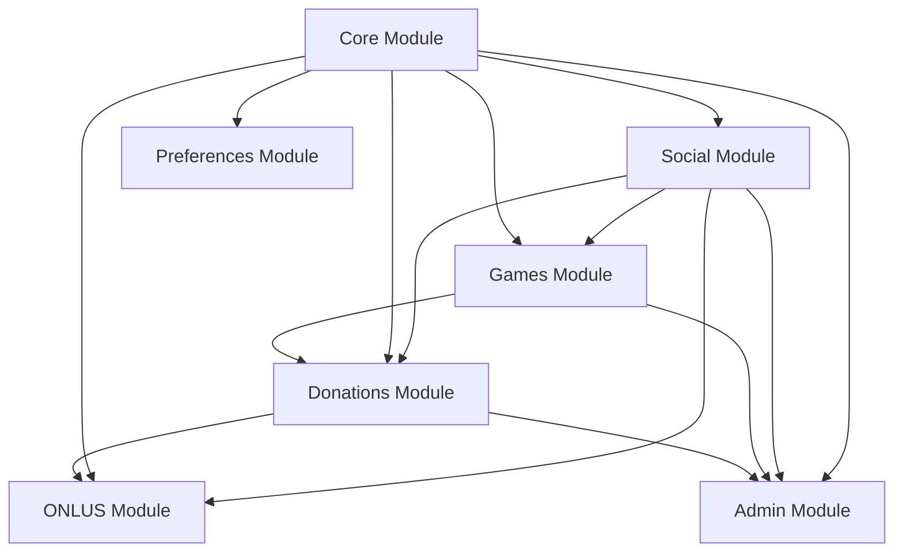

### 📋 Module Responsibilities

#### **Core Module** (`app/core/`)
- **Purpose**: Foundation services and authentication
- **Components**:
  - User management and authentication
  - JWT token handling
  - Base repository and service classes
  - Utility functions and decorators
- **Database Collections**: `users`, `configs`
- **Dependencies**: None (foundation layer)

#### **Social Module** (`app/social/`)
- **Purpose**: Social features and gamification
- **Components**:
  - User relationships and friendships
  - Impact Score system and leaderboards
  - Achievement engine and badge system
  - Social challenges and competitions
- **Database Collections**:
  - `user_relationships`
  - `user_impact_scores`
  - `leaderboards`
  - `achievements`, `user_achievements`
  - `social_challenges`
- **Dependencies**: Core (for users and auth)

#### **Games Module** (`app/games/`)
- **Purpose**: Game engine and session management
- **Components**:
  - Game plugin system
  - Session management with sync
  - Game modes and scheduling
  - Direct challenges (1v1, NvN)
  - Global teams and tournaments
  - Universal scoring system
- **Database Collections**:
  - `games`, `game_sessions`
  - `game_modes`, `mode_schedules`
  - `challenges`, `challenge_participants`
  - `global_teams`, `team_members`, `tournaments`
- **Dependencies**: Core (users), Social (impact score hooks)

#### **Donations Module** (`app/donations/`) - **GOO-15 Implementation**
- **Purpose**: Virtual wallet, payment processing, and donation management
- **Components**:
  - Virtual wallet system with credit conversion
  - Payment processing and provider integration
  - Donation workflow and receipt generation
  - Transaction reconciliation and compliance
  - Financial analytics and admin dashboard
  - Batch processing for high-volume operations
- **Database Collections**:
  - `wallets` - User virtual wallets and balances
  - `transactions` - Financial transaction records
  - `conversion_rates` - Credit conversion rates and multipliers
  - `payment_providers` - External payment provider configs
  - `payment_intents` - Payment processing records
  - `batch_operations` - Batch processing operations
  - `batch_donations` - Batch donation records
- **Dependencies**: Core (users, auth), Social (credit earning hooks)

#### **Other Modules** (Future implementation)
- **ONLUS**: Charity organization management
- **Admin**: Administrative interface and controls

## 🎯 Design Patterns

### 🏗️ Repository Pattern

**Base Repository** (`app/core/repositories/base_repository.py`):
```python
class BaseRepository:
    def __init__(self, collection_name: str)
    def find_by_id(self, id: str) → Optional[Dict]
    def find_all(self, filter: Dict = None) → List[Dict]
    def create(self, data: Dict) → str
    def update(self, id: str, data: Dict) → bool
    def delete(self, id: str) → bool
    def create_indexes(self) → None  # Abstract method
```

**Implementation Example**:
```python
class UserRepository(BaseRepository):
    def __init__(self):
        super().__init__('users')

    def find_by_email(self, email: str) → Optional[User]
    def create_indexes(self):
        # MongoDB index creation
        self.collection.create_index([('email', 1)], unique=True)
```

### 🔧 Service Layer Pattern

**Base Service Structure**:
```python
class BaseService:
    def __init__(self, repository: BaseRepository)

    # Standard return format: Tuple[bool, str, Optional[Dict]]
    def method_name(self, params) → Tuple[bool, str, Optional[Dict]]:
        try:
            # 1. Validation
            validation_error = self._validate_input(params)
            if validation_error:
                return False, validation_error, None

            # 2. Business logic
            result = self._execute_business_logic(params)

            # 3. Logging
            current_app.logger.info(f"Operation successful")
            return True, "SUCCESS_MESSAGE", result

        except Exception as e:
            current_app.logger.error(f"Operation failed: {str(e)}")
            return False, "ERROR_MESSAGE", None
```

### 🎮 Controller Pattern

**Base Controller Structure**:
```python
@blueprint.route('/endpoint', methods=['POST'])
@auth_required
def endpoint_handler(current_user):
    try:
        # 1. Input validation
        data = request.get_json()
        if not data:
            return error_response("DATA_REQUIRED")

        # 2. Service call
        success, message, result = service.method(data)

        # 3. Response formatting
        if success:
            return success_response(message, result)
        else:
            return error_response(message)

    except Exception as e:
        current_app.logger.error(f"Endpoint error: {str(e)}")
        return error_response("INTERNAL_SERVER_ERROR", status_code=500)
```

### 🪝 Event-Driven Pattern

**Hook System Architecture**:
```python
# 1. Event Registration (at startup)
hook_manager.register_hook('event_name', handler_function)

# 2. Event Triggering (in controllers)
trigger_event_name(user_id, event_data)

# 3. Event Processing (automatic)
def handler_function(user_id, event_data):
    # Process event and update systems
    return success_status
```

## 🎯 Cross-Module Integration

### 📡 Event Hook System

The event hook system enables loose coupling between modules:

#### **Registration Phase** (Startup)
```python
# In app/social/__init__.py
from .leaderboards.integration.hooks import register_integration_hooks

with app.app_context():
    register_integration_hooks()
```

**Registered Events**:
- `game_session_complete` - Game sessions ending
- `social_activity` - Social interactions
- `donation_complete` - Payment completions
- `achievement_unlock` - Achievement unlocks
- `user_login` - User login events
- `weekly_reset` - Periodic system resets
- `tournament_complete` - Tournament endings

#### **Triggering Phase** (Runtime)
```python
# In games controller
from app.social.leaderboards.integration.hooks import trigger_game_session_complete

success, message, result = session_service.end_game_session(session_id, reason)
if success:
    trigger_game_session_complete(
        str(session_data['user_id']),
        session_data
    )
```

#### **Processing Phase** (Automatic)
```python
# In event handler
def handle_game_session_complete(user_id: str, session_data: Dict):
    # Update Impact Score
    ranking_engine.trigger_user_score_update(user_id, 'gaming', activity_data)
    return True
```

### 🔄 Data Flow

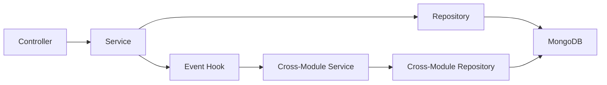

## 📊 Database Architecture

### 🏗️ MongoDB Collections Structure

#### **Core Collections**
- `users` - User accounts and authentication
  - Indexes: `email` (unique), `created_at`
- `configs` - System configuration
  - Indexes: `key` (unique)

#### **Social Collections**
- `user_relationships` - Friend connections
  - Indexes: `user_id`, `friend_id`, `status`
- `user_impact_scores` - Gamification scores
  - Indexes: `user_id` (unique), `impact_score`, `rank_global`
- `leaderboards` - Ranking tables
  - Indexes: `leaderboard_type`, `time_period`, `rank`
- `achievements` - Achievement definitions
  - Indexes: `achievement_id` (unique), `category`, `is_active`
- `user_achievements` - User progress tracking
  - Indexes: `user_id`, `achievement_id`, `completed_at`

#### **Games Collections**
- `games` - Game definitions
  - Indexes: `game_id` (unique), `is_active`
- `game_sessions` - Active game sessions
  - Indexes: `user_id`, `game_id`, `status`, `created_at`
- `game_modes` - Temporary game modes
  - Indexes: `name` (unique), `is_active`, `start_date`, `end_date`
- `challenges` - Direct player challenges
  - Indexes: `challenger_id`, `status`, `game_id`, `created_at`
- `global_teams` - Team definitions
  - Indexes: `team_id` (unique), `is_active`
- `team_members` - Team membership
  - Indexes: `user_id`, `team_id`, `role`

#### **Donations Collections** (GOO-15)
- `wallets` - Virtual wallet management
  - Indexes: `user_id` (unique), `balance`, `total_earned`
- `transactions` - Financial transaction records
  - Indexes: `user_id`, `transaction_type`, `status`, `created_at`
- `conversion_rates` - Credit conversion rates
  - Indexes: `rate_type`, `is_active`, `effective_date`
- `payment_providers` - Payment provider configurations
  - Indexes: `provider_name` (unique), `is_active`
- `payment_intents` - Payment processing records
  - Indexes: `payment_intent_id` (unique), `user_id`, `status`
- `batch_operations` - Batch processing operations
  - Indexes: `operation_type`, `status`, `created_at`
- `batch_donations` - Batch donation records
  - Indexes: `batch_id`, `user_id`, `status`

### 📈 Index Strategy

**Performance Considerations**:
1. **Query Pattern Analysis**: Indexes based on common query patterns
2. **Compound Indexes**: Multi-field indexes for complex queries
3. **Unique Constraints**: Data integrity enforcement
4. **TTL Indexes**: Automatic data cleanup (sessions, temporary data)

**Index Creation Timing**:
- **Startup**: All indexes created during module initialization
- **Testing Mode**: Index creation skipped to prevent DB connection requirements

## 🔧 Configuration Management

### 🌍 Environment-Based Configuration

**Configuration Structure** (`config/settings.py`):
```python
class Config:
    # Base configuration
    SECRET_KEY = os.environ.get('SECRET_KEY')
    JWT_SECRET_KEY = os.environ.get('JWT_SECRET_KEY')
    MONGO_URI = os.environ.get('MONGO_URI')

class DevelopmentConfig(Config):
    DEBUG = True
    LOG_LEVEL = 'DEBUG'

class ProductionConfig(Config):
    DEBUG = False
    LOG_LEVEL = 'INFO'

config = {
    'development': DevelopmentConfig,
    'production': ProductionConfig,
    'default': DevelopmentConfig
}
```

### 🔐 Security Configuration

**JWT Settings**:
- Access token expiration: 1 hour
- Refresh token expiration: 30 days
- Token blacklisting support

**CORS Configuration**:
- Environment-specific origins
- Development: `http://localhost:3000`
- Production: Configured domains only

## 🧪 Testing Architecture

### 🔬 Testing Strategy

**Test Structure**:
```
tests/
├── conftest.py              # Shared fixtures and configuration
├── test_core_auth.py        # Core authentication tests (47 tests)
├── test_preferences.py      # Preferences module tests (35 tests)
├── test_social.py          # Social features tests (28 tests)
├── test_games.py           # Game engine tests (32 tests)
└── test_integration.py     # Cross-module integration tests
```

**Testing Patterns**:
- **Service Tests**: Mock repository dependencies
- **Controller Tests**: Mock services, test API contracts
- **Repository Tests**: Mock database operations
- **Integration Tests**: Test full request/response cycles

**Mock Strategy**:
```python
# Database mocking
@pytest.fixture
def mock_db(monkeypatch):
    mock_collection = MagicMock()
    monkeypatch.setattr('app.core.database.get_db', lambda: mock_db)

# Service mocking
@pytest.fixture
def mock_user_service(monkeypatch):
    mock_service = MagicMock()
    monkeypatch.setattr('app.core.services.user_service', mock_service)
```

### 📊 Testing Configuration

**Environment Variables**:
```python
# In conftest.py
os.environ['TESTING'] = 'true'
os.environ['SKIP_DB_INIT'] = '1'
```

**Index Creation Control**:
```python
def create_indexes(self):
    if os.getenv('TESTING') == 'true':
        return  # Skip index creation in tests
    # Normal index creation
```

## 🚀 Performance Considerations

### ⚡ Optimization Strategies

**Database Optimization**:
- Compound indexes for complex queries
- Query result pagination
- Connection pooling
- Index usage monitoring

**Application Optimization**:
- Service layer caching
- Lazy loading for related data
- Async processing for heavy operations
- Event hook non-blocking execution

**Memory Management**:
- Repository instance reuse
- Service singleton pattern
- Connection pool optimization

### 📈 Scalability Design

**Horizontal Scaling Readiness**:
- Stateless service design
- Database connection abstraction
- Event-driven architecture
- Load balancer friendly

**Monitoring Integration Points**:
- Request/response timing
- Database query performance
- Event processing metrics
- Error rate tracking

## 🔮 Future Architecture Evolution

### 🎯 Planned Improvements

**Event System Enhancement**:
- Redis/Kafka integration for distributed events
- Event sourcing implementation
- Replay capability for debugging

**Microservices Migration Path**:
- Module extraction strategy
- API gateway implementation
- Service mesh integration

**Performance Enhancements**:
- Caching layer (Redis)
- Background job processing (Celery)
- Real-time features (WebSocket)

**Development Experience**:
- Auto-generated API documentation
- Development tooling integration
- Enhanced debugging capabilities

---

## 💰 GOO-15: Donation Processing Engine Architecture

### 🏗️ Donations Module Architecture

The GOO-15 implementation introduces a comprehensive donation processing system with the following architectural components:

#### **Service Layer Architecture**

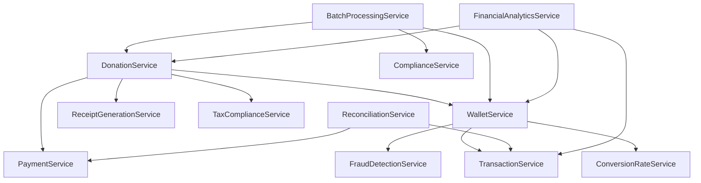

#### **Core Service Responsibilities**

**WalletService** (`app/donations/services/wallet_service.py`):
- Virtual wallet management and balance tracking
- Credit conversion from game sessions
- Auto-donation configuration and processing
- Transaction validation and security checks

**PaymentService** (`app/donations/services/payment_service.py`):
- Payment provider integration (Stripe, PayPal, etc.)
- Payment intent creation and processing
- Payment method validation and security
- Webhook handling for payment updates

**DonationService** (`app/donations/services/donation_service.py`):
- Donation workflow orchestration
- ONLUS validation and verification
- Donation receipt generation coordination
- Tax deductibility calculations

**BatchProcessingService** (`app/donations/services/batch_processing_service.py`):
- High-volume donation processing
- Batch operation management
- Progress tracking and status updates
- Error handling and retry mechanisms

**ComplianceService** (`app/donations/services/compliance_service.py`):
- AML (Anti-Money Laundering) checks
- KYC (Know Your Customer) verification
- Sanctions screening
- Regulatory compliance reporting

**ReconciliationService** (`app/donations/services/reconciliation_service.py`):
- Transaction matching between internal and external systems
- Discrepancy detection and resolution
- Financial reconciliation reporting
- Data integrity validation

**FinancialAnalyticsService** (`app/donations/services/financial_analytics_service.py`):
- Real-time financial dashboard generation
- Donation trends and forecasting
- User behavior analytics
- System performance metrics

#### **Data Flow Architecture**

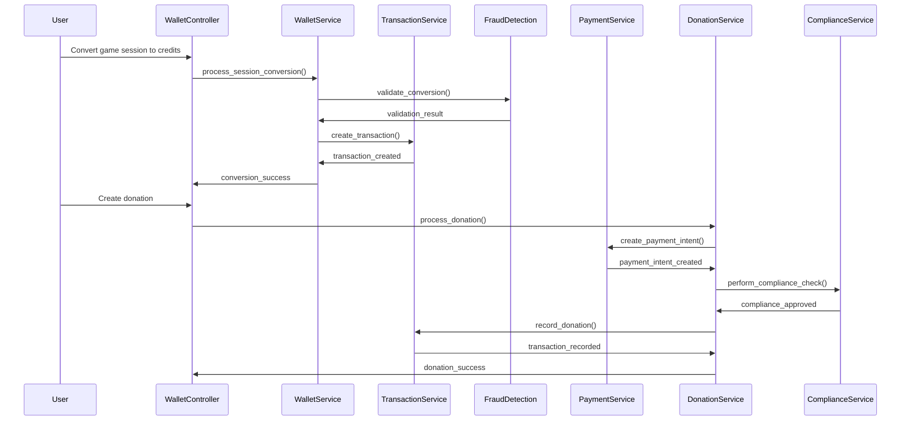

#### **Controller Layer Organization**

The donations module exposes 7 specialized controllers:

1. **WalletController** (`/api/wallet/*`) - Virtual wallet operations
2. **DonationController** (`/api/donations/*`) - Donation processing
3. **ConversionRatesController** (`/api/conversion-rates/*`) - Rate management
4. **PaymentController** (`/api/payments/*`) - Payment processing
5. **BatchController** (`/api/batch/*`) - Batch operations (admin)
6. **ComplianceController** (`/api/compliance/*`) - Compliance management (admin)
7. **FinancialAdminController** (`/api/admin/financial/*`) - Financial analytics (admin)

#### **Security Architecture**

**Multi-Layer Security Approach**:

1. **Input Validation Layer**:
   - Request data sanitization
   - Parameter type validation
   - Business rule validation

2. **Authentication Layer**:
   - JWT token verification
   - User session validation
   - Admin role verification for sensitive operations

3. **Authorization Layer**:
   - Resource access control
   - Operation-level permissions
   - Admin-only endpoint protection

4. **Transaction Security Layer**:
   - Optimistic locking for wallet operations
   - Transaction integrity validation
   - Fraud detection algorithms

5. **Compliance Layer**:
   - AML/KYC verification
   - Sanctions screening
   - Regulatory compliance checks

#### **Event Integration Architecture**

**Credit Earning Events**:
```python
# Game session completion triggers credit conversion
trigger_session_complete(user_id, session_data)
  ↓
WalletService.process_session_conversion()
  ↓
Apply dynamic multipliers (tournament, streak, weekend)
  ↓
Create transaction record
  ↓
Update wallet balance
  ↓
Check auto-donation settings
  ↓
Trigger auto-donation if threshold met
```

**Donation Events**:
```python
# Donation completion triggers multiple systems
trigger_donation_complete(user_id, donation_data)
  ↓
Update Impact Score (social module)
  ↓
Generate receipt (tax compliance)
  ↓
Update financial analytics
  ↓
Check achievement unlocks
  ↓
Update leaderboards
```

#### **Error Handling Architecture**

**Standardized Error Response Pattern**:
```python
# Service Layer Error Handling
try:
    validation_result = self._validate_input(data)
    if validation_result:
        return False, validation_result, None

    business_result = self._execute_business_logic(data)

    current_app.logger.info(f"Operation successful: {operation_info}")
    return True, "SUCCESS_CONSTANT", business_result

except ValidationError as e:
    current_app.logger.warning(f"Validation failed: {str(e)}")
    return False, "VALIDATION_ERROR_CONSTANT", None

except BusinessLogicError as e:
    current_app.logger.error(f"Business logic error: {str(e)}")
    return False, "BUSINESS_ERROR_CONSTANT", None

except Exception as e:
    current_app.logger.error(f"Unexpected error: {str(e)}")
    return False, "INTERNAL_SERVER_ERROR", None
```

**Controller Layer Error Handling**:
```python
# Standardized controller error responses
try:
    success, message, result = service.method(data)

    if success:
        return success_response(message, result)
    else:
        return error_response(message)

except Exception as e:
    current_app.logger.error(f"Controller error: {str(e)}")
    return error_response("INTERNAL_SERVER_ERROR", status_code=500)
```

#### **Performance Optimization Architecture**

**Caching Strategy**:
- Conversion rates cached for 1 hour
- Financial analytics cached for 15 minutes
- User wallet data cached for 5 minutes
- Payment provider configs cached for 24 hours

**Database Optimization**:
- Compound indexes for complex queries
- Transaction aggregation pipelines
- Batch processing for high-volume operations
- Connection pooling and query optimization

**Concurrent Processing**:
- Optimistic locking for wallet updates
- Async processing for non-critical operations
- Queue-based batch processing
- Background reconciliation jobs

### 🔄 GOO-15 Integration Points

#### **Games Module Integration**:
- Session completion triggers credit conversion
- Multiplier calculation based on game type and mode
- Tournament participation bonus calculations

#### **Social Module Integration**:
- Donation activities update Impact Score
- Achievement unlocks for donation milestones
- Leaderboard updates for charitable contributions

#### **Core Module Integration**:
- User authentication for all financial operations
- User preferences for auto-donation settings
- Admin role verification for sensitive operations

---

## 🎨 GOO-16: Impact Tracking & Reporting System Architecture

### 🏗️ System Overview

The GOO-16 Impact Tracking & Reporting System completes the donation platform by providing real-time impact visualization, progressive story unlocking, and community transparency features. Building on the foundation of GOO-14 (Virtual Wallet) and GOO-15 (Donation Processing), GOO-16 creates direct connections between donations and their real-world impact.

### 📊 Module Architecture

```
┌─────────────────────────────────────────────────────────────────────────────┐
│                        DONATIONS MODULE ARCHITECTURE                        │
├─────────────────────────────────────────────────────────────────────────────┤
│                                                                             │
│  GOO-14: Virtual Wallet System (Foundation)                               │
│  ┌─────────────────┐  ┌─────────────────┐  ┌─────────────────────────────┐ │
│  │     Wallet      │  │   Transaction   │  │    Credit Conversion        │ │
│  │     Model       │  │     Model       │  │       Service               │ │
│  └─────────────────┘  └─────────────────┘  └─────────────────────────────┘ │
│                                                                             │
│  GOO-15: Donation Processing Engine                                       │
│  ┌─────────────────┐  ┌─────────────────┐  ┌─────────────────────────────┐ │
│  │  PaymentIntent  │  │ BatchOperation  │  │    Compliance & Receipt     │ │
│  │     Model       │  │     Model       │  │       Services              │ │
│  └─────────────────┘  └─────────────────┘  └─────────────────────────────┘ │
│                                                                             │
│  GOO-16: Impact Tracking & Reporting (NEW)                               │
│  ┌─────────────────┐  ┌─────────────────┐  ┌─────────────────────────────┐ │
│  │  ImpactStory    │  │  ImpactMetric   │  │    Progressive Unlocking    │ │
│  │     Model       │  │     Model       │  │       System                │ │
│  └─────────────────┘  └─────────────────┘  └─────────────────────────────┘ │
│  ┌─────────────────┐  ┌─────────────────┐  ┌─────────────────────────────┐ │
│  │  ImpactUpdate   │  │ CommunityReport │  │    Real-time Impact         │ │
│  │     Model       │  │     Model       │  │      Visualization          │ │
│  └─────────────────┘  └─────────────────┘  └─────────────────────────────┘ │
└─────────────────────────────────────────────────────────────────────────────┘
```

### 🔄 Integration Workflow

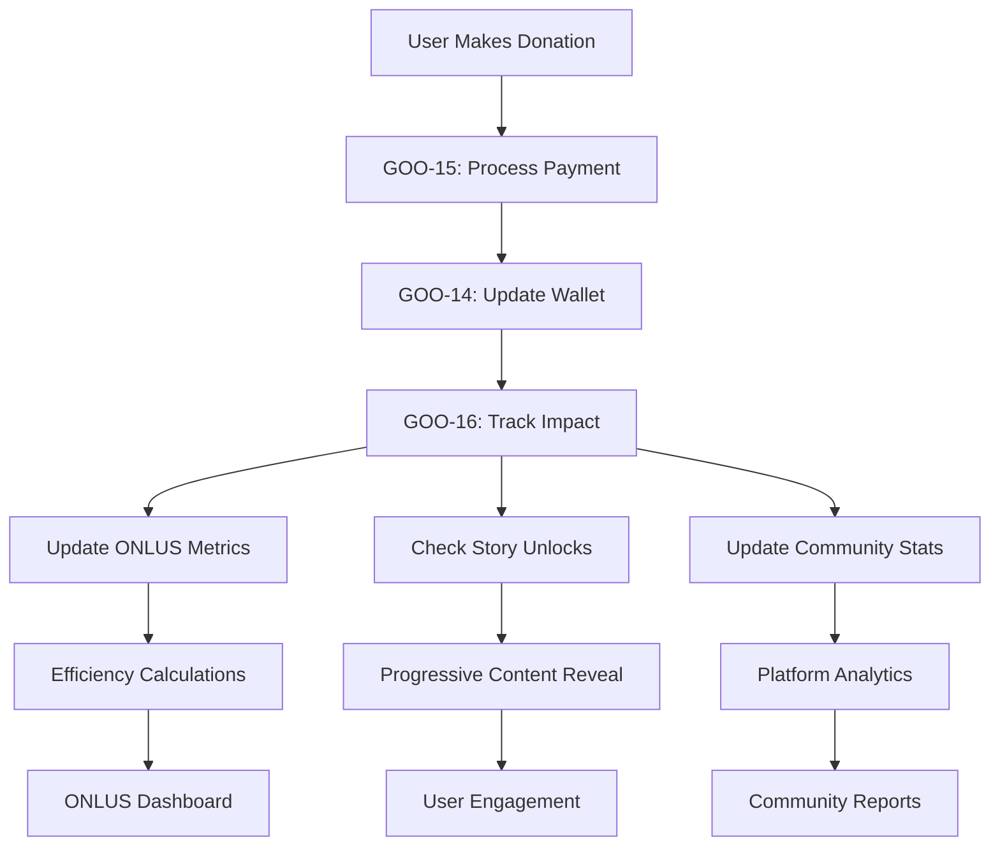

### 🎯 Core Components

#### **Impact Models** (`app/donations/models/`)

**ImpactStory** (`impact_story.py`):
- Progressive story unlocking system
- Milestone-based content revelation (€10 → €10,000)
- Multiple unlock conditions (total donated, donation count, ONLUS diversity)
- User progress tracking and API response formatting

**ImpactMetric** (`impact_metric.py`):
- Aggregated ONLUS impact metrics
- Efficiency ratio calculations (impact per euro)
- Time-series trend analysis
- Verification and dispute resolution system

**ImpactUpdate** (`impact_update.py`):
- Real-time updates from ONLUS organizations
- Engagement tracking (views, likes, shares, comments)
- Priority-based publishing system
- Media attachments and related metrics

**CommunityReport** (`community_report.py`):
- Platform-wide aggregated reports
- Growth metrics and statistical analysis
- Monthly/annual reporting cycles
- Community milestone tracking

#### **Repository Layer** (`app/donations/repositories/`)

**Advanced MongoDB Aggregations**:
```python
# Trend analysis pipeline
def get_metric_trends(self, onlus_id: str, metric_name: str, days: int = 30):
    pipeline = [
        {"$match": {"onlus_id": onlus_id, "metric_name": metric_name}},
        {"$group": {
            "_id": {"date": {"$dateToString": {"format": "%Y-%m-%d", "date": "$collection_date"}}},
            "avg_value": {"$avg": "$current_value"},
            "efficiency_ratio": {"$avg": {"$divide": ["$current_value", "$related_donations_amount"]}}
        }},
        {"$sort": {"_id.date": 1}}
    ]

# Community growth analysis
def get_platform_growth_trends(self, months: int = 12):
    pipeline = [
        {"$match": {"report_type": "monthly", "status": "published"}},
        {"$group": {
            "_id": {"year": {"$year": "$period_start"}, "month": {"$month": "$period_start"}},
            "total_donations": {"$sum": "$total_donations"},
            "growth_rate": {"$avg": "$growth_metrics.donations_growth"}
        }}
    ]
```

**Performance Indexes**:
```javascript
// High-performance indexes for story unlocking
{onlus_id: 1, is_active: 1, story_type: 1}
{unlock_condition_type: 1, unlock_condition_value: 1, is_active: 1}
{title: "text", content: "text", tags: "text"}

// Metrics aggregation optimization
{onlus_id: 1, metric_name: 1, collection_date: -1}
{metric_type: 1, efficiency_ratio: -1}

// Community reporting performance
{report_type: 1, period_start: -1, status: 1}
```

#### **Service Layer** (`app/donations/services/`)

**ImpactTrackingService** (`impact_tracking_service.py`):
- Core donation→impact workflow coordination
- User statistics aggregation and caching
- Cross-service integration with GOO-14/GOO-15
- Impact milestone detection and user level progression

**StoryUnlockingService** (`story_unlocking_service.py`):
- Progressive unlock algorithm implementation
- Milestone achievement tracking
- User progress calculation and API responses
- Content availability management based on donation history

**ImpactVisualizationService** (`impact_visualization_service.py`):
- Dashboard data aggregation and formatting
- ONLUS impact visualization preparation
- Trend analysis and efficiency calculations
- Real-time metrics compilation for frontend

**CommunityImpactService** (`community_impact_service.py`):
- Platform-wide statistics generation
- Community leaderboards and ranking systems
- Growth rate calculations and projections
- Real-time report generation and caching

#### **API Layer** (`app/donations/controllers/`)

**ImpactController** (`impact_controller.py`):
- 15+ REST endpoints with constant message responses
- User impact summaries and timeline visualization
- Story unlock progress and availability
- Community statistics and leaderboards
- ONLUS metrics and real-time updates
- Monthly/annual reporting endpoints
- Admin metrics and update management

**Endpoint Categories**:
```python
# User Impact Endpoints
GET  /api/impact/user/{user_id}                    # Impact summary
GET  /api/impact/user/{user_id}/timeline           # Donation timeline
GET  /api/impact/donation/{donation_id}            # Donation details

# Story System Endpoints
GET  /api/impact/stories/available                 # Available stories
GET  /api/impact/stories/{story_id}                # Story details
GET  /api/impact/stories/progress                  # Unlock progress

# Community Endpoints
GET  /api/impact/community/statistics              # Platform stats
GET  /api/impact/community/leaderboard             # Leaderboards
GET  /api/impact/dashboard                         # Dashboard data

# ONLUS Endpoints
GET  /api/impact/onlus/{onlus_id}/metrics          # ONLUS metrics
GET  /api/impact/onlus/{onlus_id}/updates          # ONLUS updates

# Reporting Endpoints
GET  /api/impact/reports/monthly/{year}/{month}    # Monthly reports
GET  /api/impact/reports/annual/{year}             # Annual reports

# Admin Endpoints (Admin Required)
POST /api/impact/admin/metrics                     # Create metrics
POST /api/impact/admin/updates                     # Create updates
POST /api/impact/admin/reports/generate            # Generate reports
```

### 🎮 Gamification System

#### **Progressive Milestone System**:
```python
MILESTONE_LEVELS = [10, 25, 50, 100, 250, 500, 1000, 2500, 5000, 10000]

# Example progression:
€10   → "First Impact" story unlock
€25   → "Growing Difference" story + basic metrics access
€50   → "Community Builder" story + trend data
€100  → "Changemaker" story + detailed analytics
€250  → "Impact Champion" story + ONLUS direct updates
€500  → "Philanthropist" story + community leaderboard
€1000 → "Major Donor" story + platform insights
€2500 → "Community Leader" story + admin dashboards
€5000 → "Impact Hero" story + advanced reporting
€10000→ "Transformation Leader" story + all features
```

#### **Unlock Conditions**:
- **Total Donated**: Cumulative donation amount across all ONLUS
- **Donation Count**: Number of separate donation transactions
- **ONLUS Diversity**: Number of different organizations supported
- **Impact Score**: Calculated efficiency and engagement metric
- **Special Events**: Holiday campaigns, emergency responses, community goals

### 📊 Database Collections

#### **New Collections Added**:

**impact_stories** Collection:
```javascript
{
  "_id": ObjectId,
  "onlus_id": "uuid",                    // ONLUS organization ID
  "title": "Your First Impact Story",    // Display title
  "content": "Full story content...",    // Revealed when unlocked
  "story_type": "milestone",             // milestone|progress|featured|special
  "unlock_condition_type": "total_donated",  // unlock trigger type
  "unlock_condition_value": 100.0,      // threshold amount/count
  "category": "education",               // impact category
  "priority": 5,                         // display priority 1-10
  "media_urls": ["https://..."],         // photos, videos, documents
  "tags": ["education", "children"],     // searchable tags
  "featured_until": null,                // featured expiration
  "is_active": true,                     // visibility control
  "created_at": ISODate,
  "updated_at": ISODate
}
```

**impact_metrics** Collection:
```javascript
{
  "_id": ObjectId,
  "onlus_id": "uuid",                    // ONLUS organization ID
  "metric_name": "children_helped",      // metric identifier
  "metric_type": "beneficiaries",        // financial|beneficiaries|projects|etc
  "current_value": 150,                  // current metric value
  "previous_value": 120,                 // previous period value
  "unit": "people",                      // measurement unit
  "related_donations_amount": 2500.0,    // associated donation total
  "efficiency_ratio": 0.06,              // calculated efficiency
  "collection_period": "month",          // data collection period
  "collection_date": ISODate,            // when metric was recorded
  "verification_status": "verified",     // verified|pending|disputed
  "is_active": true,
  "created_at": ISODate
}
```

**impact_updates** Collection:
```javascript
{
  "_id": ObjectId,
  "onlus_id": "uuid",                    // ONLUS organization ID
  "title": "New School Completed",       // update title
  "content": "Full update content...",   // update details
  "update_type": "milestone_reached",    // update category
  "priority": "high",                    // low|normal|high|urgent|critical
  "status": "published",                 // draft|scheduled|published|featured
  "tags": ["construction", "education"], // categorization tags
  "media_urls": ["https://..."],         // attached media
  "related_metrics": {                   // related metric updates
    "schools_built": 1,
    "children_capacity": 200
  },
  "engagement_metrics": {                // user engagement tracking
    "views": 1250,
    "likes": 45,
    "shares": 12,
    "comments": 8
  },
  "featured_until": null,                // featured expiration
  "created_at": ISODate,
  "published_at": ISODate
}
```

**community_reports** Collection:
```javascript
{
  "_id": ObjectId,
  "report_type": "monthly",              // daily|weekly|monthly|quarterly|annual
  "title": "Sept 2024 Impact Report",    // report title
  "summary": "Community achievements...", // executive summary
  "period_start": ISODate("2024-09-01"), // reporting period start
  "period_end": ISODate("2024-09-30"),   // reporting period end
  "total_donations": 45000.0,            // period donation total
  "total_donors": 320,                   // active donor count
  "active_onlus_count": 15,              // participating organizations
  "detailed_metrics": {                  // comprehensive statistics
    "donations_by_category": {
      "education": 18000.0,
      "health": 15000.0,
      "environment": 12000.0
    },
    "user_engagement": {
      "stories_unlocked": 180,
      "avg_session_duration": 420,
      "return_rate": 0.75
    }
  },
  "growth_metrics": {                    // period-over-period growth
    "donations_growth": 15.5,
    "users_growth": 8.2,
    "engagement_growth": 12.3
  },
  "status": "published",                 // draft|published|archived
  "created_at": ISODate,
  "published_at": ISODate
}
```

### 🔗 Integration Points

#### **GOO-16 → GOO-15 Integration**:
```python
# Donation completion triggers impact tracking
@donation_bp.route('/process', methods=['POST'])
def process_donation():
    # GOO-15: Process payment
    success, message, donation_data = donation_service.process_donation(data)

    if success:
        # GOO-16: Track impact
        impact_service.track_donation_impact(
            donation_data['donation_id'],
            donation_data['user_id'],
            donation_data['amount'],
            donation_data['onlus_id']
        )

    return success_response(message, donation_data)
```

#### **GOO-16 → GOO-14 Integration**:
```python
# Credit conversion includes impact milestone checks
def convert_session_to_credits(session_data):
    # GOO-14: Convert credits
    credits_earned = credit_service.calculate_credits(session_data)

    # GOO-16: Check if credit earnings unlock stories
    user_total = wallet_service.get_user_total_earned(user_id)
    unlocked_stories = story_service.check_and_unlock_stories(user_id, user_total)

    return {
        'credits_earned': credits_earned,
        'stories_unlocked': unlocked_stories,
        'new_milestone_reached': len(unlocked_stories) > 0
    }
```

### 📈 Performance Considerations

#### **Caching Strategy**:
```python
# Redis caching for frequently accessed data
CACHE_KEYS = {
    'user_impact_summary': 'impact:user:{user_id}:summary',      # TTL: 10 minutes
    'dashboard_data': 'impact:user:{user_id}:dashboard',         # TTL: 15 minutes
    'community_stats': 'impact:community:stats',                # TTL: 30 minutes
    'onlus_metrics': 'impact:onlus:{onlus_id}:metrics',         # TTL: 5 minutes
    'story_unlocks': 'impact:user:{user_id}:unlocks'            # TTL: 60 minutes
}
```

#### **Database Query Optimization**:
```python
# Efficient aggregation pipeline for user impact
def get_user_impact_summary(user_id):
    # Single aggregation query across multiple collections
    pipeline = [
        {"$lookup": {"from": "transactions", "localField": "user_id", "foreignField": "user_id"}},
        {"$lookup": {"from": "impact_stories", "localField": "unlock_level", "foreignField": "unlock_condition_value"}},
        {"$group": {"_id": "$user_id", "total_donated": {"$sum": "$amount"}, "stories_unlocked": {"$addToSet": "$story_id"}}}
    ]
```

#### **Scalability Features**:
- Background task queues for report generation
- Incremental aggregation updates
- Partitioned collections for historical data
- Read replicas for analytics queries

### 🧪 Testing Architecture

#### **Test Structure (99 Test Methods)**:
```
tests/test_goo16_models.py        (25 tests) - Model validation & business logic
tests/test_goo16_repositories.py  (28 tests) - Database operations & aggregations
tests/test_goo16_services.py      (18 tests) - Service layer business logic
tests/test_goo16_controllers.py   (21 tests) - API endpoints & auth validation
tests/test_goo16_integration.py   (7 tests)  - End-to-end workflow testing
```

#### **Coverage Requirements**:
- Models: >95% line coverage
- Repositories: >90% line coverage
- Services: >88% line coverage
- Controllers: >92% line coverage
- Integration: >85% line coverage
- **Overall Target**: >90% coverage

### 📱 Frontend Integration

#### **API Response Constants**:
All responses use constant message keys for UI internationalization:
```python
# Success constants
"USER_IMPACT_SUMMARY_SUCCESS", "STORIES_RETRIEVED_SUCCESS",
"COMMUNITY_STATS_SUCCESS", "LEADERBOARD_SUCCESS",
"DASHBOARD_DATA_SUCCESS", "MONTHLY_REPORT_SUCCESS"

# Error constants
"STORY_NOT_FOUND", "REPORT_NOT_FOUND", "ACCESS_DENIED",
"INVALID_MONTH", "ONLUS_ID_REQUIRED"
```

#### **Real-time Updates**:
```javascript
// WebSocket integration for live updates
const impactSocket = io('/impact');

impactSocket.on('story_unlocked', (data) => {
    // Show unlock notification
    showStoryUnlockNotification(data.story);
    // Refresh user progress
    refreshUserProgress();
});

impactSocket.on('community_milestone', (data) => {
    // Show platform achievement
    showCommunityMilestone(data.milestone);
});
```

### 🚀 Deployment Considerations

#### **Environment Variables**:
```bash
# GOO-16 specific configuration
IMPACT_STORY_CACHE_TTL=600
METRIC_UPDATE_FREQUENCY=300
COMMUNITY_REPORT_SCHEDULE="0 0 1 * *"
TRENDING_UPDATE_WINDOW=24
MAX_STORIES_PER_USER=50
REPORT_GENERATION_TIMEOUT=300
```

#### **Background Jobs**:
```python
# Scheduled tasks for GOO-16
@scheduler.task('cron', hour=0, minute=0, day=1)  # Monthly reports
def generate_monthly_reports():
    CommunityImpactService().generate_monthly_report()

@scheduler.task('interval', minutes=5)  # Metric updates
def update_trending_metrics():
    ImpactVisualizationService().refresh_trending_updates()

@scheduler.task('interval', minutes=10)  # Cache warming
def warm_dashboard_cache():
    CacheService().warm_dashboard_data()
```

#### **Monitoring & Alerts**:
```python
# Key metrics to monitor
MONITORING_METRICS = {
    'story_unlock_latency': {'threshold': '500ms', 'alert': 'high'},
    'dashboard_load_time': {'threshold': '2s', 'alert': 'medium'},
    'report_generation_time': {'threshold': '5min', 'alert': 'high'},
    'daily_story_unlocks': {'threshold': '> 0', 'alert': 'low'},
    'api_error_rate': {'threshold': '< 1%', 'alert': 'critical'}
}
```

---

## 🏛️ **GOO-17: ONLUS Registry & Verification System Architecture**

The ONLUS Registry & Verification System provides comprehensive management for non-profit organization registration, verification, and ongoing compliance monitoring within the GoodPlay platform.

### **System Overview**

GOO-17 implements a complete ONLUS (Non-profit Organization) lifecycle management system with:
- **Multi-phase Application Workflow**: Draft → Submission → Review → Verification → Approval
- **Document Management**: Upload, versioning, review, and lifecycle tracking
- **Automated & Manual Verification**: Risk-based verification with fraud detection
- **Compliance Monitoring**: Ongoing compliance scoring and review management
- **Public Discovery**: Searchable directory with categorization and ratings

### **Module Architecture**

#### **5-Layer Component Architecture**

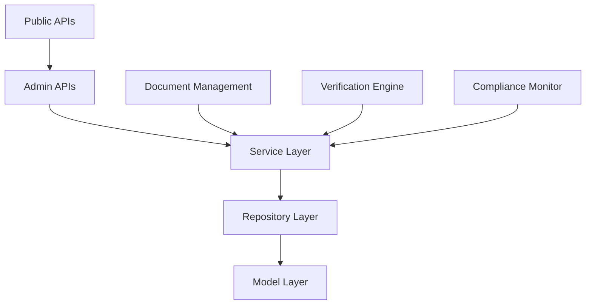

#### **Core Components**

**1. Model Layer** (`app/onlus/models/`):
- **ONLUSCategory**: Category definitions with verification requirements
- **ONLUSDocument**: Document lifecycle management with versioning
- **VerificationCheck**: Automated and manual verification processes
- **ONLUSApplication**: Multi-phase application workflow management
- **ONLUSOrganization**: Verified organization profiles with compliance tracking

**2. Repository Layer** (`app/onlus/repositories/`):
- **ONLUSCategoryRepository**: Category management and requirement queries
- **ONLUSDocumentRepository**: Document CRUD with expiration tracking
- **VerificationCheckRepository**: Verification workflow and risk assessment
- **ONLUSApplicationRepository**: Application lifecycle and statistics
- **ONLUSOrganizationRepository**: Organization management and discovery

**3. Service Layer** (`app/onlus/services/`):
- **ApplicationService**: Complete application workflow orchestration
- **VerificationService**: Verification engine with automated checks
- **DocumentService**: Document management with review workflow
- **ONLUSService**: Organization management and public discovery

**4. Controller Layer** (`app/onlus/controllers/`):
- **ApplicationController**: User application management (7 endpoints)
- **AdminApplicationController**: Admin review workflow (13 endpoints)
- **DocumentController**: Document operations (8 endpoints)
- **ONLUSController**: Public organization APIs (9 endpoints)
- **AdminONLUSController**: Admin organization management (10 endpoints)

### **Application Workflow Architecture**

#### **Multi-Phase Application Process**

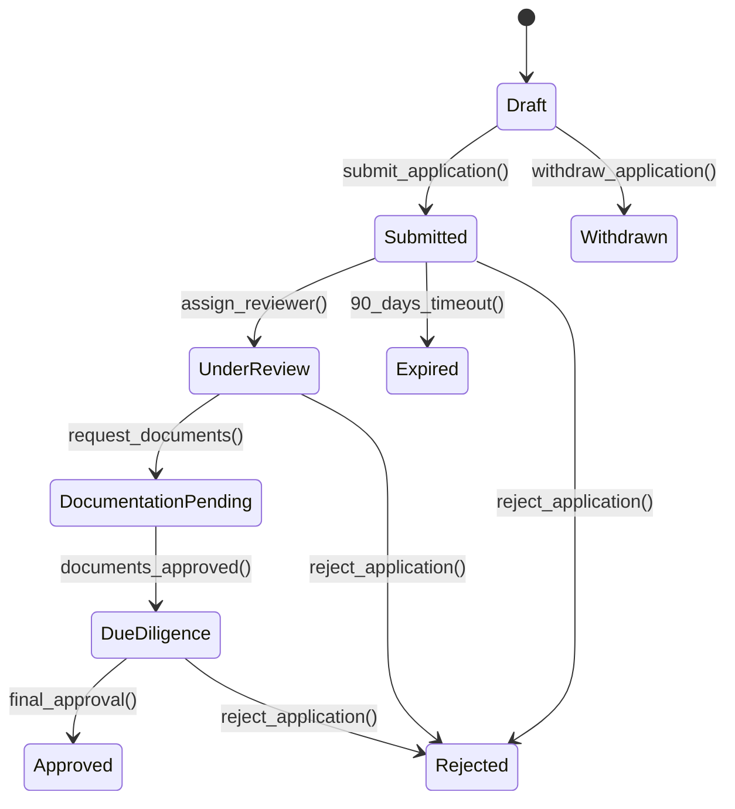

#### **Application Service Orchestration**

```python
class ApplicationService:
    def create_application(self, user_id: str, data: Dict) -> Tuple[bool, str, Dict]:
        # 1. Validate application data
        validation_result = self._validate_application_data(data)

        # 2. Get category-specific requirements
        requirements = self.category_repo.get_verification_requirements_for_category(
            data['category']
        )

        # 3. Create application with requirements
        application_data = {
            **data,
            'applicant_id': user_id,
            'status': ApplicationStatus.DRAFT.value,
            'phase': ApplicationPhase.INITIAL.value,
            'required_documents': requirements,
            'created_at': datetime.now(timezone.utc)
        }

        # 4. Save and return result
        application_id = self.application_repo.create_application(application_data)
        return True, "APPLICATION_CREATED_SUCCESS", {'application_id': application_id}
```

### **Document Management Architecture**

#### **Document Lifecycle with Versioning**

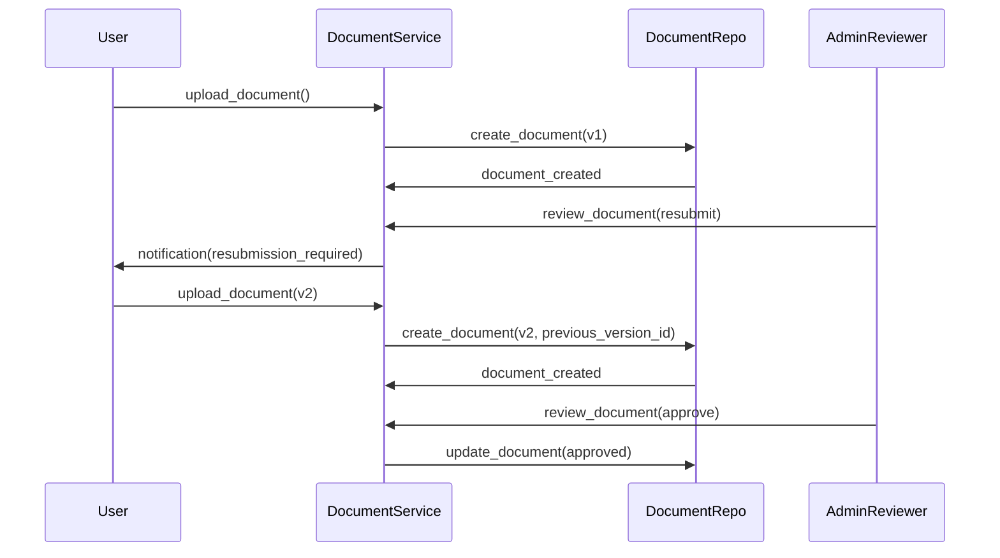

#### **Document Version Management**

```python
class ONLUSDocument:
    def update_version(self, previous_document: 'ONLUSDocument'):
        """Update document version and link to previous version."""
        self.version = previous_document.version + 1
        self.previous_version_id = previous_document._id
        self.is_current_version = True

        # Mark previous version as superseded
        previous_document.is_current_version = False
```

### **Verification Engine Architecture**

#### **Risk-Based Verification System**

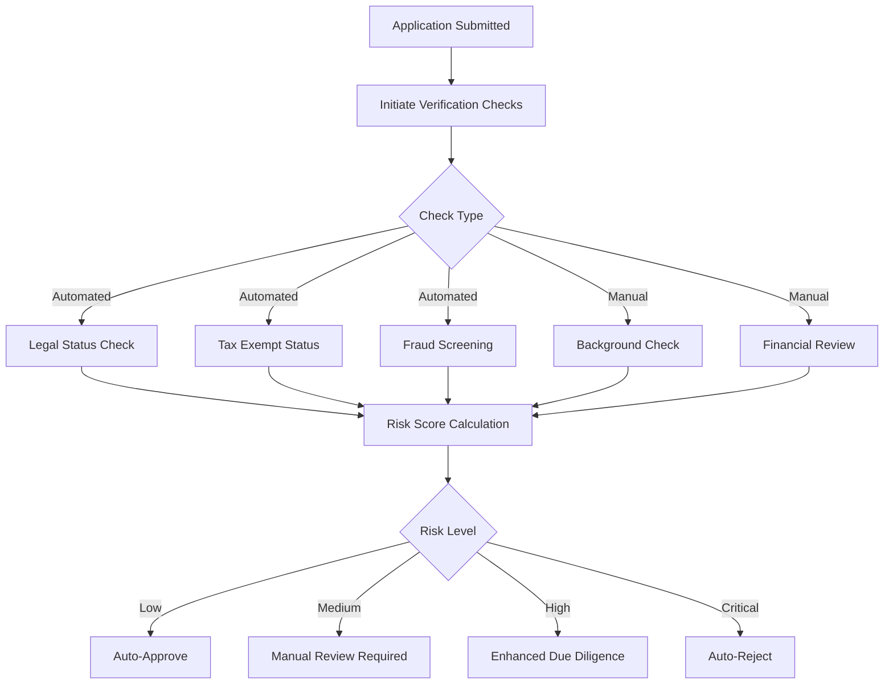

#### **Verification Check Types**

**Automated Checks**:
- **Legal Status Verification**: Registry lookup and validation
- **Tax Exempt Status**: Government database cross-reference
- **Fraud Screening**: Pattern analysis and blacklist checking
- **Financial Health**: Basic financial stability assessment

**Manual Checks**:
- **Background Check**: Leadership and board member verification
- **Operational Assessment**: Site visits and operational validation
- **Compliance Review**: Regulatory compliance verification
- **Reference Verification**: Stakeholder and partner references

#### **Risk Scoring Algorithm**

```python
class VerificationCheck:
    def get_risk_score(self) -> float:
        """Calculate risk score from verification results."""
        if self.score is None:
            return 3.0  # Unknown risk

        # Convert 0-100 score to 1-5 risk scale (lower score = higher risk)
        if self.score >= 90:
            return 1.0  # Very low risk
        elif self.score >= 75:
            return 2.0  # Low risk
        elif self.score >= 60:
            return 3.0  # Medium risk
        elif self.score >= 40:
            return 4.0  # High risk
        else:
            return 5.0  # Very high risk
```

### **Organization Management Architecture**

#### **Organization Lifecycle States**

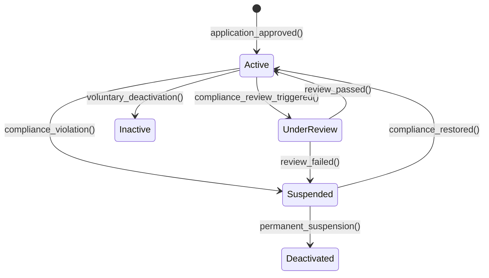

#### **Compliance Monitoring System**

```python
class ONLUSOrganization:
    def needs_compliance_review(self) -> bool:
        """Check if organization needs compliance review."""
        # Score-based review
        if self.compliance_score < 70:
            return True

        # Time-based review (annual minimum)
        if self.last_compliance_review:
            days_since_review = (datetime.now(timezone.utc) - self.last_compliance_review).days
            if days_since_review > 365:
                return True

        # Risk-based triggers
        if self.total_donations_received > 100000 and days_since_review > 180:
            return True

        return False
```

### **API Architecture & Endpoints**

#### **47 REST Endpoints Organized by Access Level**

**Public APIs** (No authentication required):
- `GET /api/onlus/organizations` - Browse organizations
- `GET /api/onlus/organizations/{id}` - Organization details
- `GET /api/onlus/organizations/featured` - Featured organizations
- `GET /api/onlus/organizations/top-rated` - Top-rated organizations
- `GET /api/onlus/categories` - Available categories
- `GET /api/onlus/statistics` - Public statistics

**User APIs** (Authentication required):
- `POST /api/onlus/applications` - Create application
- `PUT /api/onlus/applications/{id}` - Update application
- `POST /api/onlus/applications/{id}/submit` - Submit for review
- `GET /api/onlus/applications` - User's applications
- `POST /api/onlus/applications/{id}/documents` - Upload documents
- `GET /api/onlus/documents/{id}/download` - Download documents

**Admin APIs** (Admin authentication required):
- `GET /api/admin/onlus/applications` - Applications for review
- `POST /api/admin/onlus/applications/{id}/assign` - Assign reviewer
- `POST /api/admin/onlus/applications/{id}/verification/initiate` - Start verification
- `POST /api/admin/onlus/applications/{id}/approve` - Final approval
- `POST /api/admin/onlus/documents/{id}/review` - Review documents
- `PUT /api/admin/onlus/organizations/{id}/status` - Update org status
- `PUT /api/admin/onlus/organizations/{id}/compliance` - Update compliance

#### **Security Architecture by Endpoint Type**

**Public Endpoints**:
- Rate limiting (100 requests/minute)
- Response sanitization (no sensitive data)
- Cache headers for performance

**User Endpoints**:
- JWT token validation
- Resource ownership verification
- Input sanitization and validation

**Admin Endpoints**:
- Admin role verification
- Audit logging for all actions
- Enhanced input validation
- Session timeout enforcement

### **Integration Architecture**

#### **Cross-Module Integration Points**

```python
# Integration with GOO-14 Virtual Wallet
def process_donation_to_onlus(user_id: str, onlus_id: str, amount: float):
    # 1. Validate ONLUS eligibility
    organization = self.onlus_service.get_organization(onlus_id)
    if not organization.is_eligible_for_donations():
        raise ValueError("Organization not eligible for donations")

    # 2. Process donation through wallet system
    donation_result = wallet_service.process_donation(user_id, amount, onlus_id)

    # 3. Update ONLUS donation statistics
    organization.update_donation_stats(amount, donation_result['is_new_donor'])

    # 4. Generate receipt and compliance records
    receipt = self.document_service.generate_donation_receipt(donation_result)

    return donation_result, receipt
```

#### **Event-Driven Integrations**

**ONLUS Events**:
```python
# Organization approval triggers multiple systems
def trigger_organization_approved(organization_id: str):
    # 1. Enable donation processing
    wallet_service.enable_donation_target(organization_id)

    # 2. Update impact tracking
    impact_service.register_organization(organization_id)

    # 3. Add to public directory
    discovery_service.index_organization(organization_id)

    # 4. Generate compliance monitoring schedule
    compliance_service.schedule_monitoring(organization_id)
```

### **Database Architecture**

#### **Collection Design**

**onlus_applications**:
```javascript
{
  _id: ObjectId,
  applicant_id: String,           // User who submitted
  organization_name: String,
  tax_id: String,                 // Unique identifier
  email: String,
  category: String,               // ONLUSCategory enum
  status: String,                 // ApplicationStatus enum
  phase: String,                  // ApplicationPhase enum
  priority: String,               // Priority enum
  required_documents: [String],   // Document types required
  submitted_documents: [String],  // Documents submitted
  verification_checks: [ObjectId], // Related checks
  created_at: Date,
  submission_date: Date,
  review_deadline: Date,
  completion_percentage: Number
}
```

**onlus_organizations**:
```javascript
{
  _id: ObjectId,
  name: String,
  tax_id: String,                    // Indexed unique
  category: String,
  status: String,                    // OrganizationStatus enum
  compliance_status: String,         // ComplianceStatus enum
  compliance_score: Number,          // 0-100 score
  verification_date: Date,
  last_compliance_review: Date,
  featured: Boolean,
  featured_until: Date,
  total_donations_received: Number,
  total_donors: Number,
  last_donation_date: Date,
  bank_account_verified: Boolean,
  created_at: Date,
  updated_at: Date
}
```

#### **Index Strategy**

**Primary Indexes**:
```python
# Application queries
applications.create_index([("status", 1), ("submission_date", -1)])
applications.create_index([("assigned_reviewer", 1), ("status", 1)])

# Organization discovery
organizations.create_index([("category", 1), ("status", 1)])
organizations.create_index([("featured", 1), ("featured_until", 1)])
organizations.create_index([("compliance_score", -1), ("total_donations_received", -1)])

# Text search
organizations.create_index([("name", "text"), ("description", "text")])
```

### **Performance Optimization**

#### **Caching Strategy**

```python
# Organization discovery cache
@cache.memoize(timeout=300)  # 5 minutes
def get_featured_organizations():
    return self.organization_repo.get_featured_organizations()

# Category requirements cache
@cache.memoize(timeout=3600)  # 1 hour
def get_category_requirements(category: str):
    return self.category_repo.get_verification_requirements_for_category(category)
```

#### **Query Optimization**

**Aggregation Pipelines for Statistics**:
```python
def get_organization_statistics(self):
    pipeline = [
        {
            "$group": {
                "_id": {"status": "$status"},
                "count": {"$sum": 1},
                "total_donations": {"$sum": "$total_donations_received"},
                "total_donors": {"$sum": "$total_donors"}
            }
        },
        {
            "$group": {
                "_id": None,
                "by_status": {
                    "$push": {
                        "status": "$_id.status",
                        "count": "$count",
                        "total_donations": "$total_donations"
                    }
                },
                "total_organizations": {"$sum": "$count"}
            }
        }
    ]
```

### **Security & Compliance**

#### **Data Protection**

**Sensitive Data Handling**:
```python
def to_dict(self, include_sensitive: bool = False) -> Dict[str, Any]:
    """Serialize with conditional sensitive data inclusion."""
    base_data = {
        'name': self.name,
        'category': self.category,
        'description': self.description,
        'status': self.status
    }

    if include_sensitive:
        base_data.update({
            'tax_id': self.tax_id,
            'compliance_score': self.compliance_score,
            'legal_entity_type': self.legal_entity_type,
            'bank_account': self.bank_account
        })

    return base_data
```

#### **Audit Trail**

**Admin Action Logging**:
```python
@audit_log_action
def approve_application(self, application_id: str, admin_id: str, conditions: List[str]):
    # Log: WHO (admin_id) did WHAT (approve) on WHAT (application_id) WHEN (timestamp) WHY (conditions)
    log_data = {
        'action': 'APPROVE_APPLICATION',
        'admin_id': admin_id,
        'resource_type': 'ONLUS_APPLICATION',
        'resource_id': application_id,
        'conditions': conditions,
        'timestamp': datetime.now(timezone.utc)
    }
    audit_logger.log_admin_action(log_data)
```

### **Monitoring & Analytics**

#### **Key Performance Indicators**

**Application Processing Metrics**:
- Average application processing time
- Application approval rate by category
- Document review turnaround time
- Verification check completion rates

**Organization Health Metrics**:
- Active organizations count by category
- Compliance review completion rate
- Average compliance scores
- Donation eligibility percentage

**System Performance Metrics**:
- API response times by endpoint type
- Database query performance
- Document upload success rates
- Search result relevance scores

#### **Monitoring Dashboards**

```python
MONITORING_METRICS = {
    'application_processing_time': {'threshold': '7_days', 'alert': 'high'},
    'verification_completion_rate': {'threshold': '> 95%', 'alert': 'medium'},
    'compliance_review_backlog': {'threshold': '< 50', 'alert': 'high'},
    'document_upload_success_rate': {'threshold': '> 98%', 'alert': 'critical'},
    'api_response_time_p95': {'threshold': '< 2s', 'alert': 'medium'}
}
```

---

## 🏦 **GOO-19: Smart Allocation & Financial Control Architecture**

The Smart Allocation & Financial Control system represents the capstone of the ONLUS management platform, providing sophisticated donation allocation algorithms, comprehensive financial reporting, and continuous compliance monitoring.

### **System Overview**

GOO-19 completes the ONLUS ecosystem by adding:
- **Smart Allocation Engine**: Multi-factor weighted scoring for optimal donation distribution
- **Financial Reporting System**: Comprehensive analytics and multi-format report generation
- **Compliance Monitoring**: Real-time assessment with 6-category scoring system
- **Audit Trail System**: Complete transaction tracking with cryptographic integrity

### **Module Architecture Integration**

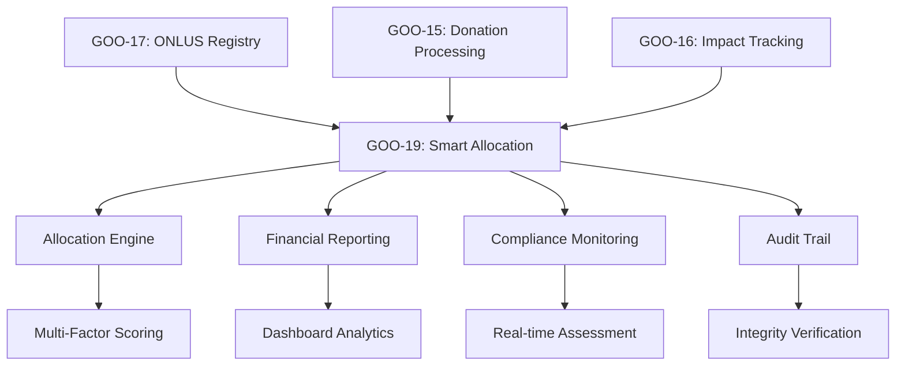

### **Core Components Architecture**

#### **1. Smart Allocation Engine** (`app/onlus/services/allocation_engine_service.py`)

**Multi-Factor Scoring Algorithm**:
```python
def calculate_allocation_score(self, request_data: Dict) -> float:
    """Calculate allocation score using 6-factor weighted algorithm."""

    # Factor weights (total = 1.0)
    WEIGHTS = {
        'funding_gap': 0.25,        # Current funding needs vs. available resources
        'urgency': 0.20,            # Project urgency and deadline pressure
        'performance': 0.20,        # Historical impact and efficiency
        'preferences': 0.15,        # Donor preference alignment
        'efficiency': 0.10,         # Cost-effectiveness ratio
        'seasonal': 0.10            # Seasonal and contextual factors
    }

    # Calculate individual factor scores (0-100 scale)
    funding_gap_score = self._calculate_funding_gap_score(request_data)
    urgency_score = self._calculate_urgency_score(request_data)
    performance_score = self._calculate_performance_score(request_data)
    preferences_score = self._calculate_preferences_score(request_data)
    efficiency_score = self._calculate_efficiency_score(request_data)
    seasonal_score = self._calculate_seasonal_score(request_data)

    # Weighted final score
    final_score = (
        funding_gap_score * WEIGHTS['funding_gap'] +
        urgency_score * WEIGHTS['urgency'] +
        performance_score * WEIGHTS['performance'] +
        preferences_score * WEIGHTS['preferences'] +
        efficiency_score * WEIGHTS['efficiency'] +
        seasonal_score * WEIGHTS['seasonal']
    )

    return round(final_score, 2)
```

**Allocation Request Processing Workflow**:
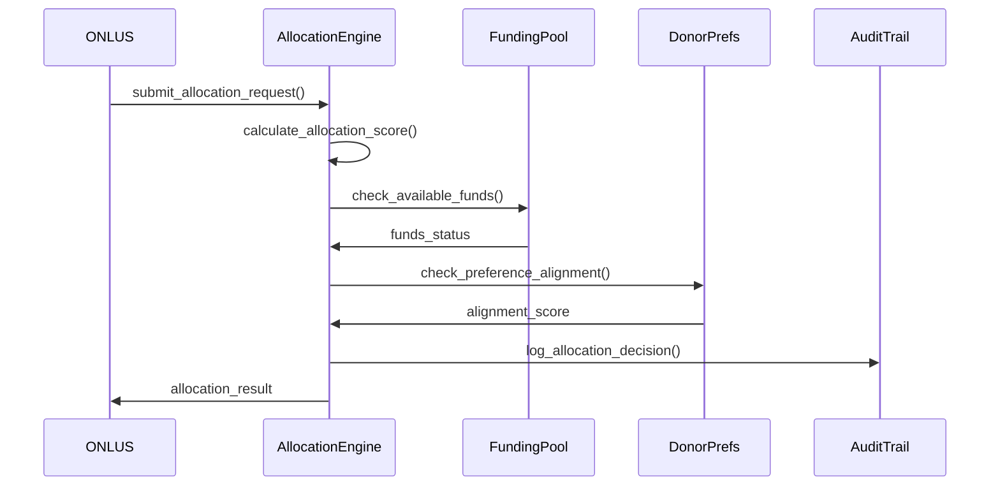

#### **2. Financial Reporting System** (`app/onlus/services/financial_reporting_service.py`)

**Multi-Format Report Generation**:
```python
class FinancialReportingService:
    SUPPORTED_FORMATS = ['pdf', 'csv', 'json']
    REPORT_TYPES = [
        'monthly', 'quarterly', 'annual',
        'donor_statement', 'onlus_statement', 'audit_report'
    ]

    def generate_periodic_report(self, report_type: str, start_date: datetime,
                               end_date: datetime, entity_id: str = None,
                               report_format: str = 'pdf') -> Tuple[bool, str, Dict]:
        """Generate comprehensive periodic financial reports."""

        # 1. Data aggregation and validation
        report_data = self._aggregate_financial_data(report_type, start_date, end_date, entity_id)

        # 2. Analytics and trend calculation
        analytics = self._calculate_financial_analytics(report_data)

        # 3. Format-specific generation
        if report_format == 'pdf':
            file_content = self._generate_pdf_report(report_data, analytics)
        elif report_format == 'csv':
            file_content = self._generate_csv_report(report_data)
        else:  # json
            file_content = self._generate_json_report(report_data, analytics)

        # 4. Report metadata and storage
        report_metadata = self._create_report_metadata(report_type, report_format, file_content)

        return True, "REPORT_GENERATION_SUCCESS", report_metadata
```

**Real-time Analytics Dashboard**:
```python
def get_analytics_dashboard_data(self, period_days: int = 30) -> Dict:
    """Generate real-time financial analytics for dashboard."""

    end_date = datetime.now(timezone.utc)
    start_date = end_date - timedelta(days=period_days)

    # Key Performance Indicators
    dashboard_data = {
        'financial_overview': {
            'total_donations': self._get_total_donations(start_date, end_date),
            'total_allocations': self._get_total_allocations(start_date, end_date),
            'pending_requests': self._get_pending_requests_count(),
            'avg_processing_time': self._calculate_avg_processing_time()
        },
        'allocation_metrics': {
            'allocation_efficiency': self._calculate_allocation_efficiency(),
            'top_performing_onlus': self._get_top_performing_onlus(limit=10),
            'allocation_trends': self._get_allocation_trends(period_days)
        },
        'donor_analytics': {
            'new_donors': self._get_new_donors_count(start_date, end_date),
            'retention_rate': self._calculate_donor_retention_rate(),
            'avg_donation_amount': self._calculate_avg_donation_amount()
        }
    }

    return dashboard_data
```

#### **3. Compliance Monitoring System** (`app/onlus/services/compliance_monitoring_service.py`)

**6-Category Compliance Assessment**:
```python
def conduct_comprehensive_assessment(self, onlus_id: str,
                                   assessment_period_months: int = 12) -> Tuple[bool, str, Dict]:
    """Perform comprehensive compliance assessment with 6-category scoring."""

    # Category weights for overall score calculation
    CATEGORY_WEIGHTS = {
        'financial_transparency': 0.20,     # Financial reporting quality
        'regulatory_compliance': 0.20,      # Legal and regulatory adherence
        'operational_efficiency': 0.15,     # Operational metrics and efficiency
        'governance_quality': 0.15,         # Leadership and governance
        'impact_effectiveness': 0.15,       # Impact measurement and results
        'stakeholder_engagement': 0.15      # Community and stakeholder relations
    }

    # Calculate individual category scores
    category_scores = {}
    for category, weight in CATEGORY_WEIGHTS.items():
        score = self._assess_category(onlus_id, category, assessment_period_months)
        category_scores[category] = score

    # Calculate weighted overall score
    overall_score = sum(score * CATEGORY_WEIGHTS[category]
                       for category, score in category_scores.items())

    # Determine compliance level
    compliance_level = self._determine_compliance_level(overall_score)

    # Generate assessment report
    assessment_data = {
        'onlus_id': onlus_id,
        'overall_score': round(overall_score, 2),
        'compliance_level': compliance_level,
        'category_scores': category_scores,
        'assessment_period_months': assessment_period_months,
        'improvement_recommendations': self._generate_recommendations(category_scores),
        'assessment_date': datetime.now(timezone.utc)
    }

    return True, "COMPLIANCE_ASSESSMENT_SUCCESS", assessment_data
```

**Real-time Monitoring System**:
```python
def monitor_real_time_compliance(self, max_alerts: int = 100) -> Tuple[bool, str, Dict]:
    """Execute real-time compliance monitoring across all organizations."""

    # Get all active organizations
    active_organizations = self.get_active_organizations()

    monitoring_results = {
        'monitoring_session_id': str(uuid.uuid4()),
        'total_organizations_checked': len(active_organizations),
        'alerts_generated': 0,
        'high_risk_organizations': 0,
        'critical_issues_found': 0,
        'alerts': []
    }

    for organization in active_organizations:
        # Check for compliance triggers
        alerts = self._check_compliance_triggers(organization)

        for alert in alerts:
            if len(monitoring_results['alerts']) >= max_alerts:
                break

            monitoring_results['alerts'].append(alert)
            monitoring_results['alerts_generated'] += 1

            if alert['urgency'] in ['high', 'critical']:
                monitoring_results['high_risk_organizations'] += 1

            if alert['urgency'] == 'critical':
                monitoring_results['critical_issues_found'] += 1

    return True, "REAL_TIME_MONITORING_SUCCESS", monitoring_results
```

#### **4. Audit Trail System** (`app/onlus/services/audit_trail_service.py`)

**Cryptographic Integrity Verification**:
```python
def create_audit_entry(self, action_type: str, entity_type: str, entity_id: str,
                      user_id: str, action_data: Dict, ip_address: str = None) -> str:
    """Create audit trail entry with cryptographic integrity."""

    # Create audit entry data
    audit_data = {
        'entry_id': str(uuid.uuid4()),
        'action_type': action_type,
        'entity_type': entity_type,
        'entity_id': entity_id,
        'user_id': user_id,
        'action_data': action_data,
        'ip_address': ip_address,
        'timestamp': datetime.now(timezone.utc).isoformat(),
        'session_id': self._get_current_session_id()
    }

    # Generate integrity hash
    integrity_hash = self._generate_integrity_hash(audit_data)
    audit_data['integrity_hash'] = integrity_hash

    # Store audit entry
    audit_id = self.audit_repo.create_audit_entry(audit_data)

    # Update audit chain
    self._update_audit_chain(audit_id, integrity_hash)

    return audit_id

def _generate_integrity_hash(self, audit_data: Dict) -> str:
    """Generate SHA-256 integrity hash for audit entry."""
    # Create deterministic string representation
    audit_string = json.dumps(audit_data, sort_keys=True, default=str)

    # Generate SHA-256 hash
    hash_object = hashlib.sha256(audit_string.encode('utf-8'))
    return hash_object.hexdigest()
```

### **Database Collections Architecture**

#### **New Collections for GOO-19**

**allocation_requests** Collection:
```javascript
{
  "_id": ObjectId,
  "onlus_id": "uuid",                    // Target ONLUS organization
  "requested_amount": 5000.0,            // Amount requested in EUR
  "approved_amount": 4500.0,             // Amount approved (may differ)
  "allocation_score": 85.5,              // Calculated allocation score (0-100)
  "status": "approved",                  // draft|submitted|pending_review|approved|rejected|allocated|completed
  "priority_level": "high",              // low|medium|high|urgent|emergency
  "project_description": "Emergency relief fund for flood victims",
  "deadline": ISODate("2024-02-15"),     // Project deadline
  "scoring_factors": {                   // Individual factor scores
    "funding_gap": 88.0,
    "urgency": 95.0,
    "performance": 78.0,
    "preferences": 82.0,
    "efficiency": 75.0,
    "seasonal": 85.0
  },
  "approval_conditions": ["Financial audit required", "Progress reports monthly"],
  "allocated_at": ISODate,
  "created_at": ISODate,
  "updated_at": ISODate
}
```

**allocation_results** Collection:
```javascript
{
  "_id": ObjectId,
  "request_id": ObjectId,                // Reference to allocation request
  "allocated_amount": 4500.0,           // Actually allocated amount
  "execution_status": "completed",       // pending|in_progress|completed|failed|cancelled
  "donor_breakdown": [                   // Breakdown by donor contributions
    {
      "donor_id": "donor_789",
      "amount": 1500.0,
      "percentage": 33.33
    }
  ],
  "transaction_ids": ["txn_123", "txn_456"], // Related transaction references
  "efficiency_ratio": 0.92,             // Allocation efficiency metric
  "impact_metrics": {                    // Expected vs actual impact
    "beneficiaries_expected": 100,
    "beneficiaries_actual": 108
  },
  "executed_at": ISODate,
  "created_at": ISODate
}
```

**financial_reports** Collection:
```javascript
{
  "_id": ObjectId,
  "report_id": "report_789",             // Unique report identifier
  "report_type": "quarterly",            // monthly|quarterly|annual|donor_statement|onlus_statement|audit_report
  "report_format": "pdf",                // pdf|csv|json
  "status": "completed",                 // pending|processing|completed|failed|cancelled
  "file_path": "/reports/2024/Q1/quarterly_report_789.pdf",
  "file_size": 2048576,                  // File size in bytes
  "start_date": ISODate("2024-01-01"),
  "end_date": ISODate("2024-03-31"),
  "generated_for_id": "onlus_123",       // Entity ID (ONLUS or donor)
  "report_data": {                       // Structured report data
    "total_donations": 125000.0,
    "total_allocations": 95000.0,
    "efficiency_metrics": {
      "avg_processing_time": 2.5,
      "allocation_success_rate": 0.94
    }
  },
  "access_permissions": ["admin_456", "onlus_123"], // Who can access
  "download_count": 3,
  "last_downloaded_at": ISODate,
  "is_confidential": false,
  "generated_at": ISODate,
  "expires_at": ISODate
}
```

**compliance_scores** Collection:
```javascript
{
  "_id": ObjectId,
  "score_id": "score_456",               // Unique score identifier
  "onlus_id": "onlus_123",              // Target ONLUS organization
  "overall_score": 87.5,                 // Overall compliance score (0-100)
  "compliance_level": "good",            // excellent|good|satisfactory|needs_improvement|critical
  "category_scores": {                   // Individual category scores
    "financial_transparency": 90.0,
    "regulatory_compliance": 85.0,
    "operational_efficiency": 88.5,
    "governance_quality": 87.0,
    "impact_effectiveness": 89.0,
    "stakeholder_engagement": 85.5
  },
  "compliance_issues": [                 // Open compliance issues
    {
      "issue_id": "issue_123",
      "issue_type": "documentation_incomplete",
      "description": "Annual financial statement not submitted",
      "severity": "medium",              // low|medium|high|critical
      "status": "open",                  // open|in_progress|resolved|dismissed
      "created_at": ISODate,
      "due_date": ISODate
    }
  ],
  "monitoring_alerts": [                 // Active monitoring alerts
    {
      "alert_id": "alert_456",
      "alert_type": "compliance_threshold",
      "message": "Compliance score below 80%",
      "urgency": "medium",               // low|medium|high|critical
      "triggered_at": ISODate,
      "is_dismissed": false
    }
  ],
  "improvement_recommendations": [       // Suggested improvements
    "Submit annual financial statements",
    "Update board member information",
    "Complete governance training"
  ],
  "assessment_period_months": 12,
  "is_current": true,                    // Whether this is the current/latest score
  "assessment_date": ISODate,
  "assessor_id": "admin_456",           // ID of the assessor
  "verification": {
    "is_verified": false,
    "verified_by": null,
    "verification_date": null,
    "verification_notes": null
  },
  "created_at": ISODate
}
```

**audit_trail** Collection:
```javascript
{
  "_id": ObjectId,
  "entry_id": "audit_789",              // Unique audit entry identifier
  "action_type": "allocation_approved",  // Type of action performed
  "entity_type": "allocation_request",   // Type of entity affected
  "entity_id": "req_123",               // ID of the affected entity
  "user_id": "admin_456",               // User who performed the action
  "action_data": {                      // Detailed action information
    "previous_status": "pending_review",
    "new_status": "approved",
    "approved_amount": 4500.0,
    "conditions": ["Monthly progress reports required"]
  },
  "ip_address": "192.168.1.100",       // User's IP address
  "session_id": "session_789",          // User session identifier
  "integrity_hash": "a1b2c3d4e5f6...", // SHA-256 integrity hash
  "previous_entry_hash": "f6e5d4c3b2a1...", // Hash of previous audit entry
  "timestamp": ISODate,
  "metadata": {
    "user_agent": "Mozilla/5.0...",
    "system_version": "v1.2.0",
    "processing_time_ms": 125
  }
}
```

### **Performance Optimization Architecture**

#### **Database Index Strategy**
```python
# Allocation optimization indexes
allocation_requests.create_index([("allocation_score", -1), ("status", 1)])
allocation_requests.create_index([("onlus_id", 1), ("status", 1), ("created_at", -1)])
allocation_requests.create_index([("deadline", 1), ("priority_level", 1)])

# Financial reporting indexes
financial_reports.create_index([("report_type", 1), ("status", 1), ("generated_at", -1)])
financial_reports.create_index([("generated_for_id", 1), ("report_type", 1)])

# Compliance monitoring indexes
compliance_scores.create_index([("onlus_id", 1), ("is_current", 1)])
compliance_scores.create_index([("overall_score", 1), ("compliance_level", 1)])
compliance_scores.create_index([("assessment_date", -1), ("is_current", 1)])

# Audit trail indexes
audit_trail.create_index([("entity_type", 1), ("entity_id", 1), ("timestamp", -1)])
audit_trail.create_index([("user_id", 1), ("action_type", 1), ("timestamp", -1)])
audit_trail.create_index([("timestamp", -1)], {"expireAfterSeconds": 2592000})  # 30 days TTL
```

#### **Caching Strategy**
```python
# Redis caching for frequently accessed data
CACHE_KEYS = {
    'allocation_scores': 'allocation:onlus:{onlus_id}:score',         # TTL: 30 minutes
    'financial_dashboard': 'financial:dashboard:{period}',            # TTL: 15 minutes
    'compliance_summary': 'compliance:onlus:{onlus_id}:summary',     # TTL: 10 minutes
    'audit_summary': 'audit:user:{user_id}:summary',                # TTL: 60 minutes
    'top_performers': 'allocation:top_performers:{period}',          # TTL: 1 hour
}
```

### **API Architecture**

#### **33 New REST Endpoints**

**Smart Allocation Endpoints** (8 endpoints):
```python
POST   /api/onlus/allocations/request                    # Create allocation request
GET    /api/onlus/allocations/{request_id}               # Get request details
POST   /api/onlus/allocations/{request_id}/approve       # Approve request (admin)
POST   /api/onlus/allocations/{request_id}/reject        # Reject request (admin)
POST   /api/onlus/allocations/batch/process              # Batch processing (admin)
GET    /api/onlus/allocations/emergency                  # Emergency allocations
POST   /api/onlus/allocations/{request_id}/execute       # Execute allocation
GET    /api/onlus/allocations/statistics                 # Allocation statistics
```

**Financial Reporting Endpoints** (8 endpoints):
```python
POST   /api/onlus/financial/reports                      # Generate report
GET    /api/onlus/financial/reports                      # List reports
GET    /api/onlus/financial/reports/{report_id}          # Get specific report
POST   /api/onlus/financial/reports/{report_id}/export   # Export report data
GET    /api/onlus/financial/analytics/dashboard          # Analytics dashboard
POST   /api/onlus/financial/donor/{donor_id}/statement   # Generate donor statement
POST   /api/onlus/financial/onlus/{onlus_id}/summary     # Generate ONLUS summary
GET    /api/onlus/financial/reports/statistics           # Reports statistics
```

**Compliance Monitoring Endpoints** (17 endpoints):
```python
POST   /api/onlus/compliance/assessment/{onlus_id}       # Conduct assessment
GET    /api/onlus/compliance/score/{onlus_id}/current    # Get current score
GET    /api/onlus/compliance/score/{onlus_id}/history    # Get score history
POST   /api/onlus/compliance/monitoring/real-time        # Real-time monitoring
GET    /api/onlus/compliance/dashboard                   # Compliance dashboard
GET    /api/onlus/compliance/high-risk                   # High-risk organizations
GET    /api/onlus/compliance/critical-issues             # Critical issues
POST   /api/onlus/compliance/score/{score_id}/issue      # Add compliance issue
POST   /api/onlus/compliance/score/{score_id}/issue/{issue_id}/resolve  # Resolve issue
POST   /api/onlus/compliance/score/{score_id}/alert      # Add monitoring alert
POST   /api/onlus/compliance/score/{score_id}/alert/{alert_id}/dismiss  # Dismiss alert
POST   /api/onlus/compliance/score/{score_id}/verify     # Verify assessment
GET    /api/onlus/compliance/statistics                  # Compliance statistics
GET    /api/onlus/compliance/trends                      # Compliance trends
GET    /api/onlus/compliance/alerts/report               # Alerts report
GET    /api/onlus/compliance/assessment-due              # Assessments due
GET    /api/onlus/compliance/top-performers              # Top performers
```

### **Security Architecture**

#### **Multi-Layer Security Implementation**

**1. Input Validation Layer**:
```python
def validate_allocation_request(self, data: Dict) -> Optional[str]:
    """Validate allocation request input data."""

    # Required field validation
    required_fields = ['onlus_id', 'requested_amount', 'project_description']
    for field in required_fields:
        if not data.get(field):
            return f"MISSING_REQUIRED_FIELD: {field}"

    # Amount validation
    amount = data.get('requested_amount')
    if not isinstance(amount, (int, float)) or amount <= 0:
        return "INVALID_AMOUNT_RANGE"

    if amount > 1000000:  # Max 1M EUR per request
        return "AMOUNT_EXCEEDS_MAXIMUM"

    # Description validation
    description = data.get('project_description', '')
    if len(description) < 50 or len(description) > 2000:
        return "INVALID_DESCRIPTION_LENGTH"

    return None
```

**2. Authorization Layer**:
```python
@admin_required
@rate_limit(limit=10, per=60)  # 10 requests per minute for admins
def approve_allocation_request(current_user, request_id):
    """Approve allocation request - Admin only."""

    # Verify admin has allocation approval permissions
    if not current_user.has_permission('allocation_approval'):
        return error_response("INSUFFICIENT_PERMISSIONS", status_code=403)

    # Check for conflicts of interest
    if self._has_conflict_of_interest(current_user['user_id'], request_id):
        return error_response("CONFLICT_OF_INTEREST", status_code=403)
```

**3. Data Integrity Layer**:
```python
def verify_audit_trail_integrity(self, start_date: datetime, end_date: datetime) -> Dict:
    """Verify audit trail integrity using hash chains."""

    audit_entries = self.audit_repo.get_entries_by_date_range(start_date, end_date)
    integrity_report = {
        'total_entries': len(audit_entries),
        'verified_entries': 0,
        'integrity_violations': [],
        'chain_breaks': []
    }

    previous_hash = None
    for entry in audit_entries:
        # Verify individual entry hash
        calculated_hash = self._calculate_entry_hash(entry)
        if calculated_hash != entry['integrity_hash']:
            integrity_report['integrity_violations'].append({
                'entry_id': entry['entry_id'],
                'expected_hash': entry['integrity_hash'],
                'calculated_hash': calculated_hash
            })
        else:
            integrity_report['verified_entries'] += 1

        # Verify hash chain
        if previous_hash and entry['previous_entry_hash'] != previous_hash:
            integrity_report['chain_breaks'].append({
                'entry_id': entry['entry_id'],
                'expected_previous': previous_hash,
                'actual_previous': entry['previous_entry_hash']
            })

        previous_hash = entry['integrity_hash']

    return integrity_report
```

### **Integration Points with Existing Modules**

#### **GOO-19 → GOO-17 Integration**:
```python
# ONLUS verification status affects allocation eligibility
def check_allocation_eligibility(self, onlus_id: str) -> Tuple[bool, str]:
    """Check if ONLUS is eligible for allocation."""

    # Get ONLUS from registry (GOO-17)
    organization = self.onlus_service.get_organization(onlus_id)
    if not organization:
        return False, "ONLUS_NOT_FOUND"

    # Check verification status
    if organization.status != OrganizationStatus.ACTIVE.value:
        return False, "ONLUS_NOT_ACTIVE"

    # Check compliance status
    if organization.compliance_status == ComplianceStatus.SUSPENDED.value:
        return False, "ONLUS_COMPLIANCE_SUSPENDED"

    # Check compliance score threshold
    if organization.compliance_score < 60:
        return False, "ONLUS_COMPLIANCE_SCORE_TOO_LOW"

    return True, "ALLOCATION_ELIGIBLE"
```

#### **GOO-19 → GOO-15 Integration**:
```python
# Allocation execution triggers donation processing
def execute_allocation(self, allocation_result_id: str) -> Tuple[bool, str, Dict]:
    """Execute approved allocation through donation system."""

    allocation_result = self.allocation_result_repo.get_result_by_id(allocation_result_id)

    # Process through GOO-15 donation system
    for donor_allocation in allocation_result.donor_breakdown:
        donation_data = {
            'user_id': donor_allocation['donor_id'],
            'amount': donor_allocation['amount'],
            'onlus_id': allocation_result.onlus_id,
            'allocation_reference': allocation_result_id
        }

        success, message, result = self.donation_service.process_automatic_donation(donation_data)
        if not success:
            # Rollback and report failure
            return False, f"DONATION_PROCESSING_FAILED: {message}", None

    # Update allocation result
    allocation_result.mark_completed()

    return True, "ALLOCATION_EXECUTED_SUCCESS", allocation_result.to_dict()
```

### **Monitoring & Observability**

#### **Key Performance Indicators**
```python
MONITORING_METRICS = {
    # Allocation Performance
    'allocation_scoring_time': {'threshold': '< 500ms', 'alert': 'medium'},
    'allocation_approval_rate': {'threshold': '> 80%', 'alert': 'low'},
    'emergency_allocation_time': {'threshold': '< 1hour', 'alert': 'critical'},

    # Financial Reporting
    'report_generation_time': {'threshold': '< 5min', 'alert': 'high'},
    'dashboard_load_time': {'threshold': '< 2s', 'alert': 'medium'},
    'report_accuracy_rate': {'threshold': '> 99%', 'alert': 'critical'},

    # Compliance Monitoring
    'compliance_assessment_completion': {'threshold': '< 2hours', 'alert': 'high'},
    'real_time_monitoring_latency': {'threshold': '< 10s', 'alert': 'medium'},
    'critical_issues_resolution_time': {'threshold': '< 24hours', 'alert': 'critical'},

    # System Health
    'audit_trail_integrity_rate': {'threshold': '100%', 'alert': 'critical'},
    'api_error_rate': {'threshold': '< 0.1%', 'alert': 'high'},
    'database_query_time_p95': {'threshold': '< 1s', 'alert': 'medium'}
}
```

#### **Alerting Configuration**
```python
# Real-time alerting for critical events
CRITICAL_ALERTS = {
    'allocation_fraud_detected': {
        'notification_channels': ['email', 'slack', 'sms'],
        'escalation_time': '5_minutes',
        'severity': 'critical'
    },
    'compliance_critical_violation': {
        'notification_channels': ['email', 'slack'],
        'escalation_time': '15_minutes',
        'severity': 'high'
    },
    'audit_integrity_breach': {
        'notification_channels': ['email', 'slack', 'sms', 'pagerduty'],
        'escalation_time': 'immediate',
        'severity': 'critical'
    }
}
```

### **Deployment Considerations**

#### **Environment Configuration**
```bash
# GOO-19 specific environment variables
ALLOCATION_SCORING_CACHE_TTL=1800
FINANCIAL_REPORT_RETENTION_DAYS=2555  # 7 years
COMPLIANCE_ASSESSMENT_TIMEOUT=7200
AUDIT_TRAIL_ENCRYPTION_KEY=${ENCRYPTION_KEY}
MAX_ALLOCATION_AMOUNT=1000000
EMERGENCY_ALLOCATION_THRESHOLD=24  # hours
REAL_TIME_MONITORING_INTERVAL=300  # 5 minutes
```

#### **Background Job Configuration**
```python
# Scheduled tasks for GOO-19
@scheduler.task('cron', hour=0, minute=0)  # Daily at midnight
def daily_compliance_monitoring():
    ComplianceMonitoringService().monitor_real_time_compliance()

@scheduler.task('cron', hour=6, minute=0, day=1)  # Monthly reports
def generate_monthly_financial_reports():
    FinancialReportingService().generate_monthly_reports()

@scheduler.task('interval', minutes=15)  # Allocation scoring updates
def update_allocation_scores():
    AllocationEngineService().recalculate_pending_scores()

@scheduler.task('interval', minutes=5)  # Audit trail integrity checks
def verify_audit_integrity():
    AuditTrailService().verify_recent_integrity()
```

---

*Architecture documentation - GoodPlay Backend v1.3*
*Last updated: September 29, 2025*
*Includes GOO-14 Virtual Wallet, GOO-15 Donation Processing, GOO-16 Impact Tracking, GOO-17 ONLUS Registry, and GOO-19 Smart Allocation & Financial Control*