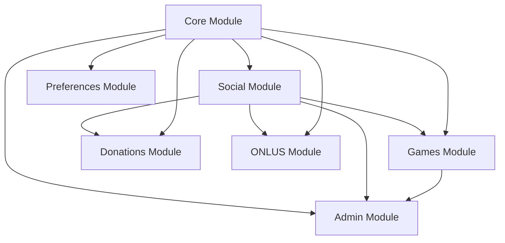
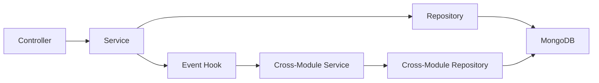

# 🏗️ GoodPlay Backend Architecture Documentation

## 📋 Overview

The GoodPlay Backend is a Flask-based REST API using MongoDB, designed with a modular architecture following Repository Pattern, Service Layer, and Event-Driven design principles. This document provides a comprehensive technical overview of the system architecture, initialization flow, and component interactions.

## 🚀 Application Startup Sequence

### 1. **Entry Point** (`app.py`)

```python
from app import create_app

app = create_app()

if __name__ == '__main__':
    app.run(host='0.0.0.0', port=5003, debug=True)
```

### 2. **Application Factory** (`app/__init__.py`)

The startup follows this precise sequence:

#### 2.1 **Core Flask Setup**
```python
def create_app(config_name=None):
    # 1. Environment detection
    config_name = os.environ.get('FLASK_ENV', 'default')

    # 2. Flask app instantiation
    app = Flask(__name__)
    app.config.from_object(config[config_name])

    # 3. JWT initialization
    jwt.init_app(app)

    # 4. CORS configuration
    CORS(app, origins=app.config['CORS_ORIGINS'])
```

#### 2.2 **Database Initialization**
```python
def init_db(app):
    # 1. MongoDB client connection
    mongo_client = MongoClient(app.config['MONGO_URI'])
    mongo_db = mongo_client[app.config['MONGO_DB_NAME']]

    # 2. Core repository index creation
    user_repo = UserRepository()
    user_repo.create_indexes()
```

#### 2.3 **Logging Setup**
```python
def init_logging(app):
    # 1. File handler configuration (production)
    # 2. Log level setting
    # 3. Formatter application
```

### 3. **Module Registration Sequence**

The modules are registered in this specific order to handle dependencies:

#### 3.1 **Core Modules** (No dependencies)
```python
# Auth and User management
app.register_blueprint(auth_bp, url_prefix='/api/auth')
app.register_blueprint(user_bp, url_prefix='/api/user')
app.register_blueprint(preferences_blueprint)  # User preferences
```

#### 3.2 **Social Module** (Depends on Core)
```python
# Social features and Impact Score system
register_social_module(app)
```

**Social Module Initialization** (`app/social/__init__.py`):
1. **Blueprint Registration**:
   - `social_bp` → `/api/social`
   - `leaderboards_bp` → `/api/social`
   - `social_challenges_bp` → `/api/social/challenges`

2. **Achievement System**:
   - `achievement_bp` → `/api/achievements`
   - Default achievements initialization
   - Achievement repository indexes

3. **Database Index Creation**:
   - RelationshipRepository
   - ImpactScoreRepository
   - LeaderboardRepository
   - Social challenge repositories (4 total)

4. **Event Hook Registration**:
   ```python
   from .leaderboards.integration.hooks import register_integration_hooks
   with app.app_context():
       register_integration_hooks()
   ```

#### 3.3 **Games Module** (Depends on Core + Social for hooks)
```python
# Game engine and session management
games_bp = create_games_blueprint()
app.register_blueprint(games_bp)

# Game modes system
modes_bp = create_modes_blueprint()
app.register_blueprint(modes_bp)

# Challenge system
challenges_bp = create_challenges_blueprint()
app.register_blueprint(challenges_bp)

# Teams and tournaments
teams_bp = create_teams_blueprint()
app.register_blueprint(teams_bp)
```

**Games Module Initialization** (`app/games/__init__.py`):
```python
def init_games_module():
    # 1. Database indexes
    game_repo = GameRepository()
    session_repo = GameSessionRepository()
    game_repo.create_indexes()
    session_repo.create_indexes()

    # 2. Mode system initialization
    mode_manager = ModeManager()
    mode_manager.initialize_system()

    # 3. Plugin discovery and loading
    discovered_plugins = plugin_manager.discover_plugins()
```

#### 3.4 **Health Check Registration**
```python
@app.route('/api/health', methods=['GET'])
def health_check():
    return {'status': 'healthy', 'message': 'API is running'}, 200
```

## 🏛️ Modular Architecture

### 📊 Module Structure

Each module follows the same architectural pattern:

```
app/{module}/
├── models/          # Data models and validation
├── repositories/    # Data access layer
├── services/        # Business logic layer
├── controllers/     # HTTP request handlers
└── __init__.py      # Module registration
```

### 🔗 Dependency Hierarchy



### 📋 Module Responsibilities

#### **Core Module** (`app/core/`)
- **Purpose**: Foundation services and authentication
- **Components**:
  - User management and authentication
  - JWT token handling
  - Base repository and service classes
  - Utility functions and decorators
- **Database Collections**: `users`, `configs`
- **Dependencies**: None (foundation layer)

#### **Social Module** (`app/social/`)
- **Purpose**: Social features and gamification
- **Components**:
  - User relationships and friendships
  - Impact Score system and leaderboards
  - Achievement engine and badge system
  - Social challenges and competitions
- **Database Collections**:
  - `user_relationships`
  - `user_impact_scores`
  - `leaderboards`
  - `achievements`, `user_achievements`
  - `social_challenges`
- **Dependencies**: Core (for users and auth)

#### **Games Module** (`app/games/`)
- **Purpose**: Game engine and session management
- **Components**:
  - Game plugin system
  - Session management with sync
  - Game modes and scheduling
  - Direct challenges (1v1, NvN)
  - Global teams and tournaments
  - Universal scoring system
- **Database Collections**:
  - `games`, `game_sessions`
  - `game_modes`, `mode_schedules`
  - `challenges`, `challenge_participants`
  - `global_teams`, `team_members`, `tournaments`
- **Dependencies**: Core (users), Social (impact score hooks)

#### **Other Modules** (Future implementation)
- **Donations**: Payment processing and wallet management
- **ONLUS**: Charity organization management
- **Admin**: Administrative interface and controls

## 🎯 Design Patterns

### 🏗️ Repository Pattern

**Base Repository** (`app/core/repositories/base_repository.py`):
```python
class BaseRepository:
    def __init__(self, collection_name: str)
    def find_by_id(self, id: str) → Optional[Dict]
    def find_all(self, filter: Dict = None) → List[Dict]
    def create(self, data: Dict) → str
    def update(self, id: str, data: Dict) → bool
    def delete(self, id: str) → bool
    def create_indexes(self) → None  # Abstract method
```

**Implementation Example**:
```python
class UserRepository(BaseRepository):
    def __init__(self):
        super().__init__('users')

    def find_by_email(self, email: str) → Optional[User]
    def create_indexes(self):
        # MongoDB index creation
        self.collection.create_index([('email', 1)], unique=True)
```

### 🔧 Service Layer Pattern

**Base Service Structure**:
```python
class BaseService:
    def __init__(self, repository: BaseRepository)

    # Standard return format: Tuple[bool, str, Optional[Dict]]
    def method_name(self, params) → Tuple[bool, str, Optional[Dict]]:
        try:
            # 1. Validation
            validation_error = self._validate_input(params)
            if validation_error:
                return False, validation_error, None

            # 2. Business logic
            result = self._execute_business_logic(params)

            # 3. Logging
            current_app.logger.info(f"Operation successful")
            return True, "SUCCESS_MESSAGE", result

        except Exception as e:
            current_app.logger.error(f"Operation failed: {str(e)}")
            return False, "ERROR_MESSAGE", None
```

### 🎮 Controller Pattern

**Base Controller Structure**:
```python
@blueprint.route('/endpoint', methods=['POST'])
@auth_required
def endpoint_handler(current_user):
    try:
        # 1. Input validation
        data = request.get_json()
        if not data:
            return error_response("DATA_REQUIRED")

        # 2. Service call
        success, message, result = service.method(data)

        # 3. Response formatting
        if success:
            return success_response(message, result)
        else:
            return error_response(message)

    except Exception as e:
        current_app.logger.error(f"Endpoint error: {str(e)}")
        return error_response("INTERNAL_SERVER_ERROR", status_code=500)
```

### 🪝 Event-Driven Pattern

**Hook System Architecture**:
```python
# 1. Event Registration (at startup)
hook_manager.register_hook('event_name', handler_function)

# 2. Event Triggering (in controllers)
trigger_event_name(user_id, event_data)

# 3. Event Processing (automatic)
def handler_function(user_id, event_data):
    # Process event and update systems
    return success_status
```

## 🎯 Cross-Module Integration

### 📡 Event Hook System

The event hook system enables loose coupling between modules:

#### **Registration Phase** (Startup)
```python
# In app/social/__init__.py
from .leaderboards.integration.hooks import register_integration_hooks

with app.app_context():
    register_integration_hooks()
```

**Registered Events**:
- `game_session_complete` - Game sessions ending
- `social_activity` - Social interactions
- `donation_complete` - Payment completions
- `achievement_unlock` - Achievement unlocks
- `user_login` - User login events
- `weekly_reset` - Periodic system resets
- `tournament_complete` - Tournament endings

#### **Triggering Phase** (Runtime)
```python
# In games controller
from app.social.leaderboards.integration.hooks import trigger_game_session_complete

success, message, result = session_service.end_game_session(session_id, reason)
if success:
    trigger_game_session_complete(
        str(session_data['user_id']),
        session_data
    )
```

#### **Processing Phase** (Automatic)
```python
# In event handler
def handle_game_session_complete(user_id: str, session_data: Dict):
    # Update Impact Score
    ranking_engine.trigger_user_score_update(user_id, 'gaming', activity_data)
    return True
```

### 🔄 Data Flow



## 📊 Database Architecture

### 🏗️ MongoDB Collections Structure

#### **Core Collections**
- `users` - User accounts and authentication
  - Indexes: `email` (unique), `created_at`
- `configs` - System configuration
  - Indexes: `key` (unique)

#### **Social Collections**
- `user_relationships` - Friend connections
  - Indexes: `user_id`, `friend_id`, `status`
- `user_impact_scores` - Gamification scores
  - Indexes: `user_id` (unique), `impact_score`, `rank_global`
- `leaderboards` - Ranking tables
  - Indexes: `leaderboard_type`, `time_period`, `rank`
- `achievements` - Achievement definitions
  - Indexes: `achievement_id` (unique), `category`, `is_active`
- `user_achievements` - User progress tracking
  - Indexes: `user_id`, `achievement_id`, `completed_at`

#### **Games Collections**
- `games` - Game definitions
  - Indexes: `game_id` (unique), `is_active`
- `game_sessions` - Active game sessions
  - Indexes: `user_id`, `game_id`, `status`, `created_at`
- `game_modes` - Temporary game modes
  - Indexes: `name` (unique), `is_active`, `start_date`, `end_date`
- `challenges` - Direct player challenges
  - Indexes: `challenger_id`, `status`, `game_id`, `created_at`
- `global_teams` - Team definitions
  - Indexes: `team_id` (unique), `is_active`
- `team_members` - Team membership
  - Indexes: `user_id`, `team_id`, `role`

### 📈 Index Strategy

**Performance Considerations**:
1. **Query Pattern Analysis**: Indexes based on common query patterns
2. **Compound Indexes**: Multi-field indexes for complex queries
3. **Unique Constraints**: Data integrity enforcement
4. **TTL Indexes**: Automatic data cleanup (sessions, temporary data)

**Index Creation Timing**:
- **Startup**: All indexes created during module initialization
- **Testing Mode**: Index creation skipped to prevent DB connection requirements

## 🔧 Configuration Management

### 🌍 Environment-Based Configuration

**Configuration Structure** (`config/settings.py`):
```python
class Config:
    # Base configuration
    SECRET_KEY = os.environ.get('SECRET_KEY')
    JWT_SECRET_KEY = os.environ.get('JWT_SECRET_KEY')
    MONGO_URI = os.environ.get('MONGO_URI')

class DevelopmentConfig(Config):
    DEBUG = True
    LOG_LEVEL = 'DEBUG'

class ProductionConfig(Config):
    DEBUG = False
    LOG_LEVEL = 'INFO'

config = {
    'development': DevelopmentConfig,
    'production': ProductionConfig,
    'default': DevelopmentConfig
}
```

### 🔐 Security Configuration

**JWT Settings**:
- Access token expiration: 1 hour
- Refresh token expiration: 30 days
- Token blacklisting support

**CORS Configuration**:
- Environment-specific origins
- Development: `http://localhost:3000`
- Production: Configured domains only

## 🧪 Testing Architecture

### 🔬 Testing Strategy

**Test Structure**:
```
tests/
├── conftest.py              # Shared fixtures and configuration
├── test_core_auth.py        # Core authentication tests (47 tests)
├── test_preferences.py      # Preferences module tests (35 tests)
├── test_social.py          # Social features tests (28 tests)
├── test_games.py           # Game engine tests (32 tests)
└── test_integration.py     # Cross-module integration tests
```

**Testing Patterns**:
- **Service Tests**: Mock repository dependencies
- **Controller Tests**: Mock services, test API contracts
- **Repository Tests**: Mock database operations
- **Integration Tests**: Test full request/response cycles

**Mock Strategy**:
```python
# Database mocking
@pytest.fixture
def mock_db(monkeypatch):
    mock_collection = MagicMock()
    monkeypatch.setattr('app.core.database.get_db', lambda: mock_db)

# Service mocking
@pytest.fixture
def mock_user_service(monkeypatch):
    mock_service = MagicMock()
    monkeypatch.setattr('app.core.services.user_service', mock_service)
```

### 📊 Testing Configuration

**Environment Variables**:
```python
# In conftest.py
os.environ['TESTING'] = 'true'
os.environ['SKIP_DB_INIT'] = '1'
```

**Index Creation Control**:
```python
def create_indexes(self):
    if os.getenv('TESTING') == 'true':
        return  # Skip index creation in tests
    # Normal index creation
```

## 🚀 Performance Considerations

### ⚡ Optimization Strategies

**Database Optimization**:
- Compound indexes for complex queries
- Query result pagination
- Connection pooling
- Index usage monitoring

**Application Optimization**:
- Service layer caching
- Lazy loading for related data
- Async processing for heavy operations
- Event hook non-blocking execution

**Memory Management**:
- Repository instance reuse
- Service singleton pattern
- Connection pool optimization

### 📈 Scalability Design

**Horizontal Scaling Readiness**:
- Stateless service design
- Database connection abstraction
- Event-driven architecture
- Load balancer friendly

**Monitoring Integration Points**:
- Request/response timing
- Database query performance
- Event processing metrics
- Error rate tracking

## 🔮 Future Architecture Evolution

### 🎯 Planned Improvements

**Event System Enhancement**:
- Redis/Kafka integration for distributed events
- Event sourcing implementation
- Replay capability for debugging

**Microservices Migration Path**:
- Module extraction strategy
- API gateway implementation
- Service mesh integration

**Performance Enhancements**:
- Caching layer (Redis)
- Background job processing (Celery)
- Real-time features (WebSocket)

**Development Experience**:
- Auto-generated API documentation
- Development tooling integration
- Enhanced debugging capabilities

---

*Architecture documentation - GoodPlay Backend v1.0*
*Last updated: September 26, 2025*