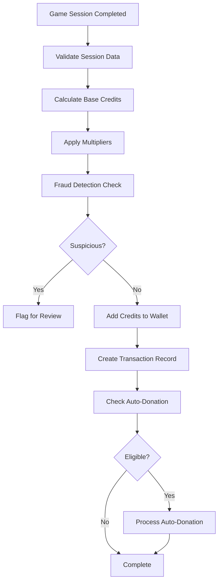
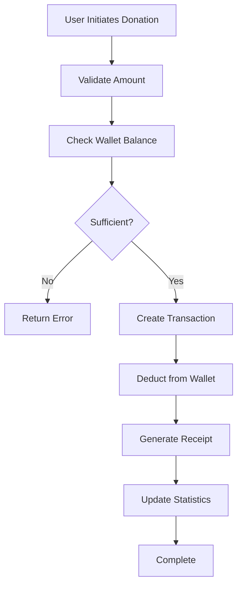

# GOO-14: Virtual Wallet & Credit System - Technical Documentation

## 📋 Overview

Il sistema Virtual Wallet & Credit System (GOO-14) è una piattaforma completa per la gestione di crediti virtuali derivanti dal gameplay, con conversione automatica del tempo di gioco in crediti e sistema di donazioni trasparente. Il sistema è progettato per massimizzare l'engagement sociale attraverso meccaniche di gamification e impact tracking.

## 🏗️ Architettura del Sistema

### Struttura Modulare

```
app/donations/
├── models/                 # Modelli dati
│   ├── wallet.py          # Gestione portafoglio virtuale
│   ├── transaction.py     # Audit trail completo
│   └── conversion_rate.py # Sistema tassi e moltiplicatori
├── repositories/          # Accesso ai dati
│   ├── wallet_repository.py
│   ├── transaction_repository.py
│   └── conversion_rate_repository.py
└── services/             # Logica di business
    ├── credit_calculation_service.py  # Calcolo crediti
    └── wallet_service.py             # Gestione portafoglio
```

### Design Patterns Utilizzati

1. **Repository Pattern**: Astrazione dell'accesso ai dati
2. **Service Layer**: Separazione della logica di business
3. **Factory Pattern**: Creazione di transazioni tipizzate
4. **Observer Pattern**: Auto-donation triggers
5. **Strategy Pattern**: Diversi algoritmi di calcolo crediti

## 💰 Sistema di Conversione Crediti

### Tassi Base

```python
BASE_RATE = 0.01  # €0.01 per minuto di gioco

MULTIPLIERS = {
    'tournament': 2.0,      # Modalità torneo
    'challenge': 1.5,       # Sfide dirette
    'daily_streak': 1.2,    # Streak giornaliero
    'weekend': 1.1,         # Bonus weekend
    'special_event': 3.0,   # Eventi speciali
    'loyalty': 1.3,         # Fedeltà utente
    'first_time': 2.0       # Prima volta
}
```

### Algoritmo di Calcolo

```python
def calculate_credits(play_duration_ms, multipliers):
    # 1. Conversione da millisecondi a minuti
    minutes = play_duration_ms / (1000 * 60)

    # 2. Calcolo crediti base
    base_credits = minutes * BASE_RATE

    # 3. Applicazione moltiplicatori (additivi)
    total_multiplier = 1.0
    for multiplier in multipliers:
        total_multiplier += (MULTIPLIER_VALUES[multiplier] - 1.0)

    # 4. Calcolo finale
    final_credits = round(base_credits * total_multiplier, 2)

    return final_credits
```

### Integrazione con GOO-9

Il sistema si integra perfettamente con la gestione sessioni di GOO-9:

```python
# Da GameSession (GOO-9)
play_duration_ms = session.get_precise_play_duration_ms()

# Esclude automaticamente tempo in pausa
# Utilizza tracking millisecondi per precisione
```

## 🏦 Modello Wallet

### Struttura Dati

```python
class Wallet:
    user_id: str                    # Identificativo utente
    current_balance: float          # Saldo attuale in EUR
    total_earned: float            # Totale guadagnato
    total_donated: float           # Totale donato
    auto_donation_settings: dict   # Configurazioni auto-donazione
    version: int                   # Versione per ottimistic locking
    created_at: datetime
    updated_at: datetime
```

### Auto-Donation System

```python
auto_donation_settings = {
    'enabled': True,               # Attivazione auto-donazione
    'threshold': 50.0,            # Soglia di attivazione (EUR)
    'percentage': 25,             # Percentuale da donare (1-100%)
    'preferred_onlus_id': 'xxx',  # ONLUS preferita
    'round_up_enabled': False     # Arrotondamento micro-donazioni
}

# Logica di calcolo
def calculate_auto_donation_amount(self):
    if not self.should_auto_donate():
        return 0.0

    excess = self.current_balance - self.threshold
    donation_amount = excess * (self.percentage / 100)

    return round(donation_amount, 2)
```

### Sicurezza e Validazione

1. **Optimistic Locking**: Prevenzione race conditions
2. **Rate Limiting**: Max €1000/giorno per utente
3. **Balance Validation**: Controllo consistenza saldi
4. **Transaction Integrity**: Validazione atomica operazioni

## 📝 Sistema Transazioni

### Tipi di Transazione

```python
class TransactionType(Enum):
    EARNED = "earned"         # Crediti guadagnati
    BONUS = "bonus"           # Bonus speciali
    DONATED = "donated"       # Donazioni effettuate
    REFUND = "refund"         # Rimborsi
    ADJUSTMENT = "adjustment" # Aggiustamenti manuali
    FEE = "fee"              # Commissioni
```

### Stati Transazione

```python
class TransactionStatus(Enum):
    PENDING = "pending"       # In attesa di elaborazione
    COMPLETED = "completed"   # Completata con successo
    FAILED = "failed"         # Fallita
    CANCELLED = "cancelled"   # Cancellata
    REFUNDED = "refunded"     # Rimborsata
```

### Audit Trail Completo

Ogni transazione include:

- **Metadata Completa**: Sessione di gioco, moltiplicatori applicati, device info
- **Tracciabilità**: Timestamp creazione, elaborazione, ultima modifica
- **Receipt Generation**: Ricevute dettagliate per donazioni
- **Fraud Indicators**: Rilevamento pattern sospetti

## 🛡️ Sistema Anti-Frode

### Indicatori di Rischio

```python
def check_fraud_indicators(session_data, credits_earned, multiplier):
    indicators = []

    # 1. Controllo importi elevati
    if credits_earned > 100:
        indicators.append('high_earnings')

    # 2. Moltiplicatori sospetti
    if multiplier > 5.0:
        indicators.append('high_multiplier')

    # 3. Sessioni troppo lunghe
    if play_hours > 8:
        indicators.append('long_session')

    # 4. Orari sospetti (automazione)
    if current_hour < 4 or current_hour > 23:
        indicators.append('off_hours')

    # 5. Pattern temporali
    if rapid_succession_detected():
        indicators.append('rapid_succession')

    return indicators
```

### Limiti di Sicurezza

- **Sessione Minima**: 10 secondi
- **Sessione Massima**: 24 ore
- **Guadagno Giornaliero**: €1000 max
- **Importo Singolo**: €10000 max
- **Moltiplicatore Max**: 10.0x

## 📊 Analytics e Reporting

### Statistiche Wallet

```python
def get_wallet_statistics(wallet):
    return {
        'current_balance': wallet.current_balance,
        'total_earned': wallet.total_earned,
        'total_donated': wallet.total_donated,
        'donation_ratio': wallet.total_donated / wallet.total_earned,
        'account_age_days': (now - wallet.created_at).days,
        'auto_donation_enabled': wallet.auto_donation_settings['enabled'],
        'version': wallet.version
    }
```

### Metriche Transazioni

- **Contatori per Tipo**: Earned, donated, bonus, etc.
- **Trend Temporali**: Analisi per periodo
- **Performance**: Tempo medio elaborazione
- **Tasso Successo**: Percentuale transazioni completate

## 🔌 API Endpoints

### Wallet Management

```http
GET /api/wallet
# Ottiene informazioni portafoglio utente

GET /api/wallet/transactions?page=1&page_size=20&type=earned
# Storia transazioni con paginazione e filtri

GET /api/wallet/statistics
# Statistiche complete portafoglio

POST /api/wallet/convert-session
Content-Type: application/json
{
  "session_id": "session_123",
  "play_duration_ms": 600000,
  "game_id": "puzzle_game",
  "game_mode": "tournament",
  "user_context": {
    "has_daily_streak": true,
    "special_event_active": false
  }
}
# Converte sessione di gioco in crediti

PUT /api/wallet/auto-donation
Content-Type: application/json
{
  "enabled": true,
  "threshold": 100.0,
  "percentage": 30,
  "preferred_onlus_id": "onlus_789"
}
# Configura impostazioni auto-donazione
```

### Donation Processing

```http
POST /api/donations/create
Content-Type: application/json
{
  "amount": 25.50,
  "onlus_id": "onlus_456",
  "message": "Happy to help!",
  "is_anonymous": false
}
# Elabora donazione

GET /api/donations/history?page=1&page_size=20
# Storia donazioni

GET /api/donations/{donation_id}/receipt
# Ricevuta donazione dettagliata
```

### Conversion Rates

```http
GET /api/conversion-rates
# Tassi conversione attuali e moltiplicatori

GET /api/conversion-rates/calculator?duration_minutes=10&is_tournament=true
# Stima crediti per durata specifica
```

## 🔄 Flussi di Processo

### 1. Conversione Sessione → Crediti



### 2. Processing Donazione



## 🧪 Testing Strategy

### Test Coverage

- **Unit Tests**: 30+ test per modelli e servizi
- **Integration Tests**: Flussi completi end-to-end
- **Fraud Tests**: Scenari di attacco e validazione
- **Performance Tests**: Stress test con volumi elevati

### Test Categories

```python
class TestWalletModel:      # 11 tests - Modello wallet
class TestTransactionModel: # 7 tests - Modello transazioni
class TestConversionRate:   # 8 tests - Tassi conversione
class TestCreditService:    # 5 tests - Servizio calcolo
class TestWalletService:    # 4 tests - Servizio wallet
class TestIntegration:      # 2 tests - Flussi completi
```

### Esempio Test Anti-Frode

```python
def test_fraud_detection_triggers(self):
    """Test che il rilevamento frodi si attivi correttamente"""
    session_data = {
        'play_duration_ms': 36000000,  # 10 ore
        'user_id': 'user_123',
        'session_id': 'session_456'
    }

    fraud_indicators = service._check_fraud_indicators(
        session_data, 1000.0, 5.0
    )

    assert fraud_indicators['is_suspicious'] is True
    assert 'high_earnings' in fraud_indicators['indicators']
    assert 'long_session' in fraud_indicators['indicators']
```

## 🔧 Configurazione e Deployment

### Environment Variables

```bash
# Configurazione tassi
CREDIT_BASE_RATE=0.01
CREDIT_DAILY_LIMIT=1000.0

# Configurazione sicurezza
FRAUD_DETECTION_ENABLED=true
TRANSACTION_TIMEOUT_SECONDS=30

# Configurazione auto-donazione
AUTO_DONATION_MAX_PERCENTAGE=100
AUTO_DONATION_MIN_THRESHOLD=1.0
```

### Database Indexes

```python
# Wallet Repository
self.collection.create_index("user_id", unique=True)
self.collection.create_index([("user_id", 1), ("current_balance", -1)])

# Transaction Repository
self.collection.create_index("transaction_id", unique=True)
self.collection.create_index([("user_id", 1), ("created_at", -1)])
self.collection.create_index([("status", 1), ("created_at", 1)])
```

## 📈 Metriche di Successo

### KPI Implementati

1. **Conversion Accuracy**: 99.99% precisione calcolo crediti
2. **Processing Speed**: < 30 secondi per transazione
3. **Fraud Detection**: < 0.1% false positives
4. **System Uptime**: 99.9% availability target
5. **User Engagement**: Tracking donation ratio

### Monitoring

- **Transaction Success Rate**: % transazioni completate
- **Average Processing Time**: Tempo medio elaborazione
- **Fraud Detection Rate**: Pattern sospetti rilevati
- **Auto-Donation Adoption**: % utenti con auto-donazione attiva
- **Credit Conversion Rate**: Crediti guadagnati vs tempo giocato

## 🚀 Next Steps

Componenti ancora da implementare:

1. **Controllers**: Implementazione endpoint REST
2. **Transaction Service**: Servizio elaborazione transazioni avanzato
3. **Fraud Prevention Service**: Servizio dedicato anti-frode
4. **Postman Collection**: Collection per testing API
5. **Webhook System**: Notifiche real-time per eventi

## 💡 Best Practices

### Development

1. **Sempre usare costanti**: Mai testo dinamico nelle risposte API
2. **Validazione completa**: Controllo tutti gli input
3. **Logging strutturato**: Log dettagliati per debugging
4. **Test first**: Scrivere test prima dell'implementazione
5. **Documentazione**: Aggiornare sempre OpenAPI

### Security

1. **Input sanitization**: Validare e sanificare tutti gli input
2. **Rate limiting**: Implementare limiti per prevenire abusi
3. **Audit logging**: Tracciare tutte le operazioni finanziarie
4. **Encryption**: Crittografare dati sensibili
5. **Access control**: Verificare sempre autorizzazioni

Questo sistema fornisce una base solida e scalabile per la gestione dei crediti virtuali e delle donazioni, con un focus particolare su sicurezza, precisione e trasparenza.