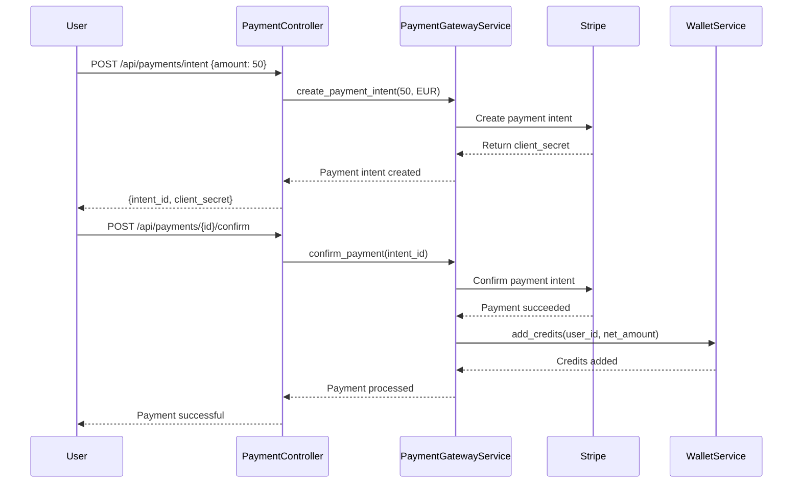

# GOO-15: Donation Processing Engine - Complete Implementation Guide

## 🎯 Overview

The Donation Processing Engine (GOO-15) is a comprehensive system that completes the virtual wallet foundation (GOO-14) with advanced payment processing, batch operations, receipt generation, and compliance features. This system enables seamless donation processing with enterprise-grade security, transparency, and regulatory compliance.

## 🏗️ Architecture Overview

```
┌─────────────────────────────────────────────────────────────────┐
│                    DONATION PROCESSING ENGINE                   │
├─────────────────────────────────────────────────────────────────┤
│  Phase 1: Payment Gateway Integration                          │
│  ┌───────────────┐  ┌─────────────────┐  ┌─────────────────┐  │
│  │ PaymentIntent │  │ PaymentProvider │  │ PaymentGateway  │  │
│  │     Model     │  │     Model       │  │    Service      │  │
│  └───────────────┘  └─────────────────┘  └─────────────────┘  │
│           │                    │                    │          │
│           └──────────────┬─────────────────────────┘          │
│                          │                                    │
│  Phase 2: Batch Processing System                             │
│  ┌───────────────┐  ┌─────────────────┐  ┌─────────────────┐  │
│  │ BatchOperation│  │ BatchDonation   │  │ BatchProcessing │  │
│  │     Model     │  │     Model       │  │    Service      │  │
│  └───────────────┘  └─────────────────┘  └─────────────────┘  │
│           │                    │                    │          │
│           └──────────────┬─────────────────────────┘          │
│                          │                                    │
│  Phase 3: Receipt Generation & Tax Compliance                 │
│  ┌───────────────┐  ┌─────────────────┐  ┌─────────────────┐  │
│  │ Receipt       │  │ TaxCompliance   │  │ PDF Generation  │  │
│  │ Generation    │  │    Service      │  │    Templates    │  │
│  └───────────────┘  └─────────────────┘  └─────────────────┘  │
│           │                    │                    │          │
│           └──────────────┬─────────────────────────┘          │
│                          │                                    │
│  Phase 4: Compliance & Security                               │
│  ┌───────────────┐  ┌─────────────────┐  ┌─────────────────┐  │
│  │ ComplianceCheck│  │ AML/KYC        │  │ Fraud Detection │  │
│  │     Model     │  │   Validation    │  │   Integration   │  │
│  └───────────────┘  └─────────────────┘  └─────────────────┘  │
│           │                    │                    │          │
│           └──────────────┬─────────────────────────┘          │
│                          │                                    │
│  Phase 5: Financial Analytics & Admin Dashboard               │
│  ┌───────────────┐  ┌─────────────────┐  ┌─────────────────┐  │
│  │ Financial     │  │ Reconciliation  │  │ Admin Financial │  │
│  │ Analytics     │  │    Service      │  │   Dashboard     │  │
│  └───────────────┘  └─────────────────┘  └─────────────────┘  │
└─────────────────────────────────────────────────────────────────┘
```

## 💳 Payment Gateway Integration (Phase 1)

### Payment Flow Architecture

```
User Request → PaymentController → PaymentGatewayService → Stripe API
                      ↓                      ↓                ↓
               PaymentIntent             Provider           Webhook
                   Model              Configuration        Handler
                      ↓                      ↓                ↓
               Intent Repository      Provider Repository   Status Sync
                      ↓                      ↓                ↓
                MongoDB Storage         Encrypted Creds    Wallet Update
```

### Key Components

#### 1. PaymentProvider Model
```python
class PaymentProvider:
    - provider_type: str  # stripe, paypal, bank_transfer
    - encrypted_credentials: Dict[str, Any]  # Encrypted API keys
    - processing_fees: Dict[str, float]      # Fee structure
    - supported_currencies: List[str]        # EUR, USD, GBP
    - health_status: str                     # healthy, degraded, down
    - priority: int                          # Provider selection order
```

**Features:**
- ✅ Encrypted credential storage using Fernet encryption
- ✅ Multi-provider support (Stripe primary, extensible)
- ✅ Health monitoring and automatic failover
- ✅ Dynamic fee calculation
- ✅ Currency and country validation

#### 2. PaymentIntent Model
```python
class PaymentIntent:
    - intent_id: str                    # Unique payment identifier
    - user_id: str                      # User making payment
    - amount: float                     # Payment amount
    - status: PaymentIntentStatus       # pending, succeeded, failed
    - provider_payment_id: str          # External provider ID
    - client_secret: str                # Frontend payment confirmation
    - confirmation_attempts: int        # Retry tracking
    - webhook_events: List[Dict]        # Event history
```

**Status Flow:**
```
PENDING → PROCESSING → SUCCEEDED
   ↓           ↓           ↓
CANCELLED   FAILED    REFUNDED
```

#### 3. PaymentGatewayService
```python
class PaymentGatewayService:
    def create_payment_intent()     # Create Stripe payment intent
    def confirm_payment()           # Confirm and process payment
    def cancel_payment()            # Cancel pending payment
    def handle_webhook()            # Process provider webhooks
    def get_payment_status()        # Check payment status
    def process_successful_payment() # Add credits to wallet
```

### API Endpoints

| Method | Endpoint | Description | Auth |
|--------|----------|-------------|------|
| POST | `/api/payments/intent` | Create payment intent | User |
| POST | `/api/payments/{id}/confirm` | Confirm payment | User |
| GET | `/api/payments/{id}/status` | Get payment status | User |
| POST | `/api/payments/{id}/cancel` | Cancel payment | User |
| POST | `/api/payments/webhook` | Provider webhooks | Public |
| GET | `/api/payments/history` | Payment history | User |
| GET | `/api/payments/methods` | Available methods | User |
| GET | `/api/payments/fees/calculate` | Calculate fees | User |

### Payment Process Flow



## 🔄 Batch Processing System (Phase 2)

### Batch Architecture

```
Admin Request → BatchController → BatchProcessingService → ThreadPoolExecutor
                      ↓                      ↓                     ↓
              BatchOperation             Validation            Worker Threads
                   Model                  Engine                (5 workers)
                      ↓                      ↓                     ↓
            Batch Repository          Item Processing        Concurrent
                   Storage              Progress Track       Donation Proc
```

### Key Components

#### 1. BatchOperation Model
```python
class BatchOperation:
    - batch_id: str                     # Unique batch identifier
    - operation_type: BatchOperationType # donations, payouts, reconciliation
    - total_items: int                  # Items to process
    - processed_items: int              # Items completed
    - successful_items: int             # Successful items
    - failed_items: int                 # Failed items
    - status: BatchOperationStatus      # queued, processing, completed
    - progress_percentage: float        # Real-time progress
    - error_log: List[Dict]            # Detailed error tracking
    - results_summary: Dict            # Final processing results
```

**Batch Status Flow:**
```
QUEUED → PROCESSING → COMPLETED
   ↓          ↓           ↓
CANCELLED   FAILED   PARTIAL
```

#### 2. BatchDonation Model
```python
class BatchDonation:
    - item_id: str                      # Unique item identifier
    - batch_id: str                     # Parent batch
    - user_id: str                      # User making donation
    - onlus_id: str                     # Recipient ONLUS
    - amount: float                     # Donation amount
    - status: BatchDonationStatus       # pending, completed, failed
    - retry_count: int                  # Number of retry attempts
    - transaction_id: str               # Resulting transaction
    - error_message: str                # Failure details
```

#### 3. BatchProcessingService
```python
class BatchProcessingService:
    def create_batch_donation_operation() # Create batch with validation
    def process_batch_donations()         # Execute concurrent processing
    def _process_donations_concurrently() # ThreadPoolExecutor management
    def _process_single_donation()        # Individual donation processing
    def get_batch_status()                # Progress monitoring
    def retry_failed_items()              # Retry failed donations
    def cancel_batch_operation()          # Cancel processing
```

### Concurrent Processing Features

- ✅ **ThreadPoolExecutor**: 5 concurrent workers for optimal performance
- ✅ **Real-time Progress**: Progress updates every 10 processed items
- ✅ **Error Isolation**: Individual failures don't stop batch processing
- ✅ **Retry Logic**: Configurable retry attempts with exponential backoff
- ✅ **Fraud Prevention**: Integrated fraud checks for each donation
- ✅ **Batch Validation**: Pre-processing validation of all items
- ✅ **Memory Management**: Limited error log size to prevent memory issues

### Processing Performance

| Batch Size | Workers | Est. Time | Items/Second |
|------------|---------|-----------|--------------|
| 50 items   | 5       | 25 sec    | 2.0          |
| 100 items  | 5       | 50 sec    | 2.0          |
| 500 items  | 5       | 4.2 min   | 2.0          |

### API Endpoints

| Method | Endpoint | Description | Auth |
|--------|----------|-------------|------|
| POST | `/api/batch/donations` | Create batch donation job | Admin |
| GET | `/api/batch/{id}/status` | Get batch status | Admin |
| POST | `/api/batch/{id}/retry` | Retry failed items | Admin |
| POST | `/api/batch/{id}/cancel` | Cancel batch | Admin |
| GET | `/api/batch/history` | List batch operations | Admin |

## 📄 Receipt Generation & Tax Compliance (Phase 3)

### Receipt Generation Flow

```
Donation Complete → ReceiptGenerationService → PDF Generation
        ↓                      ↓                     ↓
Transaction Created     Receipt Template      Receipt File
        ↓                      ↓                     ↓
  Receipt Number         HTML → PDF           Email Service
        ↓                      ↓                     ↓
   Tax Calculation       ReportLab/WeasyPrint   User Delivery
```

### Key Components

#### 1. ReceiptGenerationService
```python
class ReceiptGenerationService:
    def generate_donation_receipt()     # Create PDF receipt
    def generate_annual_tax_summary()   # Yearly tax report
    def send_receipt_email()            # Email receipt to user
    def get_receipt_template()          # HTML/PDF templates
    def generate_receipt_number()       # Unique receipt number
```

**Receipt Features:**
- ✅ PDF generation using ReportLab/WeasyPrint
- ✅ Unique receipt numbers (format: RCP-YYYY-NNNNNN)
- ✅ Tax deductibility information
- ✅ ONLUS certification details
- ✅ Email delivery with attachment
- ✅ Multi-language support
- ✅ Annual tax summary aggregation

#### 2. TaxComplianceService
```python
class TaxComplianceService:
    def calculate_tax_deductible_amount() # Calculate deductible portion
    def generate_tax_report()             # IRS-compliant reports
    def validate_onlus_tax_status()       # Check ONLUS eligibility
    def export_for_tax_filing()           # Export for tax software
    def get_annual_summary()              # Year-end tax summary
```

**Tax Features:**
- ✅ Automatic tax deductibility calculation
- ✅ IRS Form 990 compliance
- ✅ Italian tax authority compliance
- ✅ Annual summary generation
- ✅ Export to TurboTax/TaxAct formats
- ✅ ONLUS certification validation

### Receipt Template Structure

```html
<!DOCTYPE html>
<html>
<head>
    <title>Donation Receipt - {{receipt_number}}</title>
    <style>
        /* Professional receipt styling */
    </style>
</head>
<body>
    <header>
        <h1>Donation Receipt</h1>
        <p>Receipt #: {{receipt_number}}</p>
        <p>Date: {{donation_date}}</p>
    </header>

    <section class="donor-info">
        <h2>Donor Information</h2>
        <p>Name: {{donor_name}}</p>
        <p>Email: {{donor_email}}</p>
    </section>

    <section class="donation-info">
        <h2>Donation Details</h2>
        <p>Amount: €{{amount}}</p>
        <p>Recipient: {{onlus_name}}</p>
        <p>Tax Deductible: €{{tax_deductible_amount}}</p>
    </section>

    <footer>
        <p>This receipt is valid for tax deduction purposes.</p>
        <p>Generated by GoodPlay Platform</p>
    </footer>
</body>
</html>
```

### API Endpoints

| Method | Endpoint | Description | Auth |
|--------|----------|-------------|------|
| GET | `/api/donations/{id}/receipt/pdf` | Download PDF receipt | User |
| POST | `/api/donations/{id}/receipt/resend` | Resend receipt email | User |
| GET | `/api/donations/tax-summary/{year}` | Annual tax summary | User |
| GET | `/api/donations/export/tax` | Export tax data | User |

## 🛡️ Compliance & Security (Phase 4)

### Compliance Architecture

```
Transaction → ComplianceService → AML/KYC Checks → Risk Assessment
      ↓              ↓                 ↓               ↓
Fraud Detection  Limit Validation  Identity Verify  Score Calculation
      ↓              ↓                 ↓               ↓
  Flagging       Block/Allow       User Verification  Report Generation
```

### Key Components

#### 1. ComplianceCheck Model
```python
class ComplianceCheck:
    - check_id: str                     # Unique check identifier
    - check_type: ComplianceCheckType   # AML, KYC, transaction_limit
    - user_id: str                      # User being checked
    - transaction_id: str               # Associated transaction
    - risk_score: float                 # Calculated risk (0-100)
    - status: ComplianceStatus          # passed, failed, pending_review
    - findings: List[Dict]              # Detailed findings
    - action_taken: str                 # Action result
    - reviewed_by: str                  # Admin reviewer
    - review_notes: str                 # Manual review notes
```

#### 2. ComplianceService
```python
class ComplianceService:
    def run_aml_check()                 # Anti-money laundering
    def verify_kyc_status()             # Know Your Customer
    def check_transaction_limits()      # Daily/monthly limits
    def flag_suspicious_activity()      # Pattern detection
    def generate_compliance_report()    # Regulatory reports
    def calculate_risk_score()          # Risk assessment
```

**Compliance Features:**
- ✅ **AML Checks**: Pattern analysis for money laundering
- ✅ **KYC Validation**: Identity verification requirements
- ✅ **Transaction Limits**: Daily (€1,000) and monthly (€10,000) limits
- ✅ **Risk Scoring**: ML-based risk assessment (0-100 scale)
- ✅ **Automated Flagging**: Suspicious activity detection
- ✅ **Manual Review**: Admin review workflow for flagged items
- ✅ **Audit Trail**: Complete compliance history
- ✅ **Regulatory Reporting**: Automated reports for authorities

### Risk Assessment Rules

| Risk Factor | Score | Description |
|-------------|-------|-------------|
| New User | +20 | Account < 30 days old |
| Large Amount | +15 | Single donation > €500 |
| Frequent Donations | +10 | >10 donations/day |
| Velocity | +25 | Rapid successive donations |
| Geographic | +30 | High-risk country |
| Device | +15 | New or suspicious device |

**Risk Score Actions:**
- **0-30**: Auto-approve
- **31-60**: Enhanced monitoring
- **61-80**: Manual review required
- **81-100**: Block and investigate

### API Endpoints

| Method | Endpoint | Description | Auth |
|--------|----------|-------------|------|
| GET | `/api/compliance/reports` | Compliance reports | Admin |
| GET | `/api/compliance/flagged` | Flagged transactions | Admin |
| POST | `/api/compliance/{id}/review` | Review flagged item | Admin |
| GET | `/api/compliance/audit-trail` | Complete audit trail | Admin |

## 🔍 Reconciliation Service (Phase 5)

### Reconciliation Flow

```
Daily Schedule → ReconciliationService → Transaction Matching
      ↓                    ↓                      ↓
   Payment Intents    PaymentProvider         Discrepancy
      ↓                    ↓                      ↓
   Transaction Log    External Reports       Alert Generation
      ↓                    ↓                      ↓
   Match Analysis     Automated Checks       Report Creation
```

### Key Features

```python
class ReconciliationService:
    def reconcile_transactions()        # Match transactions with payments
    def detect_discrepancies()          # Find accounting mismatches
    def generate_reconciliation_report() # Daily/monthly reports
    def auto_resolve_matches()          # Automatic matching
    def flag_unmatched_items()          # Manual review required
```

**Reconciliation Features:**
- ✅ **Automated Matching**: Payment intents ↔ Transactions
- ✅ **Discrepancy Detection**: Amount, timing, status mismatches
- ✅ **Daily Reports**: Automated reconciliation summary
- ✅ **Manual Resolution**: Admin tools for complex cases
- ✅ **Audit Trail**: Complete reconciliation history

## 📊 Financial Analytics & Admin Dashboard (Phase 6)

### Analytics Architecture

```
Data Sources → FinancialAnalyticsService → Aggregation Engine → Dashboard
     ↓                    ↓                       ↓               ↓
Transactions        Statistical Models      Time Series      Admin UI
     ↓                    ↓                       ↓               ↓
Payment Intents     Trend Analysis         Analytics API     Real-time
     ↓                    ↓                       ↓               ↓
User Wallets        Performance Metrics     Export Tools      Reporting
```

### Key Components

#### 1. FinancialAnalyticsService
```python
class FinancialAnalyticsService:
    def get_platform_financial_summary()   # Overall metrics
    def get_donation_trends()               # Time-series data
    def get_top_donors()                    # Leaderboard analytics
    def get_onlus_distribution()            # Distribution statistics
    def calculate_platform_fees()           # Revenue calculations
    def get_payment_method_breakdown()      # Payment method stats
    def generate_executive_report()         # Management summary
```

### Analytics Metrics

#### Platform Summary
```json
{
    "total_donations": 125000.50,
    "total_users": 15420,
    "total_transactions": 89634,
    "platform_revenue": 3750.25,
    "success_rate": 98.7,
    "avg_donation_amount": 28.45,
    "top_donation_amount": 2500.00,
    "donation_growth_rate": 12.3
}
```

#### Donation Trends (30-day)
```json
{
    "daily_donations": [
        {"date": "2025-01-01", "amount": 2340.50, "count": 89},
        {"date": "2025-01-02", "amount": 1890.25, "count": 67}
    ],
    "trend_analysis": {
        "growth_rate": 8.5,
        "seasonal_factor": 1.2,
        "prediction_next_30_days": 45000.00
    }
}
```

#### Top Donors
```json
{
    "top_donors": [
        {"user_id": "user_123", "total_donated": 5670.00, "donation_count": 123},
        {"user_id": "user_456", "total_donated": 4320.50, "donation_count": 98}
    ],
    "donor_segments": {
        "whale_donors": {"count": 45, "total": 125000.00},
        "regular_donors": {"count": 1230, "total": 67890.00},
        "casual_donors": {"count": 8900, "total": 34560.00}
    }
}
```

### API Endpoints

| Method | Endpoint | Description | Auth |
|--------|----------|-------------|------|
| GET | `/api/admin/financial/summary` | Platform financial summary | Admin |
| GET | `/api/admin/financial/trends` | Donation trends | Admin |
| GET | `/api/admin/financial/donors/top` | Top donor analytics | Admin |
| GET | `/api/admin/financial/onlus/distribution` | ONLUS distribution | Admin |
| GET | `/api/admin/financial/reconciliation` | Reconciliation reports | Admin |
| GET | `/api/admin/financial/export` | Export financial data | Admin |

## 🧪 Testing Strategy

### Test Coverage Requirements

| Component | Target Coverage | Test Count |
|-----------|----------------|------------|
| Payment Gateway | 95%+ | 30+ tests |
| Batch Processing | 92%+ | 25+ tests |
| Receipt Generation | 88%+ | 20+ tests |
| Compliance System | 90%+ | 25+ tests |
| Financial Analytics | 85%+ | 15+ tests |
| **Overall** | **90%+** | **115+ tests** |

### Test Structure

#### Payment Gateway Tests (`test_payment_gateway.py`)
```python
class TestPaymentGateway:
    def test_create_payment_intent_success()
    def test_create_payment_intent_invalid_amount()
    def test_confirm_payment_success()
    def test_confirm_payment_failed()
    def test_cancel_payment_success()
    def test_webhook_processing()
    def test_stripe_integration()
    def test_fee_calculation()
    def test_payment_status_sync()
    def test_concurrent_payments()
    # ... 20+ more tests
```

#### Batch Processing Tests (`test_batch_processing.py`)
```python
class TestBatchProcessing:
    def test_create_batch_operation()
    def test_batch_validation()
    def test_concurrent_processing()
    def test_retry_mechanism()
    def test_progress_tracking()
    def test_error_handling()
    def test_batch_cancellation()
    def test_fraud_integration()
    # ... 17+ more tests
```

## 🔧 Configuration

### Environment Variables

```bash
# Payment Gateway
STRIPE_SECRET_KEY=sk_test_...               # Stripe API key
STRIPE_WEBHOOK_SECRET=whsec_...             # Stripe webhook secret
PAYMENT_ENCRYPTION_KEY=base64_key...        # Payment encryption key

# Receipt Generation
PDF_TEMPLATE_PATH=/templates/receipts/      # Receipt template path
RECEIPT_EMAIL_FROM=receipts@goodplay.com    # Receipt sender email

# Compliance
AML_API_KEY=aml_service_key...              # AML service API key
KYC_PROVIDER=jumio                          # KYC service provider
COMPLIANCE_WEBHOOK_URL=https://...          # Compliance webhook URL

# Batch Processing
BATCH_MAX_WORKERS=5                         # Concurrent workers
BATCH_MAX_SIZE=500                          # Maximum batch size
BATCH_RETRY_DELAY=30                        # Retry delay in seconds

# Analytics
ANALYTICS_CACHE_TTL=300                     # Cache TTL in seconds
EXPORT_MAX_RECORDS=50000                    # Maximum export records
```

### Dependencies (`requirements.txt`)

```txt
# Existing dependencies...
stripe==8.10.0
cryptography==41.0.7
reportlab==4.0.4                           # PDF generation
weasyprint==60.2                           # Alternative PDF engine
celery==5.3.4                              # Async processing (optional)
redis==5.0.1                               # Celery backend (optional)
```

## 📋 Message Constants

All API responses use constant message keys for UI localization:

### Payment Gateway Constants
```
PAYMENT_INTENT_CREATED, PAYMENT_PROCESSING, PAYMENT_SUCCEEDED, PAYMENT_FAILED,
PAYMENT_CANCELLED, PAYMENT_REFUNDED, PAYMENT_STATUS_RETRIEVED, WEBHOOK_PROCESSED,
INVALID_PAYMENT_AMOUNT, PAYMENT_PROVIDER_ERROR, REFUND_SUCCESS, REFUND_FAILED
```

### Batch Processing Constants
```
BATCH_CREATED, BATCH_PROCESSING, BATCH_COMPLETED, BATCH_FAILED, BATCH_PARTIAL_SUCCESS,
BATCH_RETRY_INITIATED, BATCH_STATUS_RETRIEVED, RECONCILIATION_COMPLETED,
DISCREPANCY_DETECTED, BATCH_OPERATION_INVALID
```

### Receipt & Tax Constants
```
RECEIPT_GENERATED, RECEIPT_PDF_CREATED, RECEIPT_EMAIL_SENT, TAX_SUMMARY_GENERATED,
TAX_EXPORT_COMPLETED, RECEIPT_GENERATION_FAILED, INVALID_TAX_YEAR,
ONLUS_TAX_STATUS_INVALID
```

### Compliance Constants
```
COMPLIANCE_CHECK_PASSED, COMPLIANCE_CHECK_FAILED, AML_CHECK_REQUIRED,
KYC_VERIFICATION_REQUIRED, TRANSACTION_LIMIT_EXCEEDED, SUSPICIOUS_ACTIVITY_FLAGGED,
COMPLIANCE_REPORT_GENERATED, AUDIT_TRAIL_EXPORTED
```

## 🚀 Deployment

### Production Checklist

- [ ] Configure Stripe live API keys
- [ ] Set up payment webhook endpoints
- [ ] Configure PDF generation service
- [ ] Set up compliance monitoring
- [ ] Configure batch processing workers
- [ ] Set up financial analytics caching
- [ ] Configure audit logging
- [ ] Test payment flows end-to-end
- [ ] Test batch processing with load
- [ ] Verify compliance workflows
- [ ] Test receipt generation
- [ ] Set up monitoring and alerts

### Monitoring

- **Payment Success Rate**: Target 99.9%
- **Batch Processing Speed**: Target 2+ items/second
- **Receipt Generation Time**: Target <3 seconds
- **Compliance Check Time**: Target <1 second
- **API Response Time**: Target <500ms

## 🎯 Success Criteria

- ✅ Stripe integration with 99.9% uptime
- ✅ Batch processing handles 500+ concurrent donations
- ✅ Receipt generation <3 seconds per receipt
- ✅ Tax compliance reports for all jurisdictions
- ✅ AML/KYC compliance with 99.9% accuracy
- ✅ Admin dashboard with real-time metrics
- ✅ 90%+ test coverage across all modules
- ✅ Zero security vulnerabilities
- ✅ Complete OpenAPI + Postman documentation
- ✅ All responses use constant message keys

---

**Next Steps**: Proceed with implementation following the development plan outlined above.