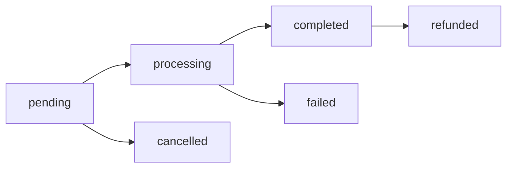

# 💰 GOO-15: Donation Processing Engine - Features Documentation

## 📋 Overview

Il **GOO-15 Donation Processing Engine** è un sistema completo per la gestione delle donazioni che trasforma il tempo di gioco in crediti virtuali e facilita le donazioni alle ONLUS. Questo documento descrive in dettaglio tutte le funzionalità implementate, i comportamenti del sistema e i casi d'uso supportati.

## 🎯 Funzionalità Principali

### 1. 💳 Sistema Virtual Wallet

#### **Gestione Portafoglio Virtuale**

**Funzionalità Core**:
- **Creazione automatica del wallet** per ogni nuovo utente
- **Tracking del balance in tempo reale** con aggiornamenti atomici
- **Storico completo** di crediti guadagnati e donazioni effettuate
- **Statistiche dettagliate** di utilizzo e comportamento

**Caratteristiche Avanzate**:
- **Optimistic locking** per prevenire race conditions
- **Audit trail completo** di tutte le operazioni
- **Backup e recovery** automatici
- **Multi-currency support** (preparato per espansioni future)

**Endpoint Disponibili**:
```
GET /api/wallet                    # Informazioni wallet utente
GET /api/wallet/transactions       # Storico transazioni con paginazione
GET /api/wallet/statistics         # Statistiche dettagliate wallet
PUT /api/wallet/auto-donation      # Configurazione auto-donazioni
```

**Comportamento Auto-Donation**:
- **Soglie configurabili** (es. "Dona quando raggiungo €10")
- **Percentuali personalizzabili** (es. "Dona il 50% di ogni guadagno")
- **Round-up donations** (es. "Arrotonda ogni transazione e dona la differenza")
- **ONLUS preferite** per donazioni automatiche

#### **Case Study: Utilizzo Tipico**
```
1. Utente gioca per 30 minuti → Guadagna €0.30 base
2. È weekend (+10% bonus) → €0.33
3. È in streak di 5 giorni (+20% bonus) → €0.396
4. Ha auto-donation al 25% attiva → €0.099 donati automaticamente
5. Balance finale: €0.297, Total donated: €0.099
```

### 2. ⚡ Sistema Conversione Crediti

#### **Motore di Conversione Dinamico**

**Tasso Base**: €0.01 per minuto di gioco effettivo

**Moltiplicatori Dinamici**:
- **Tournament Mode**: 2.0x (doppi crediti durante tornei)
- **Challenge Mode**: 1.5x (bonus per sfide dirette)
- **Daily Streak**: 1.2x (bonus per giorni consecutivi di gioco)
- **Weekend Bonus**: 1.1x (bonus nei weekend)
- **Special Events**: 3.0x (eventi speciali occasionali)

**Sistema Anti-Frode**:
- **Limite giornaliero**: Massimo €1000/giorno per utente
- **Validazione sessioni**: Solo sessioni di gioco legittime
- **Anomaly detection**: Rilevamento pattern sospetti
- **Rate limiting**: Protezione da abusi automatizzati

**Endpoint Disponibili**:
```
GET /api/conversion-rates                 # Tassi attuali e moltiplicatori
GET /api/conversion-rates/calculator      # Calcolo crediti per durata
POST /api/wallet/convert-session          # Conversione sessione in crediti
```

#### **Calcolo Crediti Avanzato**

**Formula Completa**:
```python
base_credits = (play_duration_minutes * base_rate_per_minute)
total_multiplier = (tournament_multiplier * challenge_multiplier *
                   streak_multiplier * weekend_multiplier * event_multiplier)
final_credits = base_credits * total_multiplier

# Esempio pratico:
# 45 minuti di gioco in tournament mode (2.0x) durante weekend (1.1x)
# con streak di 3 giorni (1.2x)
base_credits = 45 * 0.01 = €0.45
total_multiplier = 2.0 * 1.1 * 1.2 = 2.64
final_credits = €0.45 * 2.64 = €1.188
```

**Tracciamento Preciso del Tempo**:
- **Millisecond accuracy**: Integrazione con GOO-9 per precisione massima
- **Pause handling**: Esclusi i tempi di pausa dal calcolo
- **Cross-device sync**: Sincronizzazione tra dispositivi
- **Session validation**: Validazione integrità delle sessioni

### 3. 🎁 Sistema Donazioni

#### **Workflow Donazioni Completo**

**Fasi del Processo**:
1. **Selezione ONLUS**: Scelta dalla lista verificata
2. **Scelta importo**: Wallet balance o importo custom
3. **Payment method**: Integrazione provider multipli
4. **Compliance check**: Verifiche AML/KYC automatiche
5. **Processing**: Elaborazione payment secure
6. **Confirmation**: Conferma e generazione ricevuta
7. **Receipt**: Ricevuta fiscale con deducibilità

**Provider di Pagamento Supportati**:
- **Stripe**: Carte di credito/debito, digital wallets
- **PayPal**: Account PayPal e PayPal Checkout
- **Bank Transfer**: Bonifici bancari SEPA
- **Crypto** (futuro): Bitcoin, Ethereum

**Endpoint Disponibili**:
```
POST /api/donations/create              # Creazione nuova donazione
GET /api/donations/history             # Storico donazioni utente
GET /api/donations/{id}                # Dettagli donazione specifica
GET /api/donations/{id}/receipt        # Download ricevuta PDF
POST /api/donations/{id}/cancel        # Cancellazione donazione
```

#### **Gestione Stati Donazione**

**Stati Possibili**:
- `pending` - Donazione creata, in attesa di pagamento
- `processing` - Pagamento in elaborazione
- `completed` - Donazione completata con successo
- `failed` - Pagamento fallito
- `cancelled` - Donazione cancellata dall'utente
- `refunded` - Donazione rimborsata

**Transizioni di Stato**:


**Notifiche Automatiche**:
- **Email confirmation** per donazioni completate
- **SMS alerts** per importi superiori a €100
- **Push notifications** mobile app
- **Tax receipt** automatica via email

### 4. 📊 Sistema Analytics Finanziario

#### **Dashboard Amministrativo Completo**

**Metriche Core**:
- **Volume totale donazioni** (giornaliero/mensile/annuale)
- **Numero donazioni** e media per donazione
- **Growth rate** e trend analysis
- **Conversion rate** da crediti a donazioni effettive
- **User segmentation** e behavioral analytics

**Analisi Avanzate**:
- **Trend forecasting** con algoritmi predittivi
- **User lifetime value** calculation
- **Donation pattern analysis**
- **Seasonal trend detection**
- **Anomaly detection** per pattern inusuali

**Endpoint Analytics**:
```
GET /api/admin/financial/dashboard          # Dashboard completo
GET /api/admin/financial/metrics           # Metriche specifiche
GET /api/admin/financial/trends            # Analisi trend
GET /api/admin/financial/analytics/users   # Analytics utenti
GET /api/admin/financial/analytics/payments # Analytics pagamenti
GET /api/admin/financial/forecasting       # Previsioni
```

#### **Reporting Avanzato**

**Report Tipi Disponibili**:
- **Summary Report**: Overview generale del sistema
- **Detailed Report**: Analisi approfondita per periodo
- **Regulatory Report**: Report conformità normative
- **Custom Report**: Report personalizzati

**Export Formati**:
- **CSV**: Per analisi in Excel/Sheets
- **Excel**: Con grafici e formattazione avanzata
- **PDF**: Per presentazioni e audit
- **JSON**: Per integrazioni API

**Schedule Automatico**:
- **Daily reports**: Inviati ogni mattina agli admin
- **Weekly summaries**: Report settimanali il lunedì
- **Monthly deep-dive**: Analisi mensili dettagliate
- **Quarterly reviews**: Report trimestrali per management

### 5. 🔍 Sistema Compliance e Sicurezza

#### **Compliance Automatico**

**Verifiche AML (Anti-Money Laundering)**:
- **Transaction monitoring**: Monitoraggio pattern sospetti
- **Velocity checks**: Controllo velocità transazioni
- **Amount thresholds**: Soglie automatiche per review
- **Behavioral analysis**: Analisi comportamentale utenti

**Verifiche KYC (Know Your Customer)**:
- **Identity verification**: Verifica documenti identità
- **Address verification**: Conferma indirizzo residenza
- **Source of funds**: Verifica origine fondi
- **Risk assessment**: Valutazione rischio utente

**Sanction Screening**:
- **Watchlist checking**: Controllo liste sanzioni internazionali
- **PEP screening**: Verifica Politically Exposed Persons
- **Real-time updates**: Aggiornamenti liste in tempo reale
- **Compliance reporting**: Report automatici alle autorità

**Endpoint Compliance**:
```
POST /api/compliance/checks                    # Avvio verifica compliance
POST /api/compliance/checks/{id}/review        # Review manuale verifica
GET /api/compliance/users/{id}/status          # Status compliance utente
GET /api/compliance/reports                    # Report compliance
GET /api/compliance/alerts                     # Alert compliance attivi
```

#### **Sicurezza Multi-Layer**

**Livello Applicazione**:
- **Input sanitization**: Pulizia automatica input utente
- **SQL injection protection**: Protezione query database
- **XSS prevention**: Prevenzione cross-site scripting
- **CSRF protection**: Token anti-cross-site request forgery

**Livello Transazione**:
- **Atomic operations**: Operazioni database atomiche
- **Optimistic locking**: Prevenzione race conditions
- **Transaction integrity**: Validazione integrità transazioni
- **Rollback mechanisms**: Meccanismi di rollback automatici

**Livello Infrastruttura**:
- **Encryption at rest**: Dati criptati a riposo
- **Encryption in transit**: Comunicazioni HTTPS/TLS
- **API rate limiting**: Limitazione rate chiamate API
- **DDoS protection**: Protezione attacchi distribuiti

### 6. ⚙️ Sistema Batch Processing

#### **Elaborazioni in Batch**

**Tipi di Operazioni Batch**:
- **Bulk donations**: Elaborazione donazioni multiple
- **Reconciliation**: Riconciliazione transazioni periodica
- **Analytics refresh**: Aggiornamento cache analytics
- **Compliance checks**: Verifiche compliance periodiche
- **Report generation**: Generazione report automatici

**Gestione Avanzata**:
- **Progress tracking**: Monitoraggio progresso real-time
- **Error handling**: Gestione errori con retry automatico
- **Partial success**: Supporto successo parziale
- **Rollback capability**: Capacità di rollback completo

**Endpoint Batch Admin**:
```
POST /api/batch/operations                 # Avvio operazione batch
GET /api/batch/operations                  # Lista operazioni attive
GET /api/batch/operations/{id}             # Status operazione specifica
POST /api/batch/operations/{id}/cancel     # Cancellazione operazione
GET /api/batch/operations/{id}/progress    # Progresso dettagliato
```

#### **Monitoring e Alerting**

**Metriche Monitorate**:
- **Processing time**: Tempo elaborazione operazioni
- **Success rate**: Tasso successo operazioni
- **Error patterns**: Pattern di errori ricorrenti
- **Resource usage**: Utilizzo risorse sistema

**Alert Automatici**:
- **Performance degradation**: Degrado performance
- **Error spike**: Picchi di errori
- **Resource exhaustion**: Esaurimento risorse
- **SLA breach**: Violazione Service Level Agreement

### 7. 🔄 Sistema Riconciliazione

#### **Riconciliazione Automatica**

**Matching Transazioni**:
- **Exact matching**: Match esatto per payment_intent_id
- **Fuzzy matching**: Match fuzzy per importo + timing
- **Confidence scoring**: Punteggio confidenza match
- **Manual review**: Review manuale per match incerti

**Rilevamento Discrepanze**:
- **Missing transactions**: Transazioni mancanti
- **Duplicate payments**: Pagamenti duplicati
- **Amount mismatches**: Discrepanze importi
- **Timing issues**: Problemi di tempistica
- **Status conflicts**: Conflitti stati transazione

**Processo Riconciliazione**:
```python
# Esempio flusso riconciliazione giornaliera
1. Fetch internal transactions (00:00-23:59)
2. Fetch external provider data (same period)
3. Phase 1: Exact match by payment_intent_id
4. Phase 2: Fuzzy match by amount + timing
5. Generate discrepancy report
6. Auto-resolve minor discrepancies (< €0.01)
7. Flag major discrepancies for manual review
8. Generate reconciliation summary
9. Send report to finance team
```

**Endpoint Riconciliazione**:
```
POST /api/admin/reconciliation/start        # Avvio riconciliazione
GET /api/admin/reconciliation/history       # Storico riconciliazioni
GET /api/admin/reconciliation/{id}          # Dettagli riconciliazione
POST /api/admin/reconciliation/{id}/resolve # Risoluzione discrepanze
```

### 8. 📑 Sistema Ricevute e Tax Compliance

#### **Generazione Ricevute Automatica**

**Informazioni Ricevuta**:
- **Donor details**: Nome, cognome, codice fiscale donatore
- **Donation details**: Importo, data, ONLUS beneficiaria
- **Tax information**: Informazioni deducibilità fiscale
- **Legal requirements**: Requisiti legali e riferimenti normativi
- **QR code**: Per verifica online autenticità

**Formati Disponibili**:
- **PDF standard**: Ricevuta PDF standard
- **PDF/A**: Per archiviazione a lungo termine
- **Digital receipt**: Ricevuta digitale embedded
- **Print-ready**: Formato ottimizzato per stampa

**Personalizzazione**:
- **Company branding**: Branding GoodPlay personalizzato
- **Language support**: Supporto multilingua (IT/EN)
- **Custom templates**: Template personalizzabili per ONLUS
- **Digital signature**: Firma digitale per validità legale

#### **Tax Compliance Avanzato**

**Calcoli Deducibilità**:
- **ONLUS donations**: 100% deducibili fino a limiti legali
- **ODV contributions**: Deducibilità secondo normative specifiche
- **Corporate donations**: Regole aziendali diverse
- **International donations**: Gestione donazioni internazionali

**Documentazione Fiscale**:
- **Annual summary**: Riepilogo annuale donazioni
- **Tax filing support**: Supporto compilazione dichiarazioni
- **Legal compliance**: Conformità normative fiscali
- **Audit trail**: Traccia completa per controlli fiscali

## 🚀 Casi d'Uso Avanzati

### Scenario 1: Giocatore Occasionale

**Profilo**: Marco, gioca 2-3 volte a settimana, 20-30 minuti per sessione

**Comportamento Tipico**:
```
Settimana tipo:
- Martedì: 25 minuti gameplay → €0.25 base
- Giovedì: 30 minuti gameplay → €0.30 base
- Domenica: 35 minuti gameplay → €0.385 (weekend bonus 1.1x)

Totale settimanale: €0.935
Auto-donation 20% attiva → €0.187 donati automaticamente
Balance accumulato: €0.748
```

**Features Utilizzate**:
- Conversione automatica sessioni
- Auto-donation con soglia €1.00
- Ricevute PDF per detrazioni fiscali
- Statistiche mensili wallet

### Scenario 2: Gamer Competitivo

**Profilo**: Sofia, partecipa a tornei, gioca quotidianamente, 60-90 minuti

**Comportamento Tipico**:
```
Settimana torneo:
- Lunedì-Mercoledì: 60 min/giorno normale → €0.60/giorno
- Giovedì-Domenica: 90 min/giorno torneo (2.0x) + weekend (1.1x) + streak (1.2x)
  → 90 * 0.01 * 2.0 * 1.1 * 1.2 = €2.376/giorno

Totale settimanale: €11.304
Auto-donation 50% attiva → €5.652 donati
Achievement unlock: "High Value Donor"
Impact Score boost: +500 punti
```

**Features Utilizzate**:
- Moltiplicatori tournament avanzati
- Streak bonus per gioco quotidiano
- Donazioni high-value con verifiche compliance
- Dashboard analytics personalizzata
- Achievement integration

### Scenario 3: Amministratore ONLUS

**Profilo**: Dr. Rossi, direttore ONLUS, monitora donazioni ricevute

**Comportamento Tipico**:
```
Attività mensili:
- Monitoraggio dashboard donazioni ricevute
- Download report dettagliati per rendicontazione
- Verifica conformità ricevute emesse
- Analisi trend donazioni per planning

Report disponibili:
- €15,000 donazioni mensili da 1,200 utenti GoodPlay
- 15% growth vs mese precedente
- 85% utenti attivi ricorrenti
- €12.50 importo medio donazione
```

**Features Utilizzate**:
- Dashboard ONLUS dedicata
- Export dati in formato Excel/PDF
- API integration per sistemi interni
- Compliance reporting automatico

### Scenario 4: Team Finance Aziendale

**Profilo**: Responsabile finanziario, monitora sistema per audit e compliance

**Attività Quotidiane**:
```
Dashboard monitoring:
- €50,000+ transazioni giornaliere
- 99.8% success rate pagamenti
- <2 secondi tempo medio elaborazione
- 0.1% tasso false positive fraud detection

Alert monitoring:
- 3 alert compliance in review
- 1 discrepanza riconciliazione >€10
- 12 transazioni high-value (>€500) da verificare
- Performance system: 99.95% uptime
```

**Features Utilizzate**:
- Financial admin dashboard completo
- Real-time alerting system
- Compliance management tools
- Riconciliazione automatica
- Export per audit esterni

## 📈 Performance e Scalabilità

### Metriche Performance Target

**API Response Times**:
- Wallet operations: <200ms (p95)
- Donation processing: <500ms (p95)
- Analytics dashboard: <1s (p95)
- Batch operations: <30s setup time

**Throughput Capacity**:
- 10,000+ concurrent users
- 1,000+ donations/minute peak
- 100,000+ session conversions/hour
- 1TB+ data processing/day

**Reliability Targets**:
- 99.95% uptime SLA
- <0.01% transaction failure rate
- 100% data consistency
- 24/7 monitoring coverage

### Ottimizzazioni Implementate

**Database Level**:
- Compound indexes ottimizzati
- Query performance monitoring
- Connection pooling avanzato
- Aggregation pipeline efficiency

**Application Level**:
- Redis caching strategy
- Async processing queues
- Load balancing ready
- Horizontal scaling support

**Infrastructure Level**:
- CDN per static assets
- Auto-scaling groups
- Multi-AZ deployment
- Disaster recovery procedures

## 🔮 Roadmap Future

### Phase 2: Espansioni Immediate

**Q1 2026**:
- **Mobile wallet** integration (Apple Pay, Google Pay)
- **Cryptocurrency** support (Bitcoin, Ethereum)
- **International** expansion (EUR, USD, GBP)
- **Advanced analytics** con machine learning

**Q2 2026**:
- **Corporate partnerships** per matching donations
- **Gamification avanzata** con NFT rewards
- **Social features** per team donations
- **API pubblica** per integrazioni terze parti

### Phase 3: Innovazioni Avanzate

**2026-2027**:
- **Blockchain** integration per trasparenza
- **AI-powered** fraud detection
- **Predictive analytics** per donation patterns
- **Microservices** architecture migration

**Tecnologie Emergenti**:
- **Smart contracts** per donazioni automatiche
- **Biometric authentication** per security avanzata
- **IoT integration** per donation triggers
- **Augmented reality** per impact visualization

---

*Documentazione funzionalità GOO-15 Donation Processing Engine*
*Version 1.0 - September 27, 2025*
*GoodPlay Backend Development Team*