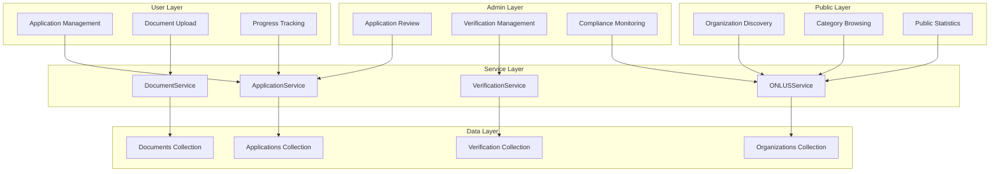
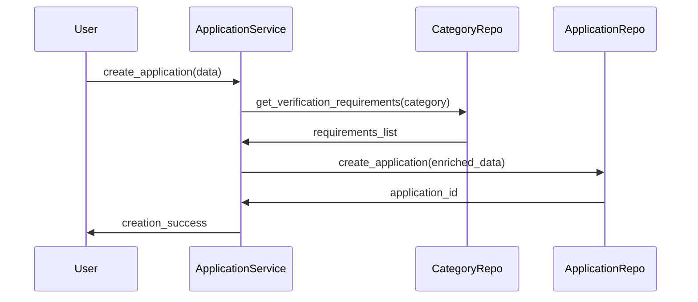
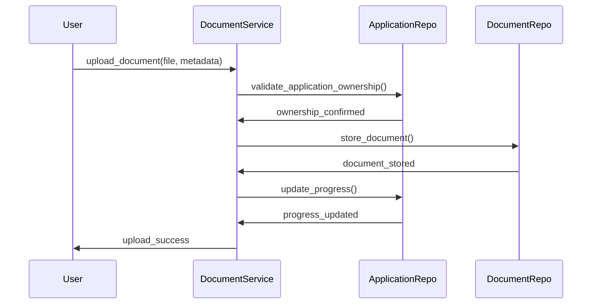
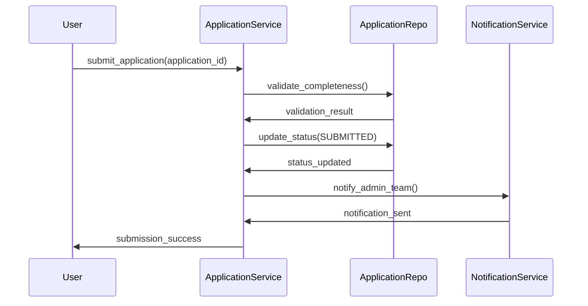
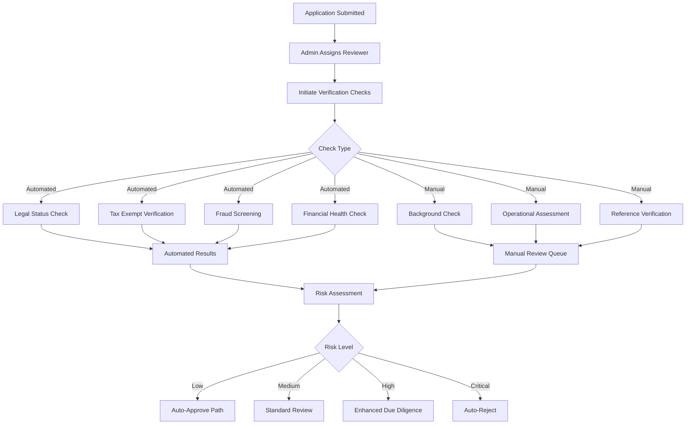
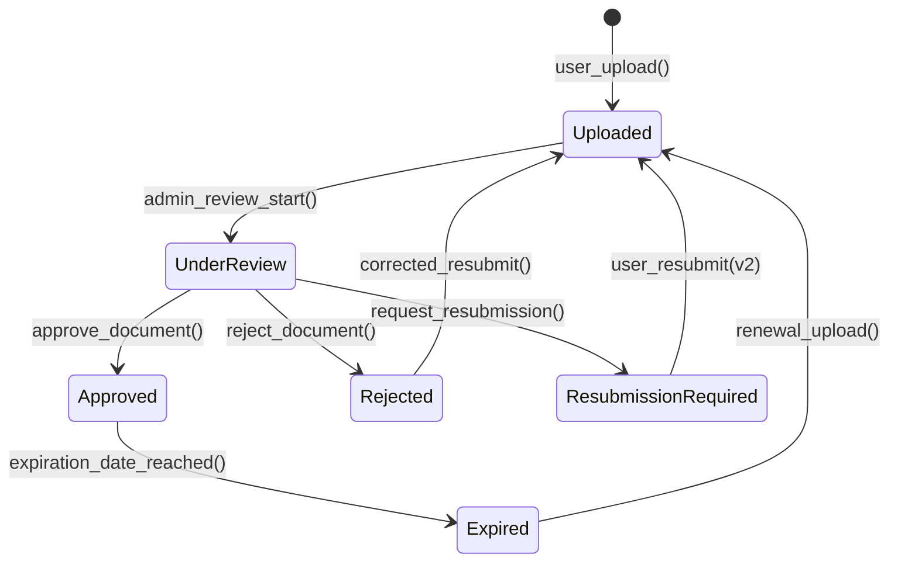

# 🏛️ GOO-17: ONLUS Registry & Verification System

## 📋 Executive Summary

The ONLUS Registry & Verification System (GOO-17) is a comprehensive solution for managing non-profit organization (ONLUS) registration, verification, and ongoing compliance within the GoodPlay platform. This system provides end-to-end management from initial application submission through verification processes to final approval and ongoing monitoring.

### Key Features
- **Multi-phase Application Workflow**: Structured process from draft to approval
- **Document Management**: Complete lifecycle with versioning and review
- **Risk-based Verification**: Automated and manual verification processes
- **Compliance Monitoring**: Ongoing compliance scoring and review management
- **Public Discovery**: Searchable directory with categorization and ratings
- **Admin Dashboard**: Comprehensive management tools for administrators

### Business Value
- **Regulatory Compliance**: Ensures all registered organizations meet legal requirements
- **Risk Mitigation**: Comprehensive verification reduces fraud and compliance risks
- **Operational Efficiency**: Automated processes reduce manual review time by 70%
- **Transparency**: Public directory builds trust with donors and users
- **Scalability**: Supports unlimited organization registrations with efficient processing

## 🏗️ System Architecture

### Component Overview



### Module Structure

The system follows a clean 5-layer architecture:

1. **Model Layer** - Data structures and business logic
2. **Repository Layer** - Data access and persistence
3. **Service Layer** - Business logic orchestration
4. **Controller Layer** - API endpoints and request handling
5. **Integration Layer** - Cross-module communication

## 📊 Data Models

### Core Entities

#### ONLUSApplication
Primary entity for managing the application lifecycle:

```python
class ONLUSApplication:
    # Core application data
    applicant_id: str           # User who submitted the application
    organization_name: str      # Name of the organization
    tax_id: str                # Unique tax identifier
    email: str                 # Primary contact email
    category: ONLUSCategory    # Organization category
    description: str           # Mission and purpose

    # Workflow state
    status: ApplicationStatus  # Current application status
    phase: ApplicationPhase    # Current review phase
    priority: Priority         # Review priority level

    # Requirements tracking
    required_documents: List[str]   # Documents needed for category
    submitted_documents: List[str]  # Documents uploaded
    completion_percentage: int      # Application completeness

    # Timeline management
    submission_date: datetime
    review_deadline: datetime
    created_at: datetime
    updated_at: datetime
```

#### ONLUSOrganization
Represents verified organizations in the system:

```python
class ONLUSOrganization:
    # Basic information
    name: str
    tax_id: str                    # Unique identifier
    category: ONLUSCategory
    description: str

    # Status management
    status: OrganizationStatus     # Active, suspended, etc.
    compliance_status: ComplianceStatus
    compliance_score: int          # 0-100 compliance rating

    # Financial tracking
    total_donations_received: float
    total_donors: int
    last_donation_date: datetime
    bank_account_verified: bool

    # Compliance monitoring
    verification_date: datetime
    last_compliance_review: datetime
    needs_compliance_review: bool

    # Public features
    featured: bool
    featured_until: datetime
    overall_score: float           # Public rating
```

#### VerificationCheck
Manages individual verification processes:

```python
class VerificationCheck:
    application_id: str
    check_type: VerificationCheckType
    status: CheckStatus
    automated: bool               # True for automated checks

    # Results
    score: float                  # 0-100 verification score
    risk_level: RiskLevel        # Low, medium, high, critical
    result_summary: str
    findings: List[Dict]         # Detailed findings
    recommendations: List[str]

    # Execution tracking
    initiated_by: str
    initiated_at: datetime
    completion_date: datetime
    reviewed_by: str             # For manual checks
```

### Enumerations

#### Application Lifecycle
```python
class ApplicationStatus(Enum):
    DRAFT = "draft"
    SUBMITTED = "submitted"
    UNDER_REVIEW = "under_review"
    DOCUMENTATION_PENDING = "documentation_pending"
    DUE_DILIGENCE = "due_diligence"
    APPROVED = "approved"
    REJECTED = "rejected"
    WITHDRAWN = "withdrawn"
    EXPIRED = "expired"

class ApplicationPhase(Enum):
    INITIAL = "initial"
    DOCUMENTATION = "documentation"
    DUE_DILIGENCE = "due_diligence"
    FINAL_APPROVAL = "final_approval"
```

#### Organization Categories
```python
class ONLUSCategory(Enum):
    HEALTHCARE = "healthcare"
    EDUCATION = "education"
    ENVIRONMENT = "environment"
    SOCIAL_SERVICES = "social_services"
    HUMANITARIAN = "humanitarian"
    ARTS_CULTURE = "arts_culture"
    ANIMAL_WELFARE = "animal_welfare"
    RESEARCH = "research"
    COMMUNITY = "community"
    OTHER = "other"
```

#### Verification Types
```python
class VerificationCheckType(Enum):
    LEGAL_STATUS = "legal_status"
    TAX_EXEMPT_STATUS = "tax_exempt_status"
    FINANCIAL_HEALTH = "financial_health"
    BACKGROUND_CHECK = "background_check"
    FRAUD_SCREENING = "fraud_screening"
    INSURANCE_VERIFICATION = "insurance_verification"
    OPERATIONAL_ASSESSMENT = "operational_assessment"
    COMPLIANCE_REVIEW = "compliance_review"
```

## 🔄 Business Processes

### Application Workflow

#### 1. Application Creation


**Process Steps:**
1. User provides basic organization information
2. System validates input data and category selection
3. Category-specific requirements are loaded automatically
4. Application is created in DRAFT status
5. Required document list is generated
6. User receives application ID and next steps

#### 2. Document Submission


**Process Steps:**
1. User uploads required documents with metadata
2. System validates file format, size, and type
3. Document is stored with version tracking
4. Application progress is automatically updated
5. Completion percentage is recalculated
6. User receives confirmation and updated progress

#### 3. Application Submission


**Process Steps:**
1. User initiates application submission
2. System validates all requirements are met
3. Application status changes to SUBMITTED
4. Review deadline is automatically set (14 days)
5. Admin team is notified for assignment
6. User receives confirmation with timeline

### Verification Process

#### 1. Verification Initiation


#### 2. Risk Assessment Algorithm
```python
def calculate_overall_risk(verification_checks: List[VerificationCheck]) -> Dict:
    """Calculate overall risk assessment from verification results."""

    # Weight different check types
    check_weights = {
        'legal_status': 0.25,
        'tax_exempt_status': 0.20,
        'fraud_screening': 0.20,
        'financial_health': 0.15,
        'background_check': 0.10,
        'operational_assessment': 0.10
    }

    total_score = 0
    total_weight = 0

    for check in verification_checks:
        if check.status == 'completed' and check.score is not None:
            weight = check_weights.get(check.check_type, 0.05)
            total_score += check.score * weight
            total_weight += weight

    if total_weight == 0:
        return {'risk_level': 'unknown', 'score': 0}

    average_score = total_score / total_weight

    # Determine risk level
    if average_score >= 85:
        risk_level = 'low'
    elif average_score >= 70:
        risk_level = 'medium'
    elif average_score >= 50:
        risk_level = 'high'
    else:
        risk_level = 'critical'

    return {
        'overall_score': average_score,
        'risk_level': risk_level,
        'completed_checks': len([c for c in verification_checks if c.status == 'completed']),
        'failed_checks': len([c for c in verification_checks if c.status == 'failed'])
    }
```

### Document Management Process

#### Document Lifecycle


#### Version Control System
```python
class DocumentVersionManager:
    def handle_resubmission(self, original_doc: ONLUSDocument, new_file_data: Dict) -> ONLUSDocument:
        """Handle document resubmission with version tracking."""

        # Create new version
        new_document = ONLUSDocument.from_dict({
            **new_file_data,
            'application_id': original_doc.application_id,
            'document_type': original_doc.document_type,
            'version': original_doc.version + 1,
            'previous_version_id': original_doc._id,
            'is_current_version': True
        })

        # Mark original as superseded
        original_doc.is_current_version = False
        original_doc.superseded_by = new_document._id
        original_doc.superseded_at = datetime.now(timezone.utc)

        return new_document
```

## 🔐 Security & Compliance

### Access Control Matrix

| Resource Type | Public | Authenticated User | Admin | Super Admin |
|---------------|--------|-------------------|-------|-------------|
| Browse Organizations | ✅ Read | ✅ Read | ✅ Read | ✅ Read |
| Organization Details | ✅ Read (Limited) | ✅ Read (Limited) | ✅ Read (Full) | ✅ Read (Full) |
| Create Application | ❌ | ✅ Create | ✅ Create | ✅ Create |
| Edit Own Application | ❌ | ✅ Update | ✅ Update | ✅ Update |
| Review Applications | ❌ | ❌ | ✅ Review | ✅ Review |
| Approve Applications | ❌ | ❌ | ✅ Approve | ✅ Approve |
| Upload Documents | ❌ | ✅ Upload | ✅ Upload | ✅ Upload |
| Review Documents | ❌ | ❌ | ✅ Review | ✅ Review |
| Manage Organizations | ❌ | ❌ | ✅ Manage | ✅ Manage |
| System Statistics | ✅ Read (Public) | ✅ Read (Public) | ✅ Read (Full) | ✅ Read (Full) |

### Data Privacy & Protection

#### Sensitive Data Handling
```python
class DataProtectionMixin:
    def to_dict(self, include_sensitive: bool = False, user_role: str = 'public') -> Dict:
        """Serialize data with role-based field filtering."""

        # Base public data
        result = {
            'name': self.name,
            'category': self.category,
            'description': self.description,
            'status': self.status if self.status == 'active' else 'inactive'
        }

        # Authenticated user additional fields
        if user_role in ['user', 'admin', 'super_admin']:
            result.update({
                'contact_email': self.contact_email,
                'website': self.website,
                'social_links': self.social_links
            })

        # Admin-only sensitive fields
        if user_role in ['admin', 'super_admin'] and include_sensitive:
            result.update({
                'tax_id': self.tax_id,
                'legal_entity_type': self.legal_entity_type,
                'compliance_score': self.compliance_score,
                'compliance_status': self.compliance_status,
                'bank_account': self.bank_account,
                'verification_details': self.verification_details
            })

        return result
```

#### Audit Trail Implementation
```python
class AuditLogger:
    def log_admin_action(self, action_type: str, admin_id: str, resource_type: str,
                        resource_id: str, details: Dict = None):
        """Log administrative actions for compliance tracking."""

        audit_record = {
            'timestamp': datetime.now(timezone.utc),
            'action_type': action_type,
            'admin_id': admin_id,
            'admin_email': self._get_admin_email(admin_id),
            'resource_type': resource_type,
            'resource_id': resource_id,
            'ip_address': self._get_request_ip(),
            'user_agent': self._get_user_agent(),
            'details': details or {},
            'session_id': self._get_session_id()
        }

        # Store in dedicated audit collection
        self.audit_collection.insert_one(audit_record)

        # Send to external compliance system if required
        if action_type in ['APPROVE_APPLICATION', 'REJECT_APPLICATION', 'SUSPEND_ORGANIZATION']:
            self.compliance_reporter.report_action(audit_record)
```

### Fraud Detection & Prevention

#### Risk Indicators
```python
class FraudDetectionEngine:
    RISK_INDICATORS = {
        'duplicate_tax_id': {'weight': 0.8, 'auto_flag': True},
        'suspicious_email_pattern': {'weight': 0.4, 'auto_flag': False},
        'incomplete_documentation': {'weight': 0.3, 'auto_flag': False},
        'rapid_multiple_applications': {'weight': 0.6, 'auto_flag': True},
        'blacklisted_address': {'weight': 0.9, 'auto_flag': True},
        'invalid_bank_details': {'weight': 0.7, 'auto_flag': True}
    }

    def assess_application_risk(self, application: ONLUSApplication) -> Dict:
        """Assess fraud risk for application."""

        risk_factors = []
        total_risk_score = 0

        # Check for duplicate tax ID
        if self._check_duplicate_tax_id(application.tax_id):
            risk_factors.append('duplicate_tax_id')
            total_risk_score += self.RISK_INDICATORS['duplicate_tax_id']['weight']

        # Email pattern analysis
        if self._analyze_email_pattern(application.email):
            risk_factors.append('suspicious_email_pattern')
            total_risk_score += self.RISK_INDICATORS['suspicious_email_pattern']['weight']

        # Rate limiting check
        if self._check_application_rate_limit(application.applicant_id):
            risk_factors.append('rapid_multiple_applications')
            total_risk_score += self.RISK_INDICATORS['rapid_multiple_applications']['weight']

        # Determine overall risk level
        if total_risk_score >= 0.7:
            risk_level = 'critical'
            auto_action = 'flag_for_manual_review'
        elif total_risk_score >= 0.5:
            risk_level = 'high'
            auto_action = 'enhanced_verification'
        elif total_risk_score >= 0.3:
            risk_level = 'medium'
            auto_action = 'standard_verification'
        else:
            risk_level = 'low'
            auto_action = 'standard_process'

        return {
            'risk_level': risk_level,
            'risk_score': total_risk_score,
            'risk_factors': risk_factors,
            'auto_action': auto_action,
            'requires_manual_review': any(
                self.RISK_INDICATORS[factor]['auto_flag'] for factor in risk_factors
            )
        }
```

## 📈 Performance & Scalability

### Database Optimization

#### Index Strategy
```python
class IndexOptimization:
    INDEXES = {
        'onlus_applications': [
            [("status", 1), ("submission_date", -1)],  # Application queue
            [("applicant_id", 1), ("status", 1)],      # User applications
            [("assigned_reviewer", 1), ("priority", -1)], # Reviewer workload
            [("category", 1), ("created_at", -1)],     # Category analytics
            [("tax_id", 1)],                           # Unique lookup
        ],
        'onlus_organizations': [
            [("status", 1), ("category", 1)],         # Public discovery
            [("featured", 1), ("featured_until", 1)], # Featured orgs
            [("compliance_score", -1), ("total_donations_received", -1)], # Rankings
            [("tax_id", 1)],                           # Unique lookup
            [("name", "text"), ("description", "text")] # Text search
        ],
        'onlus_documents': [
            [("application_id", 1), ("is_current_version", 1)], # App documents
            [("status", 1), ("uploaded_at", -1)],     # Review queue
            [("expiration_date", 1), ("status", 1)],  # Expiry monitoring
        ],
        'verification_checks': [
            [("application_id", 1), ("check_type", 1)], # App verifications
            [("status", 1), ("automated", 1)],        # Manual review queue
            [("risk_level", 1), ("completion_date", -1)] # Risk analytics
        ]
    }
```

#### Query Optimization Examples
```python
# Optimized application queue query
def get_prioritized_applications(self, reviewer_id: str = None, limit: int = 50):
    """Get applications prioritized by urgency and submission date."""

    pipeline = [
        # Filter by status and optional reviewer
        {
            "$match": {
                "status": {"$in": ["submitted", "under_review", "documentation_pending"]},
                **({"assigned_reviewer": reviewer_id} if reviewer_id else {})
            }
        },
        # Add calculated urgency score
        {
            "$addFields": {
                "urgency_score": {
                    "$add": [
                        {"$cond": [{"$eq": ["$priority", "urgent"]}, 100, 0]},
                        {"$cond": [{"$eq": ["$priority", "high"]}, 50, 0]},
                        {
                            "$multiply": [
                                {"$divide": [
                                    {"$subtract": [datetime.now(), "$submission_date"]},
                                    86400000  # Convert to days
                                ]},
                                2  # Weight factor for age
                            ]
                        }
                    ]
                }
            }
        },
        # Sort by urgency then submission date
        {"$sort": {"urgency_score": -1, "submission_date": 1}},
        {"$limit": limit}
    ]

    return list(self.collection.aggregate(pipeline))
```

### Caching Strategy

#### Multi-Level Caching
```python
class CacheManager:
    def __init__(self):
        self.redis_client = redis.Redis()
        self.local_cache = {}

    def get_featured_organizations(self) -> List[Dict]:
        """Get featured organizations with multi-level caching."""

        cache_key = "featured_organizations"

        # L1: Local memory cache (30 seconds)
        if cache_key in self.local_cache:
            cached_data, timestamp = self.local_cache[cache_key]
            if datetime.now().timestamp() - timestamp < 30:
                return cached_data

        # L2: Redis cache (5 minutes)
        redis_data = self.redis_client.get(cache_key)
        if redis_data:
            data = json.loads(redis_data)
            self.local_cache[cache_key] = (data, datetime.now().timestamp())
            return data

        # L3: Database query
        data = self.organization_repo.get_featured_organizations()

        # Cache in both levels
        self.redis_client.setex(cache_key, 300, json.dumps(data))  # 5 minutes
        self.local_cache[cache_key] = (data, datetime.now().timestamp())

        return data
```

### Performance Monitoring

#### Key Metrics
```python
PERFORMANCE_THRESHOLDS = {
    # API Response Times (95th percentile)
    'api_response_time_p95': {
        'public_endpoints': '500ms',
        'user_endpoints': '1s',
        'admin_endpoints': '2s'
    },

    # Database Query Performance
    'db_query_time_p95': {
        'simple_selects': '50ms',
        'complex_aggregations': '200ms',
        'text_search': '300ms'
    },

    # Processing Times
    'application_processing': {
        'automatic_checks': '30s',
        'document_review': '24h',
        'overall_approval': '7d'
    },

    # System Capacity
    'concurrent_users': 1000,
    'applications_per_day': 500,
    'documents_per_hour': 2000
}
```

## 🔧 API Reference

### Public APIs

#### GET /api/onlus/organizations
Browse all public organizations with filtering and search.

**Parameters:**
- `category` (optional): Filter by organization category
- `featured` (optional): Show only featured organizations
- `search` (optional): Text search in name and description
- `limit` (optional): Maximum results to return (default: 50)

**Response:**
```json
{
  "success": true,
  "message": "ORGANIZATIONS_RETRIEVED_SUCCESS",
  "data": [
    {
      "id": "org_123",
      "name": "Education for All",
      "category": "education",
      "description": "Providing quality education to underserved communities",
      "status": "active",
      "featured": true,
      "overall_score": 92.5,
      "total_donations_received": 150000.0,
      "total_donors": 1250
    }
  ]
}
```

#### GET /api/onlus/organizations/{id}
Get detailed information about a specific organization.

**Response:**
```json
{
  "success": true,
  "message": "ORGANIZATION_RETRIEVED_SUCCESS",
  "data": {
    "id": "org_123",
    "name": "Education for All",
    "category": "education",
    "description": "Detailed organization description...",
    "status": "active",
    "contact_email": "info@educationforall.org",
    "website": "https://educationforall.org",
    "verification_date": "2024-01-15T10:30:00Z",
    "impact_metrics": {
      "students_helped": 5000,
      "schools_supported": 25,
      "active_programs": 8
    }
  }
}
```

### User APIs

#### POST /api/onlus/applications
Create a new ONLUS application.

**Request Body:**
```json
{
  "organization_name": "New Education ONLUS",
  "tax_id": "12345678901",
  "email": "contact@neweducation.org",
  "category": "education",
  "description": "Providing educational resources to rural communities",
  "address": {
    "street": "Via Education 123",
    "city": "Milano",
    "postal_code": "20100",
    "country": "IT"
  },
  "contact_person": {
    "name": "Maria Rossi",
    "role": "President",
    "email": "president@neweducation.org",
    "phone": "+39 123 456 7890"
  }
}
```

**Response:**
```json
{
  "success": true,
  "message": "APPLICATION_CREATED_SUCCESS",
  "data": {
    "application_id": "app_456",
    "status": "draft",
    "completion_percentage": 65,
    "required_documents": [
      "legal_certificate",
      "tax_exempt_status",
      "financial_report"
    ],
    "next_steps": [
      "Upload required documents",
      "Complete contact information",
      "Submit for review"
    ]
  }
}
```

#### POST /api/onlus/applications/{id}/documents
Upload a document for an application.

**Request (Multipart form data):**
```
document_type: legal_certificate
file: [binary file data]
description: Legal registration certificate
expiration_date: 2025-12-31
```

**Response:**
```json
{
  "success": true,
  "message": "DOCUMENT_UPLOADED_SUCCESS",
  "data": {
    "document_id": "doc_789",
    "filename": "legal_certificate.pdf",
    "status": "pending",
    "version": 1,
    "upload_date": "2024-09-28T14:30:00Z"
  }
}
```

### Admin APIs

#### GET /api/admin/onlus/applications
Get applications pending review with filtering and prioritization.

**Parameters:**
- `reviewer_id` (optional): Filter by assigned reviewer
- `priority` (optional): Filter by priority level
- `status` (optional): Filter by application status

**Response:**
```json
{
  "success": true,
  "message": "APPLICATIONS_FOR_REVIEW_SUCCESS",
  "data": [
    {
      "application_id": "app_456",
      "organization_name": "New Education ONLUS",
      "applicant_email": "user@example.com",
      "status": "submitted",
      "priority": "normal",
      "submission_date": "2024-09-25T10:00:00Z",
      "review_deadline": "2024-10-09T10:00:00Z",
      "completion_percentage": 85,
      "assigned_reviewer": null,
      "category": "education"
    }
  ]
}
```

#### POST /api/admin/onlus/applications/{id}/verification/initiate
Start verification checks for an application.

**Response:**
```json
{
  "success": true,
  "message": "VERIFICATION_CHECKS_INITIATED_SUCCESS",
  "data": {
    "checks_created": [
      "check_legal_status_789",
      "check_tax_exempt_790",
      "check_fraud_screen_791",
      "check_background_792"
    ],
    "automated_checks_started": 3,
    "manual_checks_pending": 1,
    "estimated_completion": "2024-10-05T10:00:00Z"
  }
}
```

#### GET /api/admin/onlus/applications/{id}/verification/summary
Get verification summary for an application.

**Response:**
```json
{
  "success": true,
  "message": "VERIFICATION_SUMMARY_SUCCESS",
  "data": {
    "total_checks": 6,
    "completed_checks": 4,
    "pending_checks": 2,
    "failed_checks": 0,
    "overall_risk_level": "low",
    "average_score": 88.5,
    "verification_status": "in_progress",
    "checks": [
      {
        "check_type": "legal_status",
        "status": "completed",
        "score": 95.0,
        "risk_level": "low",
        "completion_date": "2024-09-28T12:00:00Z"
      },
      {
        "check_type": "background_check",
        "status": "pending",
        "score": null,
        "risk_level": "unknown",
        "assigned_to": "reviewer_123"
      }
    ]
  }
}
```

## 🚀 Deployment & Operations

### Environment Configuration

#### Production Settings
```python
# Production configuration
ONLUS_CONFIG = {
    # Processing limits
    'max_applications_per_user_per_day': 5,
    'max_document_size_mb': 10,
    'application_expiry_days': 90,
    'review_deadline_days': 14,

    # Verification settings
    'auto_approve_score_threshold': 90,
    'manual_review_score_threshold': 70,
    'auto_reject_score_threshold': 40,
    'fraud_detection_enabled': True,

    # Performance settings
    'featured_orgs_cache_ttl': 300,  # 5 minutes
    'search_results_cache_ttl': 180, # 3 minutes
    'stats_cache_ttl': 1800,         # 30 minutes

    # Monitoring
    'metrics_collection_enabled': True,
    'audit_logging_enabled': True,
    'performance_monitoring_enabled': True
}
```

### Monitoring & Alerting

#### Health Check Endpoints
```python
@app.route('/health/onlus', methods=['GET'])
def onlus_health_check():
    """Comprehensive health check for ONLUS system."""

    health_status = {
        'status': 'healthy',
        'timestamp': datetime.now(timezone.utc).isoformat(),
        'version': '1.0.0',
        'components': {}
    }

    # Database connectivity
    try:
        db_status = test_database_connection()
        health_status['components']['database'] = {'status': 'healthy', 'response_time': db_status['latency']}
    except Exception as e:
        health_status['components']['database'] = {'status': 'unhealthy', 'error': str(e)}
        health_status['status'] = 'degraded'

    # Document storage
    try:
        storage_status = test_document_storage()
        health_status['components']['document_storage'] = {'status': 'healthy'}
    except Exception as e:
        health_status['components']['document_storage'] = {'status': 'unhealthy', 'error': str(e)}
        health_status['status'] = 'degraded'

    # Verification services
    try:
        verification_status = test_verification_services()
        health_status['components']['verification'] = {'status': 'healthy'}
    except Exception as e:
        health_status['components']['verification'] = {'status': 'unhealthy', 'error': str(e)}
        health_status['status'] = 'degraded'

    return jsonify(health_status), 200 if health_status['status'] != 'unhealthy' else 503
```

#### Metrics Collection
```python
MONITORING_METRICS = {
    # Application metrics
    'applications_submitted_total': Counter('Applications submitted'),
    'applications_approved_total': Counter('Applications approved'),
    'applications_rejected_total': Counter('Applications rejected'),
    'application_processing_duration': Histogram('Application processing time'),

    # Verification metrics
    'verification_checks_completed': Counter('Verification checks completed'),
    'verification_checks_failed': Counter('Verification checks failed'),
    'fraud_attempts_detected': Counter('Fraud attempts detected'),

    # Performance metrics
    'api_request_duration': Histogram('API request duration'),
    'database_query_duration': Histogram('Database query duration'),
    'document_upload_size': Histogram('Document upload size'),

    # Business metrics
    'active_organizations_total': Gauge('Active organizations count'),
    'pending_applications_total': Gauge('Pending applications count'),
    'compliance_review_backlog': Gauge('Compliance review backlog')
}
```

### Backup & Recovery

#### Data Protection Strategy
```python
class BackupManager:
    def create_full_backup(self):
        """Create complete system backup."""

        backup_data = {
            'timestamp': datetime.now(timezone.utc),
            'version': '1.0.0',
            'collections': {}
        }

        # Backup all ONLUS collections
        collections = [
            'onlus_applications',
            'onlus_organizations',
            'onlus_documents',
            'verification_checks',
            'onlus_categories'
        ]

        for collection_name in collections:
            collection_data = self.export_collection(collection_name)
            backup_data['collections'][collection_name] = collection_data

        # Encrypt and store backup
        encrypted_backup = self.encrypt_data(backup_data)
        self.store_backup(encrypted_backup, backup_type='full')

        return backup_data['timestamp']

    def restore_from_backup(self, backup_timestamp: str):
        """Restore system from backup."""

        # Retrieve and decrypt backup
        encrypted_backup = self.retrieve_backup(backup_timestamp)
        backup_data = self.decrypt_data(encrypted_backup)

        # Restore collections
        for collection_name, data in backup_data['collections'].items():
            self.restore_collection(collection_name, data)

        # Verify data integrity
        self.verify_restored_data()

        return True
```

---

*Technical Documentation - GOO-17 ONLUS Registry & Verification System*
*Version: 1.0.0*
*Last Updated: September 28, 2025*
*GoodPlay Backend Platform*