# GOO-17 ONLUS Verification Process Documentation

## 📋 Table of Contents
1. [Process Overview](#process-overview)
2. [Verification Workflow](#verification-workflow)
3. [Application Phases](#application-phases)
4. [Document Verification](#document-verification)
5. [Automated Checks](#automated-checks)
6. [Manual Review Process](#manual-review-process)
7. [Risk Assessment](#risk-assessment)
8. [Decision Trees](#decision-trees)
9. [Timeline and SLAs](#timeline-and-slas)
10. [Escalation Procedures](#escalation-procedures)
11. [Admin Workflows](#admin-workflows)
12. [Appeals Process](#appeals-process)

---

## 📊 Process Overview

The ONLUS verification process is a comprehensive, multi-phase system designed to ensure the legitimacy, compliance, and quality of charitable organizations registering on the GoodPlay platform. The process balances thorough due diligence with efficient processing times.

### 🎯 **Process Objectives**
- **Legitimacy Verification**: Confirm legal status and registration
- **Compliance Assessment**: Ensure adherence to regulatory requirements
- **Quality Assurance**: Validate operational standards and transparency
- **Risk Mitigation**: Identify and address potential fraud or misrepresentation
- **Trust Building**: Create confidence for donors and platform users

### 📈 **Process Metrics**
- **Average Processing Time**: 14-21 business days
- **Automated Check Coverage**: 70% of initial validation
- **Manual Review Rate**: 30% of applications
- **Approval Rate**: 85% overall (varies by category)
- **Appeal Success Rate**: 25% of rejected applications

---

## 🔄 Verification Workflow

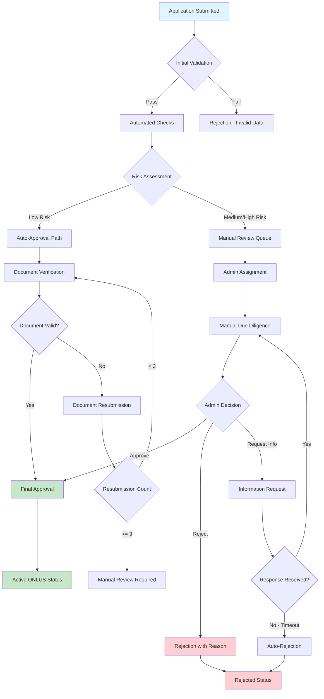

---

## 📋 Application Phases

### **Phase 1: Initial Application** ⏱️ *1-2 business days*

#### **Process Steps:**
1. **Data Collection & Validation**
   - Organization basic information
   - Legal entity verification
   - Contact details validation
   - Category selection and requirements mapping

2. **Automated Validation Checks**
   ```python
   # Example validation workflow
   validation_checks = [
       'organization_name_unique',
       'tax_code_format_valid',
       'contact_email_verified',
       'required_fields_complete',
       'category_requirements_met'
   ]
   ```

3. **Initial Risk Scoring**
   - Basic fraud detection algorithms
   - Duplicate organization checks
   - Contact verification
   - Historical platform data review

#### **Success Criteria:**
- ✅ All required fields completed
- ✅ Valid tax identification number
- ✅ Verified contact information
- ✅ No duplicate registrations found
- ✅ Category-specific requirements identified

#### **Possible Outcomes:**
- **Proceed to Documentation** → Phase 2
- **Rejection** → Invalid or incomplete data
- **Information Request** → Missing critical information

---

### **Phase 2: Documentation Review** ⏱️ *3-5 business days*

#### **Document Categories:**
1. **Legal Documents** (Required for all)
   - Certificate of incorporation
   - Tax-exempt status certificate
   - Board of directors list
   - Current bylaws or constitution

2. **Financial Documents** (Required for all)
   - Recent financial statements (last 2 years)
   - Annual reports
   - Audit reports (if applicable)
   - Budget projections

3. **Operational Documents** (Category-specific)
   - Program descriptions
   - Impact reports
   - Beneficiary testimonials
   - Partnership agreements

4. **Compliance Documents** (As required)
   - Regulatory licenses
   - Accreditation certificates
   - Insurance documentation
   - Donor privacy policies

#### **Document Verification Process:**
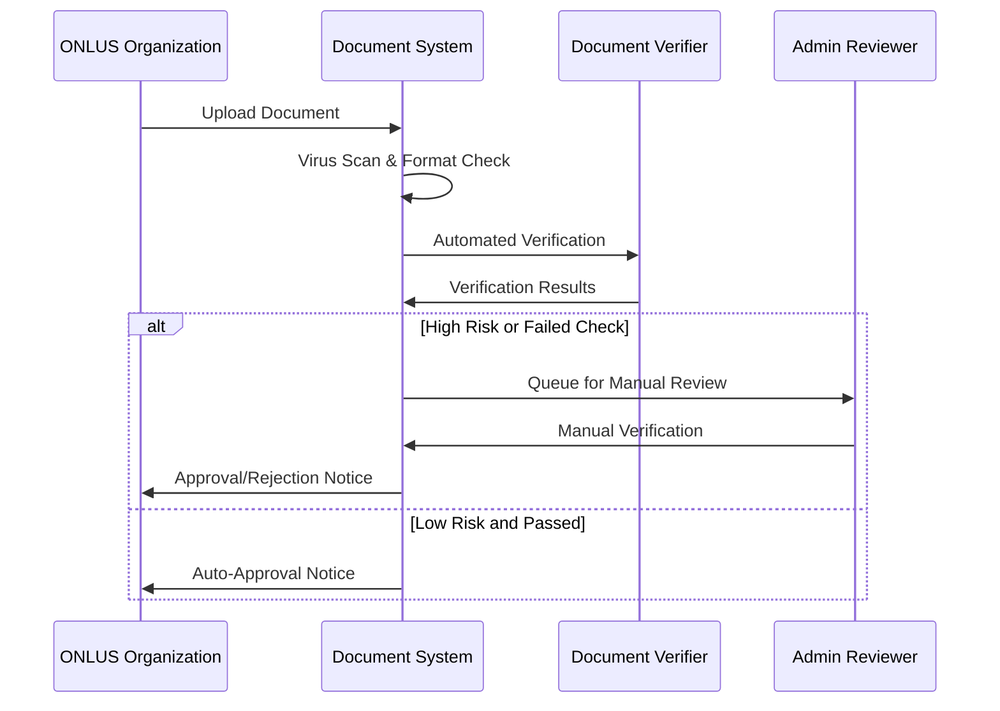

#### **Automated Document Checks:**
- **Format Validation**: PDF, image quality, readability
- **Content Extraction**: OCR for text analysis
- **Date Verification**: Ensure documents are current
- **Authenticity Markers**: Digital signatures, letterheads
- **Cross-Reference**: Compare with government databases

#### **Success Criteria:**
- ✅ All required documents submitted
- ✅ Documents pass authenticity checks
- ✅ Financial information appears reasonable
- ✅ Legal status confirmed
- ✅ No major compliance red flags

---

### **Phase 3: Due Diligence** ⏱️ *5-10 business days*

#### **Comprehensive Background Verification:**

1. **Legal Entity Verification**
   - Government registry confirmation
   - Tax status verification
   - Legal standing assessment
   - Regulatory compliance check

2. **Financial Due Diligence**
   - Financial health assessment
   - Revenue source analysis
   - Expense ratio evaluation
   - Transparency score calculation

3. **Operational Assessment**
   - Program effectiveness evaluation
   - Impact measurement review
   - Beneficiary feedback analysis
   - Partnership verification

4. **Reputation and Risk Analysis**
   - Online presence review
   - Media coverage analysis
   - Regulatory action history
   - Complaint resolution record

#### **Risk Scoring Factors:**
```python
risk_factors = {
    'financial_opacity': 25,      # Weight: 25%
    'regulatory_issues': 20,      # Weight: 20%
    'operational_concerns': 20,   # Weight: 20%
    'documentation_quality': 15,  # Weight: 15%
    'external_validation': 10,    # Weight: 10%
    'historical_performance': 10  # Weight: 10%
}

# Risk Score Calculation (0-100 scale)
# 0-30: Low Risk (Auto-approve track)
# 31-60: Medium Risk (Standard review)
# 61-100: High Risk (Enhanced due diligence)
```

---

### **Phase 4: Final Approval** ⏱️ *1-3 business days*

#### **Final Review Checklist:**
- [ ] All previous phases completed successfully
- [ ] Documentation fully verified and current
- [ ] Risk assessment within acceptable parameters
- [ ] Legal compliance confirmed
- [ ] Financial transparency adequate
- [ ] Operational capacity demonstrated

#### **Approval Process:**
1. **System Pre-Approval Check**
   - Automated final validation
   - Cross-phase consistency verification
   - Risk threshold confirmation

2. **Admin Final Review** (for medium/high risk cases)
   - Manual checklist completion
   - Decision documentation
   - Approval authorization

3. **Platform Integration**
   - ONLUS profile activation
   - Search index inclusion
   - Notification to organization
   - Internal system updates

---

## 📄 Document Verification

### **Document Lifecycle Management**

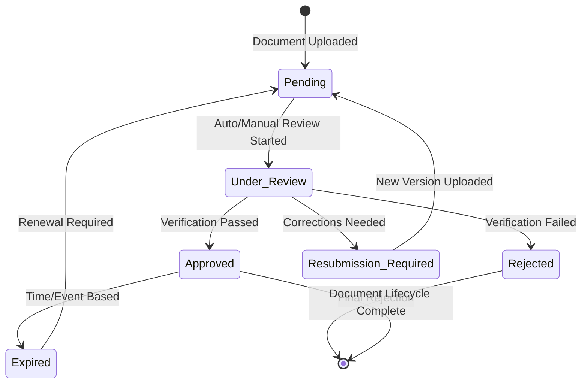

### **Verification Methods**

#### **Automated Verification (70% of documents)**
- **OCR Text Extraction**: Extract and validate key information
- **Format Compliance**: Ensure professional document standards
- **Date Validation**: Confirm currency and validity periods
- **Cross-Reference**: Compare with known databases
- **Pattern Recognition**: Identify standard legal document structures

#### **Manual Verification (30% of documents)**
- **Expert Review**: Legal or financial document specialists
- **External Validation**: Contact issuing authorities when needed
- **Fraud Detection**: Identify potential document tampering
- **Content Analysis**: Detailed review of terms and conditions
- **Quality Assessment**: Evaluate document professionalism

### **Document Categories and Requirements**

| Category | Required Documents | Verification Method | Typical Processing Time |
|----------|-------------------|-------------------|------------------------|
| **Legal** | Certificate of Incorporation, Bylaws | Government Database + Manual | 2-3 days |
| **Financial** | Financial Statements, Audit Reports | Automated + CPA Review | 3-5 days |
| **Operational** | Program Reports, Impact Studies | Manual Review | 2-4 days |
| **Compliance** | Licenses, Certifications | Authority Verification | 1-3 days |

---

## 🤖 Automated Checks

### **Technical Implementation**

#### **Data Validation Engine**
```python
class AutomatedVerificationEngine:
    def __init__(self):
        self.checks = [
            TaxCodeValidator(),
            EmailVerifier(),
            DocumentAuthenticator(),
            DuplicateDetector(),
            RiskCalculator(),
            ComplianceChecker()
        ]

    def run_verification(self, application_data):
        results = {}
        for check in self.checks:
            results[check.name] = check.execute(application_data)
        return self.aggregate_results(results)
```

#### **Automated Check Types**

1. **Identity Verification**
   - Tax identification number validation
   - Legal name verification against government records
   - Address validation and standardization
   - Contact information verification

2. **Document Authenticity**
   - Digital signature validation
   - PDF metadata analysis
   - Image forensics for tampering detection
   - OCR confidence scoring

3. **Compliance Screening**
   - Regulatory database searches
   - Sanction list checking
   - Media coverage analysis
   - Legal action history review

4. **Financial Analysis**
   - Revenue/expense ratio analysis
   - Financial trend evaluation
   - Accounting standard compliance
   - Red flag detection algorithms

5. **Operational Assessment**
   - Website analysis and validation
   - Social media presence evaluation
   - Program description consistency
   - Impact claim verification

### **Automated Decision Making**

#### **Auto-Approval Criteria (Low Risk Applications)**
- ✅ Perfect automated check scores (95%+ pass rate)
- ✅ Established organization (>2 years operation)
- ✅ Clear financial documentation
- ✅ Government database confirmation
- ✅ No regulatory red flags
- ✅ Standard category requirements met

#### **Auto-Rejection Criteria**
- ❌ Failed tax code validation
- ❌ Duplicate organization detected
- ❌ Fraudulent document indicators
- ❌ Regulatory sanctions found
- ❌ Incomplete required information
- ❌ Invalid contact details

---

## 👥 Manual Review Process

### **Review Team Structure**

#### **Specialized Review Teams**
1. **Legal Review Team**
   - Corporate lawyers
   - Regulatory compliance specialists
   - Government relations experts

2. **Financial Review Team**
   - Certified Public Accountants (CPAs)
   - Financial analysts
   - Non-profit financial specialists

3. **Operational Review Team**
   - Non-profit sector experts
   - Program evaluation specialists
   - Impact measurement professionals

4. **Risk Assessment Team**
   - Fraud detection specialists
   - Due diligence investigators
   - Background verification experts

### **Manual Review Workflow**

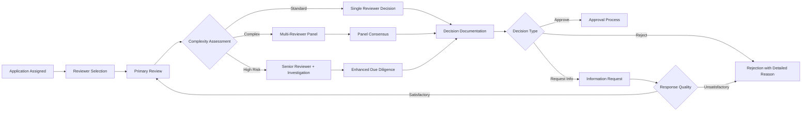

### **Review Criteria and Scoring**

#### **Legal Compliance Assessment (25%)**
- Corporate structure appropriateness
- Regulatory compliance status
- Legal documentation completeness
- Governance structure adequacy

#### **Financial Transparency (25%)**
- Financial statement quality
- Expense ratio reasonableness
- Revenue source diversity
- Financial controls evidence

#### **Operational Effectiveness (25%)**
- Program description clarity
- Impact measurement systems
- Beneficiary feedback quality
- Partnership credibility

#### **Organizational Capacity (25%)**
- Management team experience
- Board composition and governance
- Operational infrastructure
- Sustainability planning

### **Decision Documentation Requirements**

Every manual review must include:
- **Detailed reasoning** for the decision
- **Specific evidence** supporting conclusions
- **Risk assessment** summary
- **Recommendations** for improvement (if applicable)
- **Follow-up requirements** (if any)

---

## ⚖️ Risk Assessment

### **Risk Scoring Framework**

#### **Risk Categories and Weights**
```python
RISK_WEIGHTS = {
    'legal_compliance': 0.25,     # 25% - Legal status and compliance
    'financial_health': 0.20,     # 20% - Financial transparency and stability
    'operational_capacity': 0.20, # 20% - Ability to deliver programs
    'governance_quality': 0.15,   # 15% - Board and management quality
    'external_validation': 0.10,  # 10% - Third-party endorsements
    'historical_performance': 0.10 # 10% - Track record and reputation
}
```

#### **Detailed Risk Factors**

**Legal Compliance (25% weight)**
- Proper legal registration status (5%)
- Current tax-exempt status (5%)
- Regulatory compliance history (5%)
- Board governance structure (5%)
- Legal documentation completeness (5%)

**Financial Health (20% weight)**
- Financial statement quality (4%)
- Expense ratio appropriateness (4%)
- Revenue diversity (4%)
- Financial controls evidence (4%)
- Audit opinion quality (4%)

**Operational Capacity (20% weight)**
- Program delivery capability (5%)
- Management team experience (5%)
- Infrastructure adequacy (5%)
- Beneficiary feedback quality (5%)

**Governance Quality (15% weight)**
- Board composition and independence (5%)
- Executive compensation reasonableness (3%)
- Conflict of interest policies (3%)
- Transparency and accountability (4%)

**External Validation (10% weight)**
- Third-party accreditations (3%)
- Government partnerships (2%)
- Media coverage quality (2%)
- Peer organization endorsements (3%)

**Historical Performance (10% weight)**
- Operating history length (3%)
- Past compliance issues (3%)
- Program effectiveness track record (4%)

### **Risk Score Calculation**

```python
def calculate_risk_score(assessment_data):
    """
    Calculate composite risk score (0-100 scale)
    Lower scores indicate lower risk
    """
    weighted_scores = []

    for category, weight in RISK_WEIGHTS.items():
        category_score = assess_category(assessment_data[category])
        weighted_score = category_score * weight
        weighted_scores.append(weighted_score)

    total_risk_score = sum(weighted_scores)
    return min(100, max(0, total_risk_score))

def get_risk_category(risk_score):
    """Categorize risk level based on score"""
    if risk_score <= 30:
        return "LOW_RISK"
    elif risk_score <= 60:
        return "MEDIUM_RISK"
    else:
        return "HIGH_RISK"
```

### **Risk-Based Processing Paths**

#### **Low Risk (0-30 points)** 🟢
- **Processing Track**: Expedited review
- **Automation Level**: High (80% automated)
- **Manual Review**: Limited spot checks
- **Processing Time**: 7-10 business days
- **Approval Rate**: 95%+

#### **Medium Risk (31-60 points)** 🟡
- **Processing Track**: Standard review
- **Automation Level**: Moderate (50% automated)
- **Manual Review**: Comprehensive review
- **Processing Time**: 14-21 business days
- **Approval Rate**: 80-85%

#### **High Risk (61-100 points)** 🔴
- **Processing Track**: Enhanced due diligence
- **Automation Level**: Low (30% automated)
- **Manual Review**: Intensive investigation
- **Processing Time**: 21-30 business days
- **Approval Rate**: 60-70%

---

## 🌳 Decision Trees

### **Initial Triage Decision Tree**

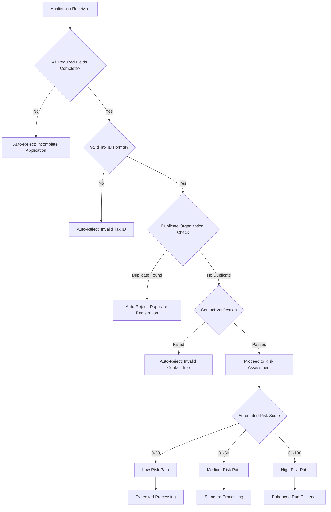

### **Document Verification Decision Tree**

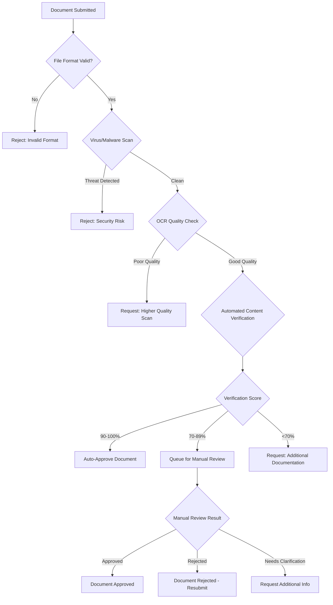

### **Final Approval Decision Tree**

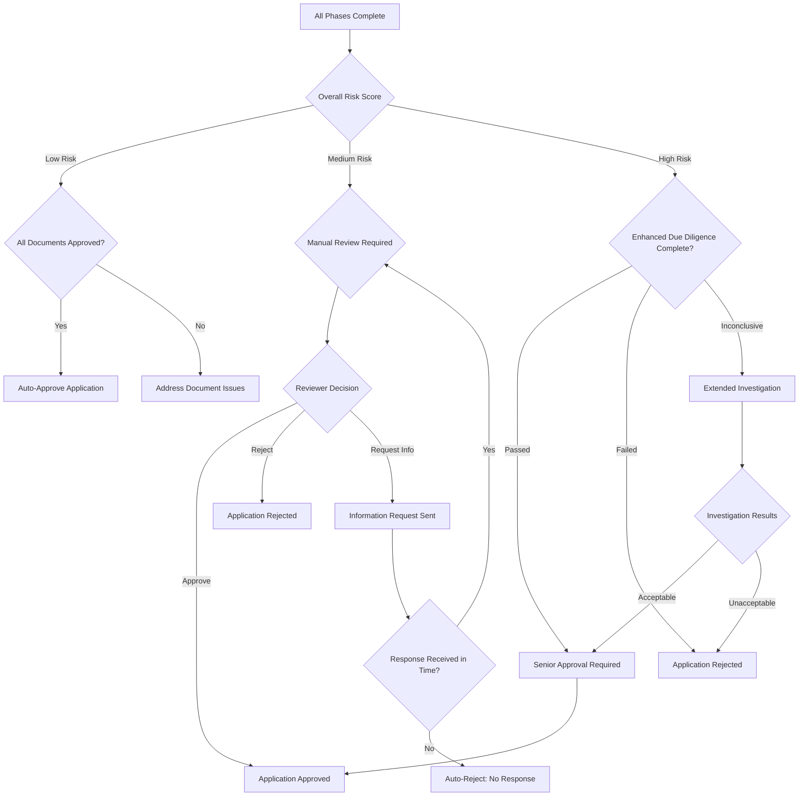

---

## ⏰ Timeline and SLAs

### **Service Level Agreements (SLAs)**

#### **Processing Time Commitments**

| Application Type | Target Processing Time | Maximum Processing Time | Success Rate Target |
|-----------------|----------------------|------------------------|-------------------|
| **Low Risk** | 7-10 business days | 14 business days | 95% within target |
| **Medium Risk** | 14-21 business days | 28 business days | 90% within target |
| **High Risk** | 21-30 business days | 45 business days | 85% within target |
| **Appeal Cases** | 10-15 business days | 21 business days | 90% within target |

#### **Phase-Specific Timelines**

```mermaid
gantt
    title ONLUS Verification Timeline
    dateFormat X
    axisFormat %d days

    section Low Risk Track
    Initial Application    :done, initial, 0, 2
    Documentation Review   :done, docs, after initial, 3
    Automated Due Diligence :done, auto-dd, after docs, 2
    Final Approval         :done, approval, after auto-dd, 1

    section Medium Risk Track
    Initial Application    :done, initial2, 0, 2
    Documentation Review   :done, docs2, after initial2, 5
    Manual Due Diligence   :active, manual-dd, after docs2, 10
    Final Approval         :approval2, after manual-dd, 3

    section High Risk Track
    Initial Application    :done, initial3, 0, 3
    Documentation Review   :done, docs3, after initial3, 7
    Enhanced Due Diligence :enhanced-dd, after docs3, 15
    Final Approval         :approval3, after enhanced-dd, 5
```

### **Communication Schedule**

#### **Automated Updates**
- **Application Received**: Immediate confirmation
- **Phase Transitions**: Within 24 hours of status change
- **Document Issues**: Within 48 hours of identification
- **Final Decision**: Within 24 hours of determination

#### **Proactive Communications**
- **Weekly Progress Updates**: For applications in process >10 days
- **Milestone Notifications**: At 50%, 75%, and 90% completion
- **Delay Notifications**: If processing exceeds 80% of SLA time
- **Escalation Alerts**: For applications approaching maximum timeline

### **Response Time Requirements**

#### **ONLUS Organization Responsibilities**
- **Information Requests**: 10 business days maximum response time
- **Document Resubmission**: 15 business days maximum
- **Clarification Requests**: 5 business days maximum
- **Appeal Submissions**: 30 calendar days from rejection notice

#### **Platform Response Times**
- **Information Request Acknowledgment**: 2 business days
- **Document Receipt Confirmation**: 1 business day
- **Status Inquiries**: 1 business day
- **Appeal Acknowledgment**: 3 business days

---

## 🚨 Escalation Procedures

### **Escalation Triggers**

#### **Automatic Escalation Scenarios**
1. **Timeline Breach**: Processing exceeds 90% of maximum SLA
2. **High-Risk Detection**: Risk score >80 or fraud indicators
3. **Document Authenticity Concerns**: Potential forgery detected
4. **Regulatory Red Flags**: Sanctions, legal actions, or violations
5. **System Failures**: Technical issues blocking processing
6. **Appeal Submissions**: All rejections that are appealed

#### **Manual Escalation Scenarios**
1. **Complex Legal Issues**: Unusual corporate structures or jurisdictions
2. **Financial Irregularities**: Suspicious financial patterns
3. **Conflicting Information**: Inconsistencies across documents/sources
4. **External Pressure**: Media attention or political sensitivity
5. **Reviewer Disagreement**: Split decisions requiring senior input

### **Escalation Hierarchy**

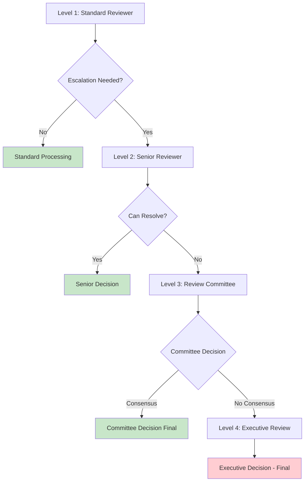

#### **Escalation Level Details**

**Level 1: Standard Reviewer**
- **Authority**: Approve/reject standard applications
- **Scope**: Risk scores 0-60, routine documentation
- **Timeline**: Standard SLA timelines
- **Escalation Criteria**: Risk >60, document concerns, unusual circumstances

**Level 2: Senior Reviewer**
- **Authority**: Approve/reject complex applications, override Level 1 decisions
- **Scope**: Risk scores 60-80, complex legal/financial issues
- **Timeline**: +3 business days to standard timeline
- **Escalation Criteria**: Risk >80, fraud suspicion, regulatory concerns

**Level 3: Review Committee (3 members)**
- **Authority**: Approve/reject high-risk applications, policy interpretations
- **Scope**: Risk scores 80+, fraud cases, appeals
- **Timeline**: +7 business days to standard timeline
- **Escalation Criteria**: Committee deadlock, executive-level sensitivity

**Level 4: Executive Review**
- **Authority**: Final decision authority, policy creation
- **Scope**: Unprecedented cases, regulatory interpretation, appeals of appeals
- **Timeline**: Case-by-case basis
- **Escalation Criteria**: Only from Level 3 deadlock or extreme circumstances

### **Escalation Process Flow**

#### **Escalation Initiation**
1. **Trigger Identification**: System or reviewer identifies escalation need
2. **Case Package Assembly**: Complete application file with escalation reason
3. **Next Level Assignment**: Automatic routing to appropriate level
4. **Timeline Adjustment**: SLA clock adjustment for escalated review
5. **Stakeholder Notification**: Inform ONLUS of escalation and revised timeline

#### **Escalation Resolution**
1. **Enhanced Review**: More thorough analysis appropriate to level
2. **Additional Verification**: External validation if needed
3. **Expert Consultation**: Subject matter experts as required
4. **Decision Documentation**: Detailed reasoning and precedent notation
5. **Resolution Communication**: Clear explanation to all stakeholders

---

## 🔧 Admin Workflows

### **Administrative Dashboard Functions**

#### **Application Management**
- **Queue Management**: Prioritize and assign applications
- **Workload Balancing**: Distribute cases across review team
- **Progress Monitoring**: Track application status and bottlenecks
- **Performance Analytics**: Review team efficiency and quality metrics

#### **Review Assignment System**
```python
class ReviewAssignmentEngine:
    def assign_reviewer(self, application):
        # Factors for assignment
        factors = {
            'reviewer_workload': 0.3,
            'expertise_match': 0.25,
            'availability': 0.2,
            'past_performance': 0.15,
            'conflict_of_interest': 0.1
        }

        # Get available reviewers
        available_reviewers = self.get_available_reviewers(application.risk_level)

        # Score and assign
        best_reviewer = self.calculate_best_match(available_reviewers, factors)
        return self.assign_and_notify(application, best_reviewer)
```

### **Admin Review Workflows**

#### **Daily Operations Workflow**
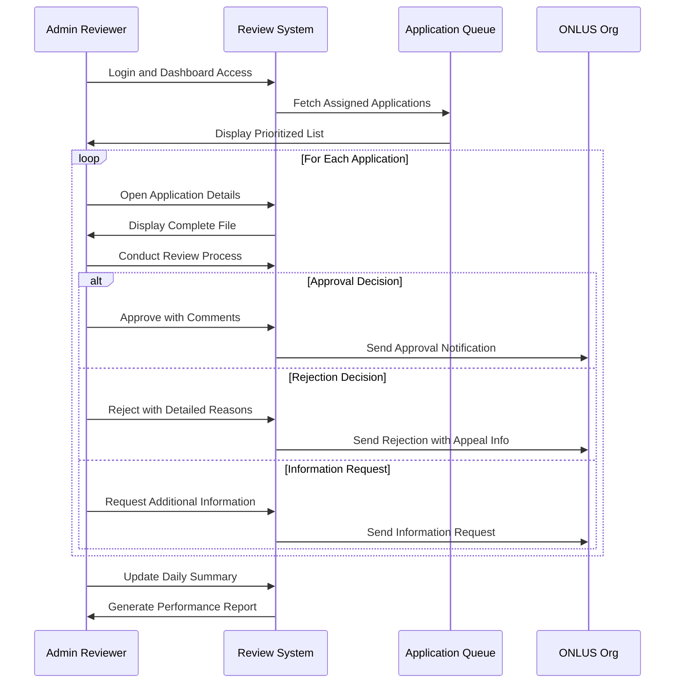

#### **Quality Assurance Workflow**
1. **Random Sampling**: 10% of approved applications reviewed
2. **Peer Review**: Complex cases reviewed by second reviewer
3. **Consistency Checks**: Decisions compared against similar cases
4. **Feedback Loop**: Quality issues addressed with reviewers
5. **Continuous Improvement**: Process refinement based on findings

### **Administrative Tools and Features**

#### **Decision Support Tools**
- **Risk Calculator**: Interactive risk assessment tool
- **Precedent Search**: Find similar past cases and decisions
- **Documentation Generator**: Standardized decision templates
- **External Verification**: Integrated government database lookups
- **Collaboration Tools**: Multi-reviewer conferencing and notes

#### **Reporting and Analytics**
- **Performance Dashboards**: Real-time processing metrics
- **Quality Reports**: Decision accuracy and consistency analysis
- **Trend Analysis**: Application patterns and risk factor evolution
- **Compliance Monitoring**: Regulatory requirement adherence
- **Resource Planning**: Workload forecasting and capacity planning

### **Admin User Roles and Permissions**

#### **Role-Based Access Control**
```python
ADMIN_ROLES = {
    'reviewer': {
        'permissions': [
            'view_applications',
            'review_documents',
            'make_decisions',
            'request_information'
        ],
        'restrictions': [
            'cannot_approve_high_risk',
            'cannot_override_system_decisions',
            'limited_to_assigned_cases'
        ]
    },
    'senior_reviewer': {
        'permissions': [
            'all_reviewer_permissions',
            'approve_high_risk',
            'override_reviewer_decisions',
            'assign_cases',
            'escalate_to_committee'
        ]
    },
    'committee_member': {
        'permissions': [
            'all_senior_permissions',
            'committee_voting',
            'policy_interpretation',
            'appeal_review'
        ]
    },
    'admin_manager': {
        'permissions': [
            'all_permissions',
            'user_management',
            'system_configuration',
            'reporting_access'
        ]
    }
}
```

---

## 📋 Appeals Process

### **Appeal Eligibility and Grounds**

#### **Eligible Appeal Scenarios**
1. **Procedural Errors**: Verification process not followed correctly
2. **New Evidence**: Significant new information not available during review
3. **Factual Errors**: Incorrect assessment of submitted information
4. **Policy Misapplication**: Verification standards applied incorrectly
5. **Discrimination Claims**: Unfair treatment based on protected characteristics
6. **Technical Issues**: System errors affecting application processing

#### **Appeal Submission Requirements**
- **Timeliness**: Must be submitted within 30 calendar days of rejection
- **Specific Grounds**: Clear statement of appeal basis from eligible scenarios
- **Supporting Evidence**: New documentation or clarification of existing materials
- **Contact Information**: Current contact details for correspondence
- **Fee**: No fee required for first appeal, nominal fee for subsequent appeals

### **Appeal Review Process**

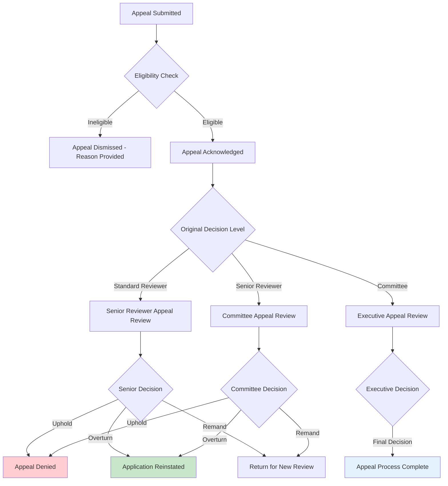

#### **Appeal Review Standards**
- **Fresh Review**: Complete re-examination of original application
- **Enhanced Scrutiny**: Higher level of review than original decision
- **Burden of Proof**: Appellant must demonstrate error or provide new evidence
- **Independence**: Review conducted by different personnel than original
- **Documentation**: Detailed reasoning required for all appeal decisions

### **Appeal Outcomes and Next Steps**

#### **Possible Appeal Results**
1. **Appeal Granted - Application Approved**: Full approval with explanation
2. **Appeal Granted - Return for Review**: Remand to appropriate level for new review
3. **Appeal Partially Granted**: Specific issues addressed, remaining concerns noted
4. **Appeal Denied**: Original decision upheld with detailed reasoning
5. **Appeal Dismissed**: Procedural or eligibility issues prevent substantive review

#### **Post-Appeal Options**
- **Acceptance**: ONLUS accepts final decision
- **Reapplication**: Submit new application after addressing issues (6-month waiting period)
- **External Review**: Regulatory complaints or legal action (outside platform process)
- **Process Improvement**: Feedback incorporated into verification process enhancement

### **Appeal Timeline and Communications**

#### **Appeal Processing Schedule**
- **Acknowledgment**: 3 business days from submission
- **Eligibility Determination**: 5 business days from acknowledgment
- **Review Assignment**: 2 business days from eligibility confirmation
- **Review Completion**: 15 business days from assignment
- **Decision Communication**: 2 business days from review completion
- **Total Timeline**: 21-25 business days maximum

#### **Communication Protocol**
- **Regular Updates**: Weekly status updates during review
- **Transparency**: Clear explanation of process and timeline
- **Documentation**: All communications documented in appeal file
- **Accessibility**: Multiple communication channels available
- **Follow-up**: Post-decision support and clarification available

---

## 📊 Process Performance Metrics

### **Key Performance Indicators (KPIs)**

#### **Efficiency Metrics**
- **Average Processing Time**: Target vs. actual by risk category
- **SLA Compliance Rate**: Percentage of applications processed within timeline
- **Queue Depth**: Number of applications waiting at each phase
- **Throughput**: Applications processed per day/week/month
- **Resource Utilization**: Reviewer workload and capacity metrics

#### **Quality Metrics**
- **Decision Accuracy Rate**: Appeals overturned / total decisions
- **Consistency Score**: Similar case decision alignment
- **Documentation Quality**: Completeness of decision reasoning
- **Error Rate**: Processing mistakes and corrections required
- **Customer Satisfaction**: ONLUS feedback on process experience

#### **Risk and Compliance Metrics**
- **Risk Detection Rate**: High-risk cases properly identified
- **False Positive Rate**: Low-risk cases unnecessarily escalated
- **Compliance Adherence**: Regulatory requirement fulfillment
- **Fraud Prevention**: Fraudulent applications identified and rejected
- **Audit Results**: External verification of process integrity

### **Continuous Improvement Framework**

#### **Regular Process Reviews**
- **Monthly Performance Reviews**: KPI analysis and trend identification
- **Quarterly Process Audits**: Comprehensive workflow evaluation
- **Annual Strategy Assessment**: Major process improvements and policy updates
- **Continuous Feedback Integration**: Ongoing stakeholder input incorporation

#### **Improvement Implementation**
1. **Issue Identification**: Data analysis and stakeholder feedback
2. **Root Cause Analysis**: Deep dive into process bottlenecks or quality issues
3. **Solution Development**: Process design improvements and tool enhancements
4. **Pilot Testing**: Limited implementation to validate improvements
5. **Full Rollout**: System-wide implementation with training and support
6. **Impact Measurement**: Post-implementation effectiveness assessment

---

## 🔚 Conclusion

The GOO-17 ONLUS Verification Process represents a comprehensive, balanced approach to ensuring the quality and legitimacy of charitable organizations on the GoodPlay platform. Through automated efficiency, human expertise, risk-based decision making, and continuous improvement, the process serves the dual purpose of protecting donors and supporting legitimate ONLUS organizations in their mission to create positive social impact.

### **Process Success Factors**
- **Comprehensive Coverage**: Multi-phase approach addresses all verification aspects
- **Scalable Framework**: Automated and manual components balance efficiency with thoroughness
- **Risk-Based Approach**: Resources focused where most needed
- **Transparent Operations**: Clear expectations and communications
- **Continuous Evolution**: Regular improvement based on data and feedback

### **Future Enhancements**
- **AI/ML Integration**: Enhanced fraud detection and risk assessment
- **Real-time Verification**: Instant validation of government database information
- **Blockchain Documentation**: Immutable record keeping for enhanced security
- **Predictive Analytics**: Proactive identification of compliance issues
- **API Integration**: Seamless connections with regulatory databases and partners

---

*This document is maintained by the GoodPlay Engineering Team and updated quarterly to reflect process improvements and regulatory changes.*

**Document Version**: 1.0
**Last Updated**: September 2025
**Next Review**: December 2025
**Owner**: ONLUS Verification Team
**Approved By**: Head of Trust & Safety