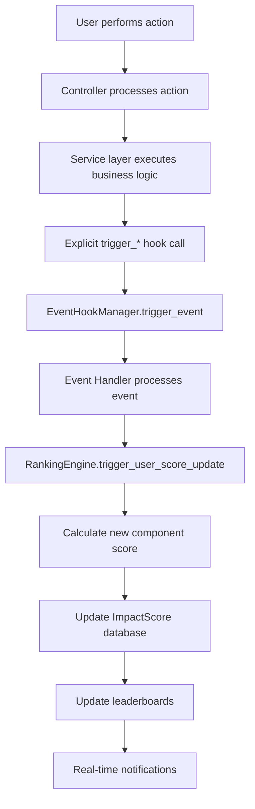

# 🎯 Impact Score System & Event Hook Architecture

## 📋 Panoramica del Sistema

L'**Impact Score System** è un sistema di gamification avanzato che calcola un punteggio globale per ogni utente basato sulle sue attività nell'applicazione. Il sistema utilizza un'architettura basata su eventi per aggiornare automaticamente i punteggi in tempo reale.

### 🎮 Formula di Calcolo

```
Impact Score = (Gaming Component × 30%) + (Social Component × 20%) + (Donation Component × 50%)
```

**Componenti del Punteggio**:
- **Gaming Activity (30%)**: Attività di gioco, varietà, tornei, achievement
- **Social Engagement (20%)**: Interazioni sociali, amicizie, sfide, community
- **Donation Impact (50%)**: Donazioni, frequenza, diversità ONLUS, eventi speciali

### 📊 Range di Punteggio per Componente

| Componente | Peso | Punteggio Massimo | Impatto sull'Impact Score |
|------------|------|-------------------|---------------------------|
| Gaming     | 30%  | 1.000 punti      | 300 punti massimi        |
| Social     | 20%  | 500 punti        | 100 punti massimi        |
| Donation   | 50%  | 2.000 punti      | 1.000 punti massimi      |
| **TOTALE** | 100% | **3.500 punti**  | **1.400 punti massimi**  |

## 🏗️ Architettura del Sistema

### 📁 Struttura Modulare

```
app/social/leaderboards/
├── models/
│   └── impact_score.py          # Modello dati Impact Score
├── services/
│   ├── ranking_engine.py        # Engine di calcolo punteggi
│   └── leaderboard_service.py   # Gestione classifiche
├── repositories/
│   ├── impact_score_repository.py  # Data access layer
│   └── leaderboard_repository.py   # Repository classifiche
├── integration/
│   ├── hooks.py                 # Sistema Event Hook Manager
│   └── event_handlers.py       # Handler specifici per eventi
└── controllers/
    └── leaderboard_controller.py   # API endpoints
```

### 🎯 Componenti Principali

#### 1. **ImpactScore Model**
Modello dati che rappresenta il punteggio di un utente:

```python
class ImpactScore:
    - user_id: ObjectId
    - impact_score: float (totale calcolato)
    - gaming_component: float (0-1000)
    - social_component: float (0-500)
    - donation_component: float (0-2000)
    - rank_global: int (posizione globale)
    - rank_weekly: int (posizione settimanale)
    - gaming_details: Dict (breakdown dettagliato gaming)
    - social_details: Dict (breakdown dettagliato social)
    - donation_details: Dict (breakdown dettagliato donation)
    - score_history: List (storico punteggi)
```

#### 2. **RankingEngine**
Servizio principale per il calcolo e aggiornamento punteggi:

```python
# Metodi principali
- calculate_user_impact_score(user_id) → Calcola score completo
- trigger_user_score_update(user_id, component, activity_data) → Update specifico
- recalculate_all_rankings() → Ricalcola tutte le classifiche
- update_leaderboards() → Aggiorna leaderboard globali e settimanali
```

## 🪝 Event Hook System

### 🎯 Architettura ad Eventi

Il sistema utilizza un'architettura basata su **eventi** per aggiornare automaticamente i punteggi Impact Score quando l'utente compie azioni nell'app.

### 📡 EventHookManager

```python
class EventHookManager:
    def register_hook(event_name, handler)  # Registra handler per evento
    def trigger_event(event_name, **kwargs) # Triggera tutti gli handler
    def get_registered_events()             # Lista eventi registrati
```

**Funzionamento**:
1. All'avvio app: si registrano gli handler per ogni tipo di evento
2. Durante l'uso: quando succede un evento, si triggerano automaticamente tutti gli handler registrati
3. Gli handler aggiornano l'Impact Score in base al tipo di attività

### 🎮 Eventi Supportati

#### 1. **game_session_complete**
**Trigger**: Quando un utente completa una sessione di gioco

**Dati dell'evento**:
```python
{
    'user_id': 'user_123',
    'session_data': {
        'session_id': 'session_456',
        'game_id': 'tetris_classic',
        'play_duration_ms': 300000,  # 5 minuti
        'final_score': 1250,
        'achievements_unlocked': ['first_tetris'],
        'session_type': 'normal'
    }
}
```

**Aggiornamento Impact Score**:
- **Play Time Score**: Basato su durata sessione
- **Game Variety Score**: Incrementa se nuovo gioco
- **Achievement Score**: Bonus per achievement sbloccati
- **Consistency Multiplier**: Bonus per sessioni consecutive

#### 2. **social_activity**
**Trigger**: Interazioni sociali (amicizie, sfide, condivisioni)

**Dati dell'evento**:
```python
{
    'user_id': 'user_123',
    'activity_type': 'friend_request_accepted',
    'activity_data': {
        'target_user_id': 'user_456',
        'interaction_score': 5,
        'timestamp': '2025-09-26T19:00:00Z'
    }
}
```

**Tipi di attività supportate**:
- `friend_request_sent` - Richiesta amicizia inviata
- `friend_request_accepted` - Richiesta amicizia accettata
- `challenge_sent` - Sfida inviata
- `challenge_completed` - Sfida completata
- `social_share` - Condivisione social
- `community_interaction` - Interazione community

#### 3. **donation_complete**
**Trigger**: Quando un utente completa una donazione

**Dati dell'evento**:
```python
{
    'user_id': 'user_123',
    'donation_data': {
        'amount': 25.00,
        'onlus_id': 'onlus_456',
        'transaction_type': 'regular',
        'is_recurring': False,
        'special_event': 'christmas_campaign',
        'currency': 'EUR'
    }
}
```

**Aggiornamento Impact Score**:
- **Amount Score**: Basato sull'importo donato
- **Frequency Score**: Bonus per donazioni regolari
- **Diversity Score**: Bonus per donazioni a ONLUS diverse
- **Event Score**: Bonus per eventi speciali

#### 4. **achievement_unlock**
**Trigger**: Quando un utente sblocca un achievement

**Dati dell'evento**:
```python
{
    'user_id': 'user_123',
    'achievement_data': {
        'achievement_id': 'first_victory',
        'category': 'gaming',  # gaming/social/impact
        'badge_rarity': 'rare',
        'reward_credits': 100
    }
}
```

#### 5. **user_login**
**Trigger**: Login utente (per tracking consistenza)

**Aggiornamento**: Refresh periodico score se > 12 ore dall'ultimo calcolo

#### 6. **weekly_reset**
**Trigger**: Reset settimanale delle classifiche

**Azione**: Reset classifiche settimanali e mantenimento storiche

#### 7. **tournament_complete**
**Trigger**: Completamento torneo

**Dati dell'evento**:
```python
{
    'tournament_id': 'tournament_123',
    'tournament_type': 'weekly_challenge',
    'participants': [
        {
            'user_id': 'user_123',
            'final_rank': 1,
            'score': 2500,
            'is_winner': True
        }
    ]
}
```

## 📈 Calcolo Dettagliato dei Componenti

### 🎮 Gaming Component (30% del totale)

**Sub-componenti**:
```python
gaming_details = {
    'play_time_score': 0.0,      # Tempo di gioco (0-300 punti)
    'game_variety_score': 0.0,   # Varietà giochi (0-200 punti)
    'tournament_score': 0.0,     # Partecipazione tornei (0-300 punti)
    'achievement_score': 0.0,    # Achievement sbloccati (0-200 punti)
    'consistency_multiplier': 1.0 # Moltiplicatore consistenza (0.8-1.5)
}
```

**Formula**:
```
Gaming Score = (play_time + variety + tournament + achievements) × consistency_multiplier
Contributo Impact = Gaming Score × 0.30
```

### 👥 Social Component (20% del totale)

**Sub-componenti**:
```python
social_details = {
    'friends_score': 0.0,        # Numero amici e interazioni (0-150 punti)
    'challenges_score': 0.0,     # Sfide inviate/accettate (0-150 punti)
    'community_score': 0.0,      # Partecipazione community (0-100 punti)
    'sharing_score': 0.0,        # Condivisioni social (0-100 punti)
    'engagement_multiplier': 1.0  # Moltiplicatore engagement (0.8-1.3)
}
```

### 💰 Donation Component (50% del totale)

**Sub-componenti**:
```python
donation_details = {
    'amount_score': 0.0,         # Importo totale donato (0-800 punti)
    'frequency_score': 0.0,      # Frequenza donazioni (0-400 punti)
    'diversity_score': 0.0,      # Diversità ONLUS (0-400 punti)
    'event_score': 0.0,          # Partecipazione eventi speciali (0-400 punti)
    'consistency_multiplier': 1.0 # Moltiplicatore consistenza (0.9-1.4)
}
```

## 🔄 Integration Flow

### 📊 Complete Event Flow



### 🎯 Practical Example: Game Session Completion

1. **User action**: Completes Tetris game (5 minutes, score 1250)

2. **Controller handling**:
```python
# In games_controller.py - end_game_session endpoint
success, message, result = session_service.end_game_session(session_id, reason)

if success:
    # Explicit hook trigger
    session_data = result.get('session', {}) if result else {}
    if session_data.get('user_id'):
        trigger_game_session_complete(
            str(session_data['user_id']),
            session_data
        )
```

3. **Event processing**:
```python
# handle_game_session_complete() is called
activity_data = {
    'session_id': 'session_123',
    'game_id': 'tetris',
    'play_duration_ms': 300000,
    'final_score': 1250,
    'session_type': 'normal'
}
ranking_engine.trigger_user_score_update(user_id, 'gaming', activity_data)
```

4. **Score calculation**:
```python
# Calculate new gaming component
gaming_details = {
    'play_time_score': 45,      # +45 for 5 minutes play
    'game_variety_score': 10,   # +10 if Tetris played before
    'achievement_score': 0,     # No achievements
    'consistency_multiplier': 1.1  # Bonus for consecutive sessions
}
new_gaming_score = (45 + 10 + 0) × 1.1 = 60.5 points
```

5. **Impact Score update**:
```python
# Gaming component contributes 30% to total
gaming_contribution = 60.5 × 0.30 = 18.15 points
new_impact_score = social_score + donation_score + 18.15
```

6. **Leaderboard update**: Global and weekly rankings recalculated

## 🔌 API Usage

### 🎮 Triggering from Controllers

```python
# In game controller after session completion
from app.social.leaderboards.integration.hooks import trigger_game_session_complete

@games_bp.route('/sessions/<session_id>/end', methods=['POST'])
@auth_required
def end_game_session(current_user, session_id):
    # Session termination logic...
    success, message, result = session_service.end_game_session(session_id, reason)

    if success:
        # Trigger Impact Score update via explicit hook call
        try:
            session_data = result.get('session', {}) if result else {}
            if session_data.get('user_id'):
                trigger_game_session_complete(
                    str(session_data['user_id']),
                    session_data
                )
        except Exception as e:
            # Log but don't fail the main operation
            current_app.logger.warning(f"Failed to trigger impact score update: {str(e)}")

    return success_response(message, result)
```

### 👥 Social Activity Triggers

```python
# In social controller after friend request acceptance
from app.social.leaderboards.integration.hooks import trigger_social_activity

@social_bp.route('/friend-request/<relationship_id>/accept', methods=['PUT'])
@auth_required
def accept_friend_request(current_user, relationship_id):
    success, message, result = relationship_service.accept_friend_request(
        current_user.get_id(), relationship_id
    )

    if success:
        # Trigger Impact Score update via explicit hook call
        try:
            trigger_social_activity(
                current_user.get_id(),
                'friend_request_accepted',
                {'relationship_id': relationship_id}
            )
        except Exception as e:
            # Log but don't fail the main operation
            current_app.logger.warning(f"Failed to trigger social activity hook: {str(e)}")

    return success_response(message, result)
```

## 📚 Available Hook Functions

### 🎯 Hook Trigger Functions

```python
from app.social.leaderboards.integration.hooks import (
    trigger_game_session_complete,    # Gaming events
    trigger_social_activity,          # Social events
    trigger_donation_complete,        # Donation events
    trigger_achievement_unlock,       # Achievement events
    trigger_user_login,              # Login events
    trigger_weekly_reset,            # System events
    trigger_tournament_complete      # Tournament events
)
```

### 📋 Event Registration

```python
# In application setup
from app.social.leaderboards.integration.hooks import register_integration_hooks

# Register all event handlers
register_integration_hooks()

# Events registered automatically:
# - game_session_complete → handle_game_session_complete
# - social_activity → handle_social_activity
# - donation_complete → handle_donation_activity
# - achievement_unlock → handle_achievement_unlock
# - user_login → handle_user_login
# - weekly_reset → handle_weekly_reset
# - tournament_complete → handle_tournament_result
```

## 🎯 Best Practices

### ✅ When to Use Hooks

1. **After significant actions**: Game completion, donations, social interactions
2. **Automatic events**: Login, periodic resets, achievement completion
3. **Cross-modular actions**: When a module needs to notify changes to others

### ⚠️ What to Avoid

1. **Don't overload**: Avoid events for every small action
2. **Error handling**: Always handle hook failures gracefully
3. **Performance**: Hooks must be fast (non-blocking)

### 🔧 Configuration

```python
# In app config
IMPACT_SCORE_ENABLED = True
IMPACT_SCORE_REAL_TIME_UPDATES = True
IMPACT_SCORE_BATCH_MODE = False
LEADERBOARD_UPDATE_FREQUENCY = 'real_time'  # real_time, hourly, daily
```

### 🏗️ Architecture Notes

**Event-Based Integration**: The system now uses explicit hook calls in controllers instead of monkey patching. This provides:

- **Transparency**: Clear visibility of when events are triggered
- **Reliability**: No risk of breaking when method signatures change
- **Maintainability**: Easy to trace event flow and debug issues
- **Performance**: No runtime method replacement overhead

## 🚀 Future Roadmap

### 🔮 Planned Improvements

1. **Event Streaming**: Integration with Redis/Kafka for distributed events
2. **Batch Processing**: Batch mode for massive updates
3. **Machine Learning**: AI to optimize weights and multipliers
4. **Analytics**: Dashboard for system performance monitoring
5. **A/B Testing**: Automated testing of different calculation formulas

---

*Documentation updated September 26, 2025 - GoodPlay Backend v1.0*