# 🏛️ Guida per l'Iscrizione delle ONLUS su GoodPlay

## 📋 Indice
1. [Benvenuti su GoodPlay](#benvenuti-su-goodplay)
2. [Requisiti per l'Iscrizione](#requisiti-per-liscrizione)
3. [Processo di Registrazione](#processo-di-registrazione)
4. [Documentazione Richiesta](#documentazione-richiesta)
5. [Processo di Verifica](#processo-di-verifica)
6. [Tempistiche e Stato Applicazione](#tempistiche-e-stato-applicazione)
7. [Gestione del Profilo ONLUS](#gestione-del-profilo-onlus)
8. [Raccolta Fondi e Donazioni](#raccolta-fondi-e-donazioni)
9. [Domande Frequenti](#domande-frequenti)
10. [Supporto e Contatti](#supporto-e-contatti)

---

## 🌟 Benvenuti su GoodPlay

### **Cos'è GoodPlay?**
GoodPlay è la piattaforma innovativa che trasforma il tempo di gioco in impatto sociale reale. Attraverso la nostra tecnologia, i giocatori guadagnano crediti virtuali giocando che possono poi donare alle ONLUS registrate sulla piattaforma.

### **Perché Aderire a GoodPlay?**

#### **🎯 Benefici per la Vostra ONLUS**
- **Nuova Fonte di Raccolta Fondi**: Accesso a una community di giocatori generosi
- **Visibilità Aumentata**: Esposizione a migliaia di potenziali sostenitori
- **Donazioni Regolari**: Flusso costante di micro-donazioni dai giocatori
- **Trasparenza Totale**: Sistema di tracciamento completo delle donazioni
- **Engagement Giovanile**: Coinvolgimento delle nuove generazioni
- **Zero Commissioni**: Ricezione integrale delle donazioni

#### **📊 I Numeri che Contano**
- **50,000+** giocatori attivi sulla piattaforma
- **€2.3M+** già donati alle ONLUS partner
- **180+** organizzazioni già registrate
- **15 minuti** tempo medio di donazione per sessione di gioco

### **La Nostra Missione**
Creare un ecosistema sostenibile dove il divertimento digitale si trasforma in aiuto concreto per chi ne ha bisogno, rendendo la beneficenza accessibile e coinvolgente per tutti.

---

## ✅ Requisiti per l'Iscrizione

### **📋 Requisiti Obbligatori**

#### **Status Legale**
- ✅ **Riconoscimento ONLUS**: Atto costitutivo e statuto registrati
- ✅ **Codice Fiscale Valido**: Identificativo fiscale dell'organizzazione
- ✅ **Iscrizione Registri**: Registro delle ONLUS o equivalente regionale
- ✅ **Status Fiscale**: Certificazione dell'esenzione fiscale
- ✅ **Sede Operativa**: Indirizzo verificabile dell'organizzazione

#### **Governance e Trasparenza**
- ✅ **Consiglio di Amministrazione**: Composizione e verbali recenti
- ✅ **Bilanci Recenti**: Ultimi 2 anni di rendicontazione finanziaria
- ✅ **Relazioni di Attività**: Documentazione dei programmi svolti
- ✅ **Statuto Aggiornato**: Documento costitutivo attuale
- ✅ **Contatti Verificabili**: Email e telefono dell'organizzazione

#### **Attività e Programmi**
- ✅ **Scopo Sociale Chiaro**: Definizione precisa della missione
- ✅ **Beneficiari Identificati**: Target specifico dell'attività
- ✅ **Programmi Attivi**: Progetti in corso o pianificati
- ✅ **Impatto Misurabile**: Risultati e metriche di valutazione
- ✅ **Durata Operativa**: Almeno 6 mesi di attività documentata

### **🎯 Categorie ONLUS Supportate**

#### **Settori Prioritari**
1. **Sanità e Assistenza Sociale** 🏥
   - Assistenza socio-sanitaria
   - Ricerca medica
   - Sostegno a malati e famiglie

2. **Istruzione e Formazione** 📚
   - Supporto educativo
   - Formazione professionale
   - Programmi di alfabetizzazione

3. **Tutela Ambientale** 🌱
   - Conservazione della natura
   - Educazione ambientale
   - Sviluppo sostenibile

4. **Servizi Sociali** 🤝
   - Assistenza agli anziani
   - Supporto all'infanzia
   - Integrazione sociale

5. **Cultura e Sport** 🎨
   - Promozione culturale
   - Sport inclusivo
   - Arte e spettacolo

6. **Diritti Civili** ⚖️
   - Tutela dei diritti umani
   - Pari opportunità
   - Supporto legale

### **❌ Criteri di Esclusione**

#### **Organizzazioni Non Ammesse**
- Enti con scopi di lucro
- Organizzazioni politiche o sindacali
- Enti religiosi con attività esclusivamente di culto
- Organizzazioni con contenziosi legali in corso
- Enti con precedenti di frode o irregolarità finanziarie
- Organizzazioni che supportano attività illegali

---

## 🚀 Processo di Registrazione

### **📝 Passaggio 1: Registrazione Account**

#### **Creazione Account Amministratore**
1. **Accesso al Portale**: Visitare [goodplay.it/onlus-registration](http://goodplay.it/onlus-registration)
2. **Dati Personali del Responsabile**:
   - Nome e cognome completi
   - Email istituzionale (preferibile dominio organizzazione)
   - Numero di telefono verificabile
   - Ruolo nell'organizzazione
3. **Verifica Email**: Conferma attraverso link di attivazione
4. **Accesso Sicuro**: Creazione password sicura (min. 8 caratteri, maiuscole, numeri, simboli)

#### **Informazioni Organizzazione**
```
📋 Dati da Preparare:
• Nome ufficiale dell'organizzazione
• Codice fiscale/Partita IVA
• Indirizzo sede legale completo
• Telefono e fax dell'organizzazione
• Sito web ufficiale (se disponibile)
• Profili social media ufficiali
```

### **📊 Passaggio 2: Profilo Organizzazione**

#### **Informazioni Base**
- **Nome e Denominazione**: Nome ufficiale e acronimi utilizzati
- **Descrizione Breve**: Sommario della missione (max 200 caratteri)
- **Descrizione Dettagliata**: Presentazione completa dell'organizzazione (max 2000 caratteri)
- **Anno di Fondazione**: Data di costituzione dell'ente
- **Numero Beneficiari**: Stima delle persone aiutate annualmente

#### **Categoria e Specializzazione**
```
🎯 Selezione Categoria Principale:
□ Sanità e Assistenza Sociale
□ Istruzione e Formazione
□ Tutela Ambientale
□ Servizi Sociali
□ Cultura e Sport
□ Diritti Civili
□ Cooperazione Internazionale
□ Altro (specificare)
```

#### **Area Geografica di Intervento**
- **Ambito Locale**: Comune o provincia specifica
- **Ambito Regionale**: Una o più regioni italiane
- **Ambito Nazionale**: Tutto il territorio italiano
- **Ambito Internazionale**: Paesi esteri di intervento

### **📷 Passaggio 3: Materiali Multimediali**

#### **Logo e Immagini**
- **Logo Ufficiale**: Formato PNG/JPG, risoluzione minima 300x300px
- **Foto di Copertina**: Immagine rappresentativa 1200x600px
- **Galleria Foto**: Massimo 10 immagini delle attività (facoltativo)
- **Video Presentazione**: Link YouTube/Vimeo (facoltativo, max 3 minuti)

#### **Linee Guida per le Immagini**
- ✅ Qualità alta e nitida
- ✅ Rappresentative dell'attività
- ✅ Rispettosa della privacy dei beneficiari
- ✅ Formato JPG o PNG
- ❌ Watermark o testi sovrapposti
- ❌ Contenuti inappropriati o offensivi

---

## 📁 Documentazione Richiesta

### **📋 Documenti Obbligatori per Tutte le ONLUS**

#### **1. Documentazione Legale**
```
📄 Documenti da Preparare:
□ Atto costitutivo e statuto (PDF)
□ Certificato di iscrizione al registro ONLUS
□ Codice fiscale dell'ente
□ Eventuali modifiche statutarie
□ Delibera di nomina del legale rappresentante
```

**💡 Suggerimenti**:
- Scansioni chiare e leggibili (min. 300 DPI)
- Tutti i documenti devono essere aggiornati
- Se documenti datati, fornire dichiarazione di validità

#### **2. Documentazione Finanziaria**
```
📊 Bilanci e Rendicontazione:
□ Bilancio degli ultimi 2 anni
□ Relazione di attività degli ultimi 2 anni
□ Verbali assemblea di approvazione bilanci
□ Certificazione revisore dei conti (se applicabile)
□ Dichiarazione dei redditi degli ultimi 2 anni
```

**📈 Criteri di Valutazione Finanziaria**:
- Trasparenza nella rendicontazione
- Proporzione ragionevole tra costi amministrativi e attività
- Stabilità finanziaria e sostenibilità
- Corretta applicazione delle norme contabili ONLUS

#### **3. Documentazione Operativa**
```
🎯 Attività e Programmi:
□ Relazione dettagliata delle attività svolte
□ Elenco progetti attivi e programmati
□ Protocolli operativi per i servizi offerti
□ Partnership e collaborazioni significative
□ Testimonianze di beneficiari (se disponibili)
```

### **📂 Documenti Specifici per Categoria**

#### **Sanità e Assistenza Sociale** 🏥
```
Documentazione Aggiuntiva:
□ Autorizzazioni sanitarie (se applicabili)
□ Iscrizione albi professionali del personale
□ Protocolli di assistenza e cura
□ Convenzioni con strutture sanitarie
□ Certificazioni di qualità (ISO, accreditamenti)
```

#### **Istruzione e Formazione** 📚
```
Documentazione Aggiuntiva:
□ Accreditamento enti formativi (se applicabile)
□ Curricula del personale docente
□ Programmi formativi e metodologie
□ Partenariati con istituzioni educative
□ Risultati e valutazioni dei corsi erogati
```

#### **Tutela Ambientale** 🌱
```
Documentazione Aggiuntiva:
□ Progetti di conservazione realizzati
□ Collaborazioni con enti di ricerca
□ Impatti ambientali misurati
□ Autorizzazioni per interventi sul territorio
□ Riconoscimenti e premi ambientali
```

#### **Servizi Sociali** 🤝
```
Documentazione Aggiuntiva:
□ Protocolli di intervento sociale
□ Formazione del personale operativo
□ Network di collaborazioni territoriali
□ Valutazione impatto sociale dei progetti
□ Procedure di tutela e protezione utenti
```

### **🔐 Gestione Sicura dei Documenti**

#### **Standard di Sicurezza**
- **Crittografia**: Tutti i documenti sono crittografati durante upload
- **Accesso Limitato**: Solo personale autorizzato può visualizzare
- **Backup Sicuro**: Copie di sicurezza in server protetti
- **Conservazione Temporanea**: Documenti cancellati dopo approvazione/rifiuto
- **Conformità GDPR**: Trattamento dati secondo normative privacy

#### **Formati Accettati**
- **PDF**: Formato preferito per tutti i documenti ufficiali
- **DOC/DOCX**: Accettati per relazioni e descrizioni
- **JPG/PNG**: Per scansioni di documenti cartacei
- **Dimensione Max**: 10MB per file singolo
- **Limitazioni**: No file compressi, executable, o formati proprietari

---

## 🔍 Processo di Verifica

### **⏱️ Timeline del Processo di Verifica**



```mermaid
gantt
    title Processo di Verifica ONLUS
    dateFormat X
    axisFormat %d giorni

    section Fase 1: Verifica Iniziale
    Controllo Dati            :done, verifica1, 0, 2
    Validazione Documenti     :done, verifica2, after verifica1, 3

    section Fase 2: Verifica Approfondita
    Controllo Legale          :active, legal, after verifica2, 4
    Analisi Finanziaria       :analisi, after verifica2, 4
    Verifica Operativa        :operativa, after verifica2, 3

    section Fase 3: Approvazione
    Revisione Finale          :revisione, after legal, 2
    Decisione Finale          :decisione, after revisione, 1
    Attivazione Profilo       :attivazione, after decisione, 1
```

### **🤖 Fase 1: Verifica Automatizzata (1-3 giorni)**

#### **Controlli Automatici**
1. **Validazione Codice Fiscale**
   - Verifica formato e codice di controllo
   - Controllo esistenza nei database fiscali
   - Verifica coerenza con denominazione

2. **Controllo Duplicati**
   - Ricerca organizzazioni già registrate
   - Verifica unicità codice fiscale
   - Controllo indirizzi email già utilizzati

3. **Analisi Documentale Automatica**
   - Scansione virus e malware
   - Controllo leggibilità documenti
   - Estrazione automatica informazioni chiave
   - Verifica coerenza dati inseriti

4. **Controlli di Base**
   - Completezza informazioni richieste
   - Validità indirizzi email e telefoni
   - Controllo link siti web forniti
   - Verifica categoria di appartenenza

#### **Risultati Possibili Fase 1**
- ✅ **Approvazione Automatica**: Tutte le verifiche superate (solo ONLUS a basso rischio)
- ⚠️ **Verifica Manuale Richiesta**: Alcuni controlli necessitano approfondimento
- ❌ **Rigetto Immediato**: Dati fondamentalmente errati o mancanti

### **👥 Fase 2: Verifica Manuale (5-15 giorni)**

#### **Team di Verifica Specializzato**
- **Esperto Legale**: Verifica conformità normativa e documentazione legale
- **Analista Finanziario**: Revisione bilanci e sostenibilità economica
- **Specialista Settoriale**: Valutazione competenza nel settore di intervento
- **Responsabile Qualità**: Controllo standard e procedure operative

#### **Processo di Verifica Dettagliata**

**🏛️ Verifica Legale**
- Controllo atto costitutivo e modifiche statutarie
- Verifica poteri del legale rappresentante
- Controllo iscrizioni in registri e albi
- Verifica assenza contenziosi o sanzioni
- Controllo conformità normativa settoriale

**💰 Analisi Finanziaria**
- Revisione bilanci ultimi 2 anni
- Calcolo indici di efficienza (costi amministrativi/totali)
- Verifica sostenibilità finanziaria
- Controllo regolarità contabile
- Analisi fonti di finanziamento

**🎯 Valutazione Operativa**
- Analisi coerenza tra statuto e attività svolte
- Verifica competenze e qualifiche del team
- Controllo qualità e impatto dei progetti
- Valutazione network e partnership
- Controllo trasparenza e comunicazione

**🔍 Due Diligence Aggiuntiva**
- Ricerche online su reputazione e presenza mediatica
- Controllo presso registri pubblici e banche dati
- Verifica presso enti di settore e partner dichiarati
- Controllo eventuali segnalazioni o reclami
- Analisi risk assessment complessivo

### **📊 Sistema di Punteggio e Classificazione**

#### **Calcolo del Punteggio di Rischio (0-100)**
```python
Fattori di Valutazione:
• Conformità Legale (25%): 0-25 punti
• Trasparenza Finanziaria (20%): 0-20 punti
• Efficacia Operativa (20%): 0-20 punti
• Governance (15%): 0-15 punti
• Reputazione (10%): 0-10 punti
• Esperienza (10%): 0-10 punti

Classificazione Finale:
🟢 Basso Rischio (0-30): Approvazione rapida
🟡 Medio Rischio (31-60): Verifica standard
🔴 Alto Rischio (61-100): Verifica approfondita
```

#### **Criteri di Approvazione**
- **Approvazione Immediata**: Punteggio 0-30, tutti i controlli superati
- **Approvazione Condizionata**: Punteggio 31-60, con eventuali raccomandazioni
- **Approvazione con Riserva**: Punteggio 61-80, monitoraggio iniziale intensivo
- **Rigetto**: Punteggio 81-100 o gravi irregolarità rilevate

### **📋 Comunicazioni Durante la Verifica**

#### **Aggiornamenti Automatici**
- **Conferma Ricezione**: Entro 24 ore dalla candidatura
- **Avvio Verifica**: Comunicazione inizio processo dettagliato
- **Aggiornamenti Settimanali**: Progress report sullo stato avanzamento
- **Richieste Informazioni**: Eventuale richiesta chiarimenti o documenti aggiuntivi
- **Decisione Finale**: Comunicazione esito con motivazioni dettagliate

#### **Canali di Comunicazione**
- **Email Primaria**: Tutte le comunicazioni ufficiali
- **Dashboard ONLUS**: Stato real-time del processo di verifica
- **Telefono**: Per urgenze o chiarimenti (orari ufficio)
- **Chat Support**: Assistenza tecnica durante l'application

---

## ⏰ Tempistiche e Stato Applicazione

### **📅 Timeline Standard del Processo**

#### **Classificazione per Velocità di Elaborazione**

**🚀 Track Veloce (7-10 giorni lavorativi)**
- ONLUS con punteggio di rischio basso (0-30)
- Documentazione completa e di alta qualità
- Organizzazioni già note o con referenze verificabili
- Settori a basso rischio (istruzione, cultura)

**⚡ Track Standard (14-21 giorni lavorativi)**
- ONLUS con punteggio di rischio medio (31-60)
- Documentazione adeguata ma che richiede verifica manuale
- Organizzazioni di dimensioni medie con attività diversificate
- Settori con requisiti normativi specifici

**🔍 Track Approfondito (21-30 giorni lavorativi)**
- ONLUS con punteggio di rischio alto (61-100)
- Organizzazioni di grandi dimensioni o complessità elevata
- Settori ad alto rischio (sanità, cooperazione internazionale)
- Casi che richiedono verifiche esterne aggiuntive

### **📊 Monitoraggio Stato Applicazione**

#### **Dashboard Personale ONLUS**
Accedendo al vostro account, potete monitorare in tempo reale:

```
🏠 Dashboard Stato Applicazione
├── 📋 Fase Attuale
│   ├── Nome fase in corso
│   ├── Percentuale completamento
│   └── Tempo stimato rimanente
│
├── ✅ Fasi Completate
│   ├── Data completamento
│   ├── Risultato ottenuto
│   └── Note del revisore
│
├── 📄 Documenti
│   ├── Stato verifica per documento
│   ├── Eventuali richieste di chiarimento
│   └── Scadenze per integrazioni
│
└── 📞 Comunicazioni
    ├── Messaggi dal team di verifica
    ├── Richieste di informazioni
    └── Notifiche importanti
```

#### **Stati dell'Applicazione**

**🟦 In Preparazione**
- Applicazione creata ma non ancora inviata
- Possibilità di modifiche e integrazioni
- Nessuna scadenza temporale

**🟡 In Esame - Verifica Automatica**
- Controlli automatici in corso
- Durata: 1-3 giorni lavorativi
- Nessuna azione richiesta dalla ONLUS

**🟠 In Esame - Verifica Manuale**
- Revisione da parte del team specializzato
- Durata: variabile secondo track di elaborazione
- Possibili richieste di chiarimenti

**🔴 Informazioni Richieste**
- Documentazione aggiuntiva necessaria
- **Tempo per risposta: 10 giorni lavorativi**
- Processo sospeso fino a risposta

**🟢 Approvata**
- Verifica completata con successo
- Profilo ONLUS attivato sulla piattaforma
- Inizio ricezione donazioni

**❌ Rigettata**
- Applicazione non approvata
- Possibilità di appeal entro 30 giorni
- Nuova applicazione dopo 6 mesi

### **📱 Notifiche e Comunicazioni**

#### **Sistema di Notifiche Multi-Canale**
- **Email**: Tutte le comunicazioni ufficiali e aggiornamenti importanti
- **SMS**: Notifiche urgenti e promemoria scadenze (opzionale)
- **Dashboard**: Aggiornamenti in tempo reale sullo stato
- **App Mobile**: Notifiche push per aggiornamenti istantanei (in arrivo)

#### **Frequenza Comunicazioni**
- **Conferme Immediate**: Entro 1 ora per azioni importanti
- **Aggiornamenti Settimanali**: Ogni martedì per applicazioni in corso
- **Promemoria Scadenze**: 48 ore e 24 ore prima della scadenza
- **Comunicazioni Urgenti**: Immediatamente per problemi critici

---

## 👤 Gestione del Profilo ONLUS

### **🎨 Creazione del Profilo Pubblico**

#### **Sezioni del Profilo ONLUS**

**📖 Informazioni Base**
```
🏛️ Sezione Principale:
• Nome organizzazione e logo
• Slogan o mission statement
• Categoria e settore di intervento
• Anno di fondazione
• Località di operazione
• Contatti pubblici (email, telefono, sito web)
```

**📝 Descrizione e Missione**
- **Descrizione Breve**: Elevator pitch dell'organizzazione (200 caratteri)
- **Missione Dettagliata**: Scopi e obiettivi dell'organizzazione (1000 caratteri)
- **Storia**: Breve racconto della fondazione e sviluppo (800 caratteri)
- **Valori**: Principi guida dell'organizzazione

**🎯 Programmi e Progetti**
```
📋 Per Ogni Progetto:
• Nome e descrizione del progetto
• Obiettivi specifici
• Beneficiari target
• Risultati attesi/ottenuti
• Timeline di implementazione
• Budget necessario/raccolto
• Foto e video (opzionali)
```

**📊 Trasparenza e Risultati**
- **Impatto Misurabile**: Statistiche sui risultati ottenuti
- **Utilizzo Fondi**: Breakdown percentuale spese per categoria
- **Report Periodici**: Aggiornamenti sulle attività svolte
- **Riconoscimenti**: Premi e certificazioni ricevute

### **💰 Impostazione Donazioni**

#### **Configurazione Raccolta Fondi**

**🎯 Obiettivi di Raccolta**
```
💸 Impostazioni Donazioni:
□ Obiettivo generale annuale (€)
□ Obiettivi specifici per progetto
□ Soglie di milestone e celebrazioni
□ Messaggi di ringraziamento personalizzati
□ Aggiornamenti sui progressi
```

**📈 Modalità di Raccolta**
- **Raccolta Generale**: Fondi per le attività complessive dell'organizzazione
- **Raccolta per Progetto**: Campagne specifiche per singoli progetti
- **Raccolta d'Emergenza**: Fondi per situazioni critiche o urgenti
- **Raccolta Ricorrente**: Obiettivi mensili o trimestrali

#### **Strumenti di Fundraising**

**📱 Widget di Donazione**
- Codice HTML da incorporare nel sito web
- Banner personalizzabili per social media
- QR code per donazioni rapide da mobile
- Link diretto per campagne email

**📊 Analytics Donazioni**
```
📈 Metriche Disponibili:
• Totale donazioni ricevute
• Numero donatori unici
• Donazione media per utente
• Trend temporale delle donazioni
• Provenienza geografica donatori
• Dispositivi utilizzati per donare
• Progetti più supportati
```

### **🔧 Strumenti di Gestione**

#### **Dashboard Amministrativa**

**💼 Pannello di Controllo**
- **Gestione Profilo**: Modifica informazioni e contenuti
- **Gestione Progetti**: Creazione, modifica e archiviazione progetti
- **Monitoraggio Donazioni**: Tracking in tempo reale delle donazioni
- **Comunicazione**: Invio aggiornamenti ai donatori
- **Analytics**: Report dettagliati su performance e engagement

**👥 Gestione Team**
```
🔑 Ruoli e Permessi:
• Amministratore: Accesso completo e modifiche
• Editor: Modifica contenuti ma non impostazioni
• Visualizzatore: Solo lettura di analytics e donazioni
• Fundraiser: Focus su campagne di raccolta fondi
```

#### **Comunicazione con i Donatori**

**📧 Sistema di Messaging**
- **Newsletter Periodiche**: Aggiornamenti regolari sui progetti
- **Ringraziamenti Automatici**: Messaggi personalizzati post-donazione
- **Report di Impatto**: Comunicazioni sui risultati ottenuti
- **Inviti Eventi**: Promozione di eventi e iniziative

**🎉 Engagement e Riconoscimenti**
- **Programma Fedeltà**: Riconoscimenti per donatori ricorrenti
- **Certificati di Donazione**: Documenti ufficiali per detraibilità fiscale
- **Muro della Fama**: Riconoscimento pubblico donatori (consenso richiesto)
- **Inviti Esclusivi**: Accesso privilegiato a eventi e contenuti

---

## 💳 Raccolta Fondi e Donazioni

### **💰 Come Funzionano le Donazioni su GoodPlay**

#### **🎮 Il Meccanismo di Conversione Crediti**
```
🔄 Flusso delle Donazioni:
1. Giocatore gioca su GoodPlay
2. Sistema genera crediti virtuali (€0.01/minuto)
3. Giocatore sceglie ONLUS da sostenere
4. Crediti convertiti in donazione reale
5. ONLUS riceve bonifico bancario mensile
```

**⚡ Tipologie di Donazioni**
- **Donazioni Dirette**: Giocatori scelgono specificamente la vostra ONLUS
- **Donazioni Automatiche**: Sistema auto-donazione dei giocatori
- **Donazioni Challenge**: Fondi raccolti durante sfide e tornei
- **Donazioni Eventi**: Campagne speciali e collaborazioni

### **📊 Sistema di Tracciamento Trasparente**

#### **🔍 Visibilità Completa delle Donazioni**
```
📋 Informazioni Disponibili per Ogni Donazione:
• ID univoco della transazione
• Data e ora della donazione
• Importo in euro
• Provenienza (giocatore anonimo/identificato)
• Progetto specifico (se selezionato)
• Metodo di generazione crediti
• Status della transazione
```

#### **📈 Report e Analytics**
- **Dashboard Real-time**: Donazioni live e statistiche aggiornate
- **Report Mensili**: Riassunto dettagliato delle donazioni ricevute
- **Analisi Trend**: Andamenti temporali e stagionalità
- **Segmentazione Donatori**: Profili e comportamenti dei sostenitori

### **🏦 Gestione Finanziaria**

#### **💸 Processo di Pagamento**
```
📅 Timeline Pagamenti:
• Calcolo Mensile: Ogni 1° del mese successivo
• Verifica Importi: 2-3 giorni lavorativi
• Bonifico Bancario: Entro il 10 del mese
• Notifica Pagamento: Conferma immediata
• Documentazione: Ricevuta fiscale entro 15 giorni
```

**🔒 Sicurezza e Conformità**
- **Crittografia**: Tutti i dati finanziari protetti con SSL 256-bit
- **Tracciabilità**: Log completo di tutte le transazioni
- **Conformità Normativa**: Rispetto direttive antiriciclaggio
- **Audit Trail**: Documentazione completa per controlli esterni

#### **📋 Documentazione Fiscale**

**🧾 Documentazione Fornita**
- **Ricevute Mensili**: Dettaglio donazioni ricevute nel mese
- **Certificazioni Annuali**: Riepilogo donazioni per dichiarazione fiscale
- **Report per Donatori**: Documentazione per detraibilità del donatore
- **Conformità 5x1000**: Gestione separata per compatibilità normativa

### **🎯 Ottimizzazione della Raccolta Fondi**

#### **📱 Strategie di Engagement**

**🎮 Gamification per ONLUS**
- **Obiettivi Progressivi**: Target di raccolta con milestone celebrative
- **Campagne a Tema**: Raccolta fondi legate a eventi o ricorrenze
- **Sfide Community**: Coinvolgimento diretto dei giocatori in obiettivi
- **Storie di Impatto**: Narrazione dei risultati ottenuti

**📢 Promozione e Visibilità**
```
🌟 Tecniche di Promotion:
• Featured ONLUS: Rotazione in homepage
• Storie di Successo: Case study e testimonianze
• Partnership Speciali: Collaborazioni con influencer gaming
• Eventi Dedicati: Giornate tematiche per settori specifici
• Social Media: Condivisione su canali GoodPlay
```

#### **🤝 Collaborazioni e Partnership**

**🎮 Partnership con Gaming**
- **Streamer Collaborations**: Influencer che promuovono cause specifiche
- **Tournament Charity**: Tornei dedicati con prize pool donato
- **Gaming Guild**: Clan e team che adottano ONLUS partner
- **Game Developer**: Collaborazioni con sviluppatori per eventi speciali

**🏢 Partnership Corporate**
- **CSR Aziendali**: Programmi di responsabilità sociale d'impresa
- **Employee Engagement**: Programmi per dipendenti aziende partner
- **Matching Donations**: Aziende che raddoppiano donazioni dipendenti
- **Sponsorship Eventi**: Sostegno aziendale per campagne specifiche

---

## ❓ Domande Frequenti

### **📝 Processo di Registrazione**

**❓ Quanto tempo richiede il processo di approvazione?**
**💬** Il tempo varia in base alla complessità della vostra organizzazione:
- **ONLUS semplici**: 7-10 giorni lavorativi
- **ONLUS standard**: 14-21 giorni lavorativi
- **ONLUS complesse**: 21-30 giorni lavorativi

**❓ Posso modificare le informazioni durante la verifica?**
**💬** Sì, fino alla fase di verifica finale potete aggiornare documenti e informazioni. Dopo l'approvazione, le modifiche richiedono un processo di verifica semplificato.

**❓ Cosa succede se la mia applicazione viene rigettata?**
**💬** Riceverete una spiegazione dettagliata dei motivi. Potete:
- Presentare ricorso entro 30 giorni
- Correggere i problemi e riapplicare dopo 6 mesi
- Richiedere consulenza per migliorare l'applicazione

**❓ È possibile velocizzare il processo di approvazione?**
**💬** Il processo ha tempi standard non accelerabili, ma potete aiutare fornendo:
- Documentazione completa e di alta qualità
- Risposte rapide alle richieste di chiarimento
- Informazioni accurate e verificabili

### **💰 Donazioni e Pagamenti**

**❓ Quando riceverò i primi pagamenti?**
**💬** I pagamenti sono mensili. La prima donazione può arrivare:
- **Approvazione a inizio mese**: Pagamento entro il 10 del mese successivo
- **Approvazione a metà/fine mese**: Pagamento entro il 10 del secondo mese

**❓ Ci sono commissioni o costi nascosti?**
**💬** No, GoodPlay non trattiene commissioni. Ricevete il 100% delle donazioni. Gli unici costi possibili sono:
- Commissioni bancarie del vostro istituto (variabili)
- Costi di emissione ricevute fiscali (se richieste in formato cartaceo)

**❓ Posso scegliere come utilizzare le donazioni ricevute?**
**💬** Assolutamente sì. Le donazioni sono libere e potete utilizzarle secondo il vostro statuto e missione. Raccomandiamo trasparenza nell'uso dei fondi per mantenere la fiducia dei donatori.

**❓ Come posso ringraziare i donatori?**
**💬** GoodPlay offre diversi strumenti:
- Messaggi automatici di ringraziamento
- Newsletter personalizzate
- Report di impatto sulle attività
- Inviti a eventi e iniziative

### **🔧 Gestione del Profilo**

**❓ Posso gestire autonomamente il mio profilo?**
**💬** Sì, avete accesso completo al pannello di controllo per:
- Aggiornare informazioni e contenuti
- Aggiungere nuovi progetti
- Monitorare donazioni
- Comunicare con i donatori

**❓ Posso avere più persone che gestiscono il profilo?**
**💬** Sì, potete invitare fino a 5 colleghi con diversi livelli di accesso:
- **Amministratore**: Accesso completo
- **Editor**: Modifica contenuti
- **Visualizzatore**: Solo lettura analytics
- **Fundraiser**: Focus campagne raccolta fondi

**❓ Come posso promuovere la mia ONLUS sulla piattaforma?**
**💬** Strategie consigliate:
- Mantenete il profilo aggiornato con progetti e risultati
- Comunicate regolarmente con i donatori
- Partecipate a eventi e iniziative speciali
- Condividete storie di impatto coinvolgenti

### **📊 Tracciamento e Reporting**

**❓ Posso vedere chi ha donato alla mia organizzazione?**
**💬** Per privacy, le donazioni sono anonime. Potete vedere:
- Importi e date delle donazioni
- Dati demografici aggregati (senza identificazione)
- Provenienza geografica generale
- Tendenze e pattern di donazione

**❓ Come posso dimostrare l'utilizzo trasparente dei fondi?**
**💬** Raccomandiamo di:
- Pubblicare report periodici sull'uso dei fondi
- Aggiornare regolarmente i progetti finanziati
- Condividere storie e testimonianze dei beneficiari
- Mantenere la documentazione finanziaria aggiornata

### **⚖️ Aspetti Legali e Fiscali**

**❓ Le donazioni ricevute sono detraibili per i donatori?**
**💬** Sì, se la vostra ONLUS è regolarmente iscritta nei registri competenti. GoodPlay fornisce la documentazione necessaria per la detraibilità fiscale.

**❓ Devo dichiarare le donazioni ricevute?**
**💬** Sì, come per tutte le donazioni ricevute dalla vostra organizzazione. GoodPlay fornisce tutta la documentazione necessaria per gli adempimenti fiscali.

**❓ Cosa succede se cambio dati bancari o fiscali?**
**💬** Potete aggiornare i dati attraverso il pannello di controllo. Modifiche significative (cambio denominazione, fusioni) richiedono una nuova verifica.

### **🔒 Sicurezza e Privacy**

**❓ Come sono protetti i miei dati e quelli dei donatori?**
**💬** GoodPlay utilizza:
- Crittografia SSL 256-bit per tutti i dati
- Server sicuri certificati ISO 27001
- Conformità completa al GDPR
- Backup multipli e disaster recovery
- Audit di sicurezza regolari

**❓ Posso interrompere la partnership in qualsiasi momento?**
**💬** Sì, potete disattivare il profilo in qualsiasi momento. Riceverete le donazioni maturate fino alla data di disattivazione e potrete riattivare il profilo in futuro se desiderate.

---

## 📞 Supporto e Contatti

### **🎯 Canali di Supporto Specializzato**

#### **📧 Email Support**
```
📬 Contatti Email per Categoria:
• onlus-support@goodplay.it - Supporto generale ONLUS
• verification@goodplay.it - Domande su processo verifica
• payments@goodplay.it - Questioni pagamenti e donazioni
• technical@goodplay.it - Problemi tecnici piattaforma
• legal@goodplay.it - Questioni legali e fiscali
```

**⏰ Tempi di Risposta Email**:
- **Supporto Generale**: 24 ore (giorni lavorativi)
- **Urgenze Verifica**: 12 ore (giorni lavorativi)
- **Problemi Pagamenti**: 6 ore (giorni lavorativi)
- **Emergenze Tecniche**: 2 ore (24/7)

#### **📞 Supporto Telefonico**
```
☎️ Linea Diretta ONLUS: +39 02 1234 5678
🕒 Orari: Lunedì-Venerdì 9:00-18:00
🌍 Lingua: Italiano, Inglese
📱 WhatsApp Business: +39 335 1234 567
```

**🎧 Supporto Specializzato per Tipo**:
- **Mattina (9:00-13:00)**: Supporto tecnico e verifica documenti
- **Pomeriggio (14:00-18:00)**: Consulenza fundraising e strategia
- **Venerdì (9:00-12:00)**: Sessioni di formazione e onboarding

#### **💬 Chat e Messaging**

**🔔 Live Chat in Piattaforma**
- Disponibile durante orari ufficio
- Risposta media: 5 minuti
- Supporto multilingua
- Possibilità di condivisione schermo per assistenza tecnica

**📱 Supporto Social Media**
- **LinkedIn**: @GoodPlayItalia - Networking e aggiornamenti professionali
- **Facebook**: @GoodPlayIT - Community e success stories
- **Twitter**: @GoodPlay_IT - News e aggiornamenti rapidi
- **Instagram**: @goodplay.italia - Storie visive e impatto sociale

### **📚 Risorse di Auto-Aiuto**

#### **📖 Knowledge Base Completa**
```
🔍 Sezioni della Knowledge Base:
├── 🚀 Getting Started
│   ├── Guida passo-passo registrazione
│   ├── Video tutorial setup profilo
│   └── Checklist documenti richiesti
│
├── 💰 Gestione Donazioni
│   ├── Come ottimizzare la raccolta fondi
│   ├── Best practices comunicazione donatori
│   └── Analisi e interpretazione analytics
│
├── 🔧 Strumenti Tecnici
│   ├── Guida al pannello di controllo
│   ├── Integrazione widget donazioni
│   └── Troubleshooting problemi comuni
│
└── ⚖️ Aspetti Legali
    ├── Conformità fiscale e normativa
    ├── Privacy e protezione dati
    └── Termini di servizio spiegati
```

#### **🎥 Centro Video Tutorial**
- **Video di Benvenuto**: Panoramica completa della piattaforma (15 min)
- **Setup Profilo**: Guida step-by-step alla configurazione (20 min)
- **Gestione Donazioni**: Come massimizzare la raccolta fondi (25 min)
- **Analytics Avanzate**: Interpretazione dati e trend analysis (18 min)
- **Casi di Studio**: Success stories di ONLUS partner (serie 5-10 min)

### **🎓 Programmi di Formazione e Supporto**

#### **📅 Webinar Mensili Gratuiti**
```
🗓️ Calendario Webinar:
• 1° Martedì del mese: "ONLUS Success Stories"
• 2° Martedì del mese: "Fundraising Digital Strategies"
• 3° Martedì del mese: "Legal & Compliance Updates"
• 4° Martedì del mese: "Platform Updates & New Features"

⏰ Orario: 15:00-16:00 CET
📝 Registrazione: gratuita, certificato di partecipazione
🎥 Replay: Disponibili per 30 giorni
```

#### **🏆 Programma di Mentoring**
- **ONLUS Mentor**: Pairing con organizzazioni esperte
- **Consulenza 1:1**: Sessioni personalizzate di 60 minuti
- **Peer Learning**: Gruppi di discussione tra ONLUS simili
- **Expert Sessions**: Accesso a esperti di fundraising e marketing

### **🚨 Supporto d'Emergenza**

#### **⚠️ Situazioni di Emergenza Supportate**
- **Problemi Pagamenti Critici**: Mancati pagamenti o errori bancari
- **Crisi di Comunicazione**: Gestione problemi reputazionali
- **Emergenze Tecniche**: Malfunzionamenti che bloccano donazioni
- **Questioni Legali Urgenti**: Problemi normativi o compliance
- **Catastrofi Naturali**: Supporto per campagne di emergenza

#### **📞 Linea Emergenza 24/7**
```
🆘 Numero Emergenza: +39 800 123 456
🌐 Email Urgenze: emergency@goodplay.it
⚡ Tempo Risposta: Massimo 2 ore
🔔 Escalation: Direttamente al management team
```

### **🤝 Community e Networking**

#### **👥 Community ONLUS GoodPlay**
- **Forum Privato**: Spazio di discussione esclusivo per ONLUS registrate
- **Eventi di Networking**: Incontri trimestrali in grandi città
- **Collaborazioni**: Facilitazione partnership tra organizzazioni
- **Gruppi Regionali**: Network locali per supporto territoriale

#### **📰 Newsletter e Aggiornamenti**
```
📬 Newsletter ONLUS Weekly:
• Aggiornamenti piattaforma e nuove funzionalità
• Success stories e best practices
• Opportunità di collaboration e funding
• Trend nel settore non-profit e fundraising
• Inviti a eventi e webinar esclusivi

📊 Report Mensile del Settore:
• Analytics aggregate delle donazioni
• Trend e stagionalità delle donazioni
• Benchmark performance settoriali
• Previsioni e opportunità emergenti
```

### **💼 Servizi Premium e Consulenza**

#### **🌟 Pacchetti di Supporto Avanzato**

**🥉 Supporto Standard** (Gratuito)
- Email support entro 24h
- Knowledge base completa
- Webinar mensili
- Community forum

**🥈 Supporto Pro** (€49/mese)
- Priorità in tutte le comunicazioni
- Sessioni di consulenza mensili
- Analytics avanzate personalizzate
- Supporto telefonico diretto

**🥇 Supporto Enterprise** (€149/mese)
- Account manager dedicato
- Consulenza strategica settimanale
- Customizzazione profilo avanzata
- Reporting e analytics su misura
- Training personalizzato del team

#### **🎯 Servizi di Consulenza Specializzata**
- **Digital Fundraising Strategy**: Strategia completa raccolta fondi online
- **Grant Writing Support**: Assistenza nella scrittura di bandi e progetti
- **Marketing e Comunicazione**: Ottimizzazione presenza online e brand
- **Compliance e Legal**: Supporto normativo e fiscale specializzato
- **Technology Integration**: Integrazione con sistemi esistenti della ONLUS

---

## 🎉 Benvenuti nella Famiglia GoodPlay!

### **🚀 I Vostri Prossimi Passi**

Una volta completata la lettura di questa guida, siete pronti per iniziare il vostro percorso con GoodPlay:

1. **📝 Preparate la Documentazione**: Raccogliete tutti i documenti necessari
2. **🌐 Visitate il Portale**: Andate su [goodplay.it/onlus-registration](http://goodplay.it/onlus-registration)
3. **👤 Create il Vostro Account**: Registratevi come amministratore ONLUS
4. **📊 Compilate il Profilo**: Inserite tutte le informazioni della vostra organizzazione
5. **📄 Caricate i Documenti**: Upload di tutta la documentazione richiesta
6. **⏳ Attendete la Verifica**: Il nostro team valuterà la vostra applicazione
7. **🎊 Iniziate a Ricevere Donazioni**: Una volta approvati, iniziate subito!

### **🌍 Unisciti al Movimento del Gaming for Good**

Diventando parte di GoodPlay, non state solo registrando la vostra ONLUS su una piattaforma. State entrando in un movimento rivoluzionario che sta trasformando il modo in cui le nuove generazioni si rapportano alla beneficenza e all'impatto sociale.

**🎮 Insieme Possiamo**:
- Rendere la beneficenza divertente e accessibile
- Coinvolgere i giovani in cause sociali importanti
- Creare un flusso sostenibile di donazioni per il vostro lavoro
- Costruire una community di persone che credono nel cambiamento
- Dimostrare che il gaming può essere una forza positiva nel mondo

### **💪 Il Vostro Impatto Inizia Oggi**

Ogni minuto che i giocatori trascorrono divertendosi può trasformarsi in aiuto concreto per le persone che supportate. Ogni credito guadagnato, ogni donazione ricevuta, ogni vita toccata attraverso GoodPlay è un passo verso un mondo migliore.

**🌟 Siamo Qui per Supportarvi**: Il team GoodPlay è al vostro fianco in ogni fase del percorso. Non esitate a contattarci per qualsiasi dubbio, suggerimento o semplicemente per condividere le vostre storie di successo.

---

**📞 Pronti a Iniziare?**

Contattate il nostro team di supporto ONLUS:
- **📧 Email**: onlus-support@goodplay.it
- **☎️ Telefono**: +39 02 1234 5678
- **💬 Live Chat**: Disponibile sul sito web
- **📱 WhatsApp**: +39 335 1234 567

**Insieme, rendiamo il mondo un posto migliore, un gioco alla volta! 🎮💚**

---

*Documento aggiornato a Settembre 2025 - Versione 2.1*
*© 2025 GoodPlay Italia S.r.l. - Tutti i diritti riservati*
*Per aggiornamenti e versioni più recenti, visitate: [docs.goodplay.it/onlus-guide](http://docs.goodplay.it/onlus-guide)*